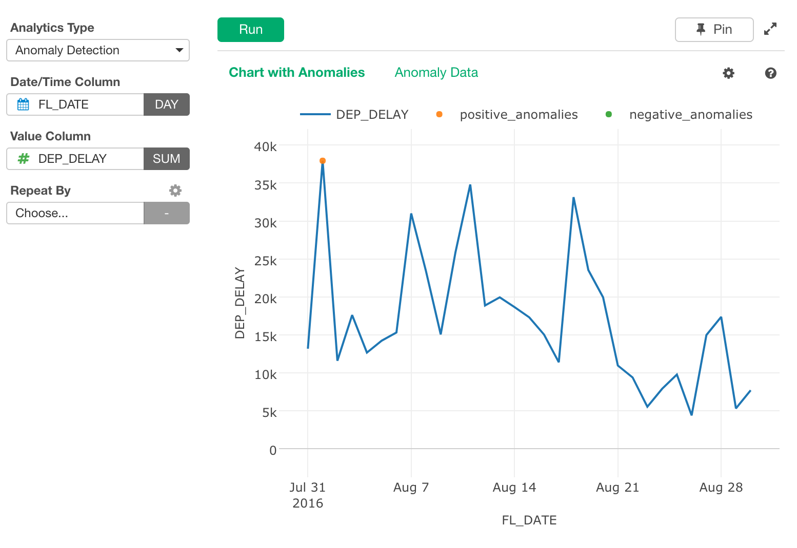
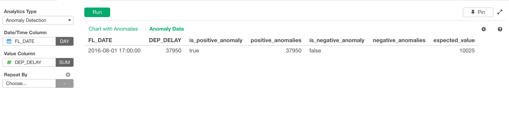

# Anomaly Detection

With algorithm "Seasonal Hybrid ESD (S-H-ESD)", created by Twitter, it detects anomaly in the presence of seasonality and an underlying trend

## Input Data
Input data should be a time series data. Each row should represent one observation with date/time. It should have following columns.

  * Date - A Date or POSIXct column when the observation was made.
  * Some measure value - Numeric column that stores observed value.

## How to Use This Feature
1. Click Analytics View tab.
2. If necessary, click "+" button on the left of existing Analytics tabs, to create a new Analytics.
3. Select "Anomaly Detection" for Analytics Type.
4. Select Date column and associated Round Function for Date/Time Column.
5. (Optional) Select Numeric column and aggregate function for Value Column.
6. (Optional) Select a column to group subjects with "Repeat By" column selector. For each group, a separate small chart will be displayed.
10. Click Run button to run the analytics.
11. Select view type (explained below) by clicking view type link to see each type of generated visualization.

### "Chart with Anomalies" View
"Chart with Anomalies" View displays a time series chart with anomalies as colored points. You can see orange points as positive anomalies and green points as negative anomalies on the chart. 

### "Anomaly Data" View
"Anomaly Data" View displays actual anomaly values in table format. You can check if the anomaly is for positive (or negative), value of positive (or negative) anomaly and expected value.

## R Package

The `Anomaly Detection` uses [`AnomalyDetection`](https://github.com/twitter/AnomalyDetection) R Package under the hood.

## Exploratory R Package

For details about AnomalyDetection usage in Exploratory R Package, please refer the [github repository](https://github.com/exploratory-io/exploratory_func/blob/master/R/anomaly_detection.R)
