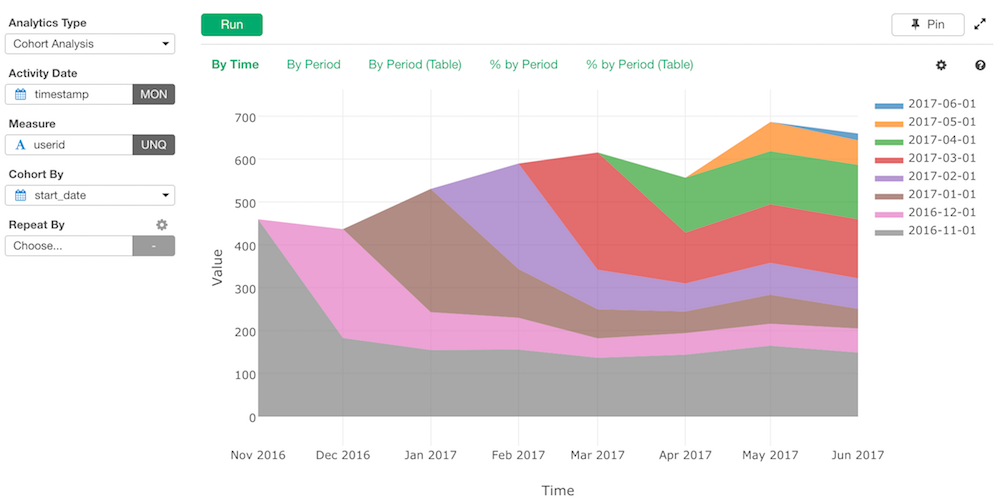
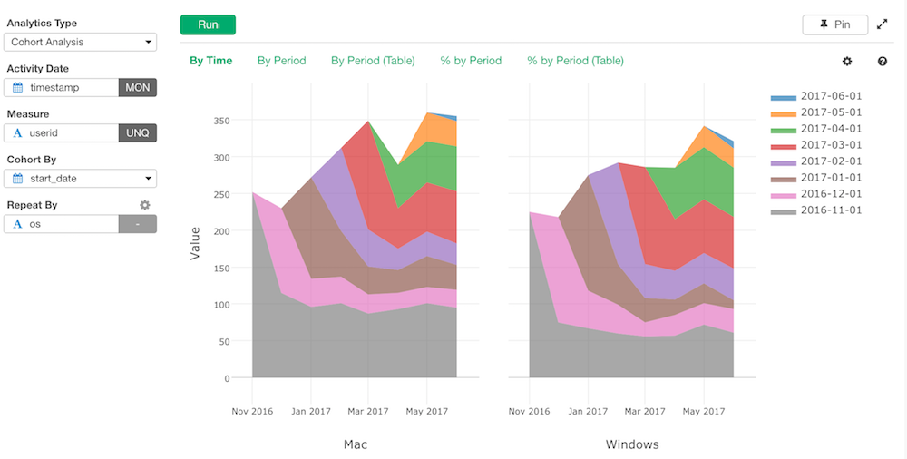
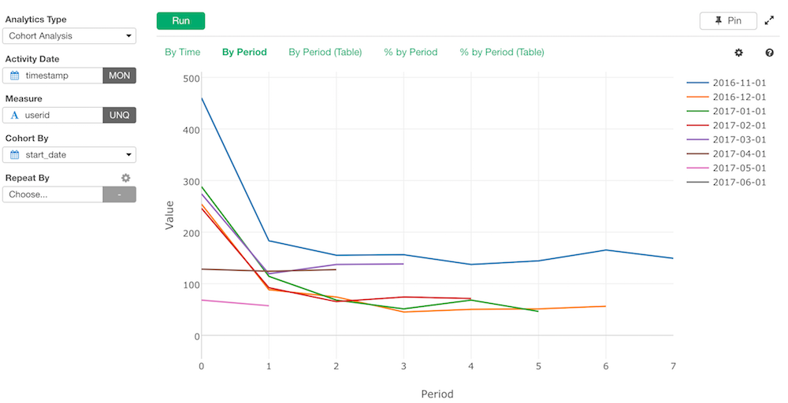
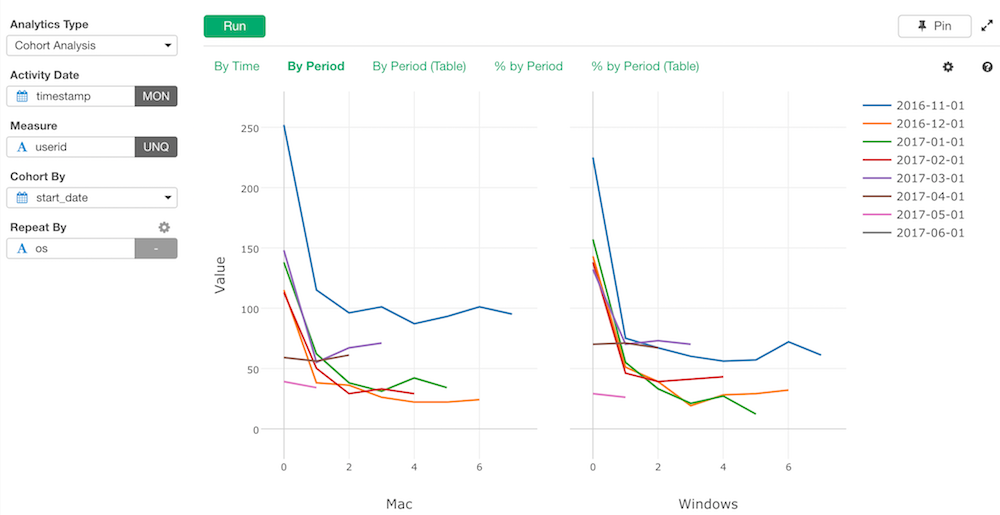
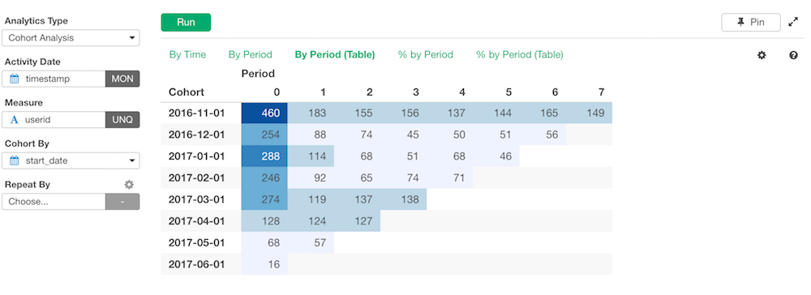
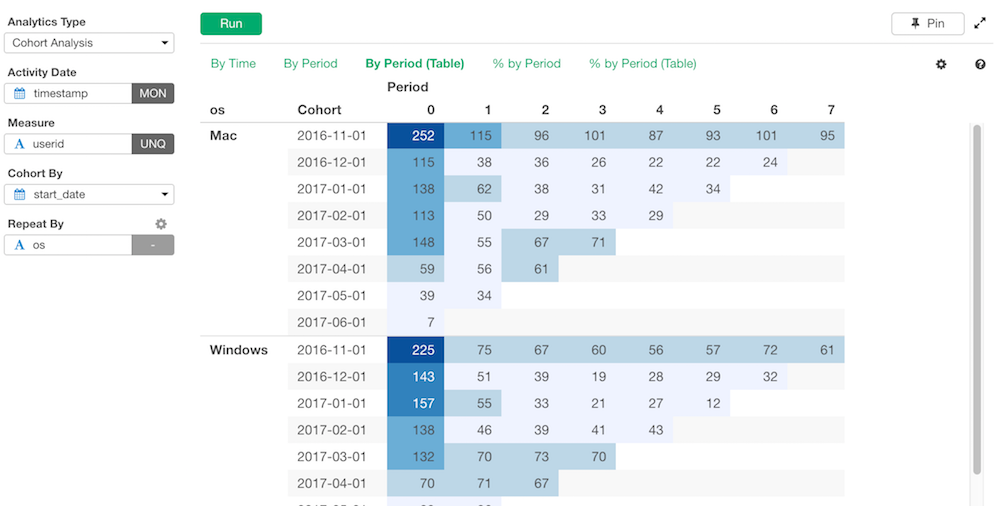
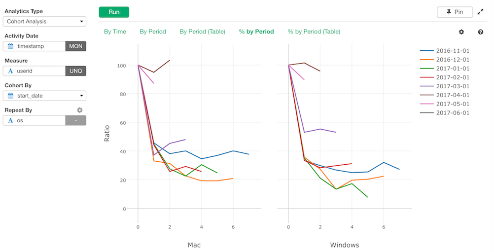
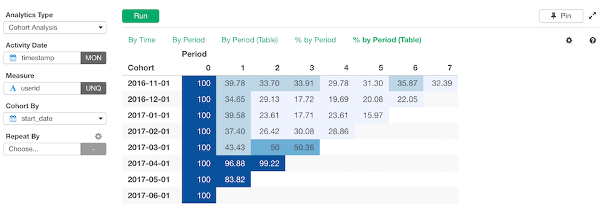
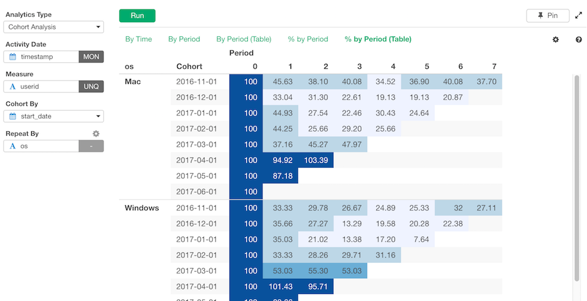

# Cohort Analysis
Visualizes how a measure for each cohort (group) changes as time goes by. 

## Input Data
Each row of the input data should represent one observation (e.g. number of active users on 7/1/2017 who joined at 3/1/2017). It should have following columns.

* Activity Date - A Date or POSIXct column with the beginning of the observation of the subject. You can also set the unit of the period such as by week, by month etc at the sub dropdown menu. 
* Measure - A column with numeric data. 
* Cohort By - A column with the cohort (group) data. Non text data such as numerical data or date date is handled as categorical. 
* Other columns to group observations - Optionally, if there are other columns that groups subjects, they can be used to draw separate survival curves for each group, for comparison between groups.

## How to Use This Feature
1. Click Analytics View tab.
1. If necessary, click "+" button on the left of existing Analytics tabs, to create a new Analytics.
1. Select "Cohort Analysis" for Analytics Type.
1. Select Activity Date column with "Activity Date" column selector.
1. Select Measure column with "Measure" column selector.
1. Select Cohort By column with "Cohort By" column selector.
1. (Optional) Select a column to group subjects with "Repeat By" column selector. For each group, a separate small chart will be displayed.
1. Click Run button to run the analytics.
1. Select view type (explained below) by clicking view type link to see each type of generated visualization.

### "By Time" View
"By Time" View displays how the measure for each cohort changes by time.

This example is with Repeat By.

### "By Period" View
"By Period" View displays how the measure for each cohort changes by period.

This example is with Repeat By.

### "By Period (Table)" View
"By Period" View displays how the measure for each cohort changes by period in a table format.

This example is with Repeat By.

### "% by Period" View
"% by Period" View displays how the measure for each cohort changes in percent by period.

This example is with Repeat By.

### "% by Period (Table)" View
"% by Period" View displays how the measure for each cohort changes in percent by period in a table format.

This example is with Repeat By.

