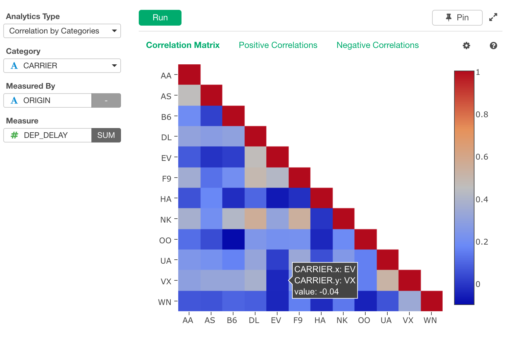
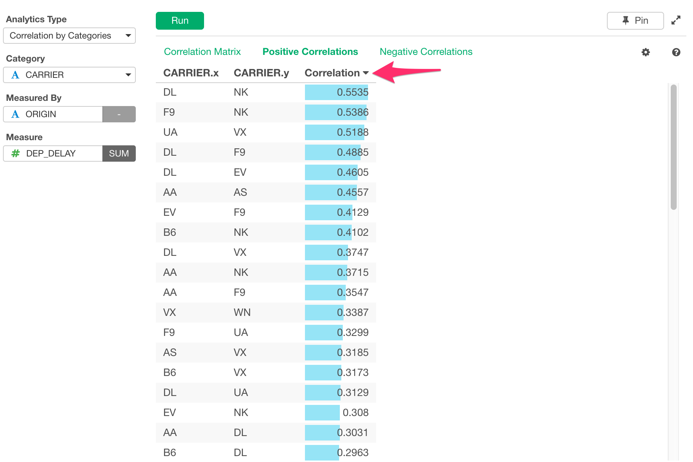
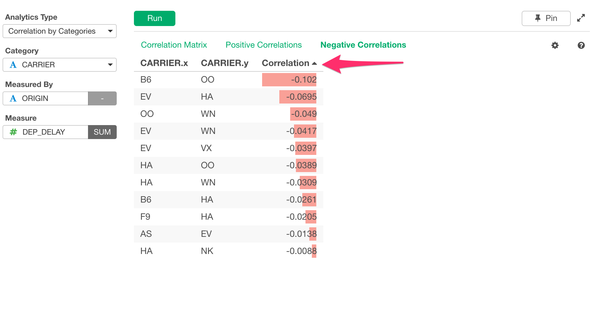

# Correlation by Category

Calculates correlations among groups defined by a category column.

## Input Data
Input data should contain categorical columns and numeric columns.

  * Category Column - Categorical column that defines the groups among which correlations are calculated.
  * Measured By Column - Column that defines dimension to calculate correlation. For each group, measure is aggregated for each value of this column, forming a vector that represents the group. Then, correlations are calculated among these vectors. If Date/POSIXct column is specified, measure is aggregated for each period of time (day, week, etc.) that is specified.
  * Measure Column - Numeric column that is used to calculate correlation.

## How to Use This Feature
1. Click Analytics View tab.
2. If necessary, click "+" button on the left of existing Analytics tabs, to create a new Analytics.
3. Select "Correlation by Categories" for Analytics Type.
4. Select Category Columns that you want to see correlation.
5. Select Measured By Columns that you want to summarize measure column.
6. Select Measure Column that you want to use to calculate correlation.
7. Click Run button to run the analytics.
8. Select view type (explained below) by clicking view type link to see each type of generated visualization.

### "Correlation Matrix" View
"Correlation Matrix" View displays correlations with Heatmap. Red color means it has positive correlation and Blue color means it has negative correlation. The darker the color, the stronger the correlation.

### "Positive Correlations" View
"Positive Correlations" View displays the most positive 100 correlations. You can click Column Header for Correlation to sort the data by Correlation value.

### "Negative Correlations" View
"Negative Correlations" View displays the most negative 100 correlations... You can click Column Header for Correlation to sort the data by Correlation value.

## R Package

The `Correlation by Category` uses [`stats`](https://stat.ethz.ch/R-manual/R-devel/library/stats/html/cor.html) R Package under the hood.

## Exploratory R Package

For details about Cohort Analysis in Exploratory R Package, please refer the [github repository](https://github.com/exploratory-io/exploratory_func/blob/master/R/stats_wrapper.R)
