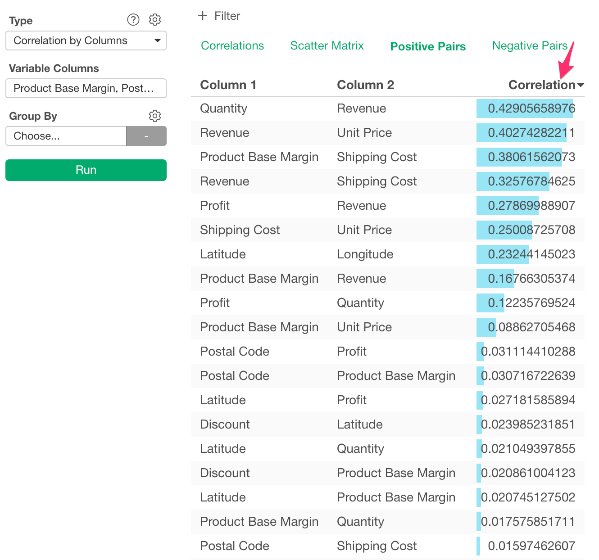

# Correlation by Column

Calculates Correlations among columns.

## Input Data
Input data should contain numeric columns.

  * Variable Columns - Numeric columns among which correlations are calculated.

## How to Use This Feature
1. Click Analytics View tab.
2. If necessary, click "+" button on the left of existing Analytics tabs, to create a new Analytics.
3. Select "Correlation by Columns" for Analytics Type.
4. Click Variable Columns and open Column Selector Dialog.
5. Select Numeric Columns that you want to calculate correlation.

6. Click Run button to run the analytics.
7. Select view type (explained below) by clicking view type link to see each type of generated visualization.

### "Correlation Matrix" View
"Correlation Matrix" View displays correlations with Heatmap. Red color means it has positive correlation and Blue color means it has negative correlation. The darker the color, the stronger the correlation.

### "Positive Correlations" View
"Positive Correlations" View displays the most positive 100 correlations. You can click Column Header for Correlation to sort the data by Correlation value.

### "Negative Correlations" View
"Negative Correlations" View displays the most negative 100 correlations. You can click Column Header for Correlation to sort the data by Correlation value.

