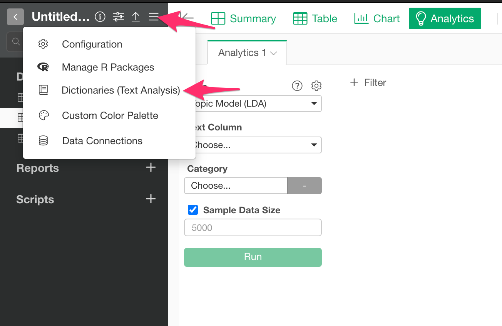
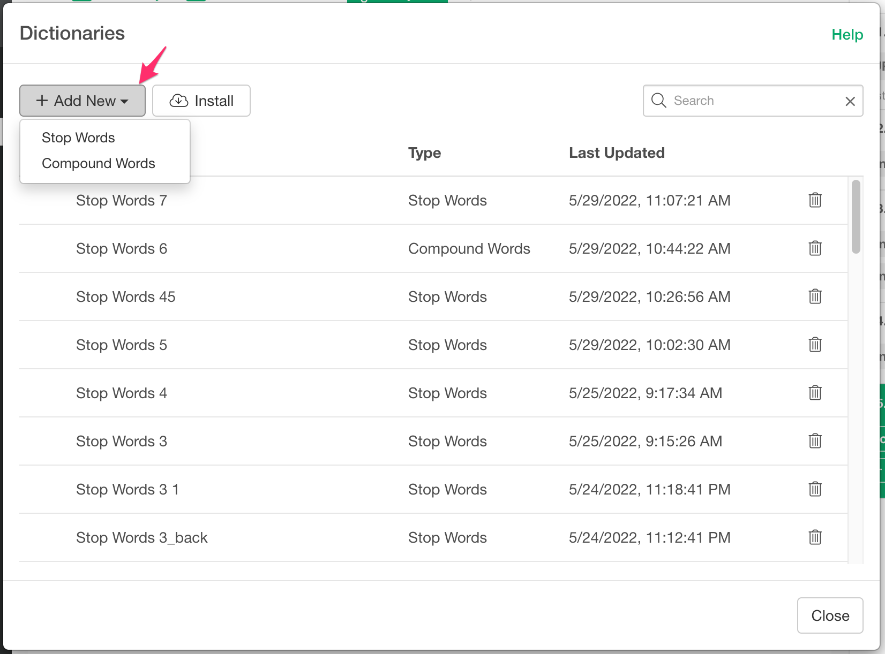
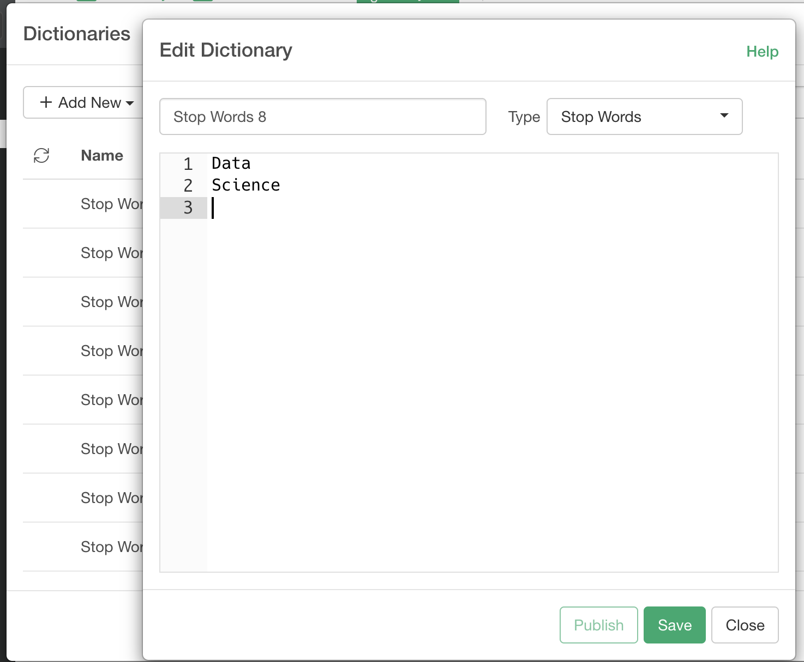
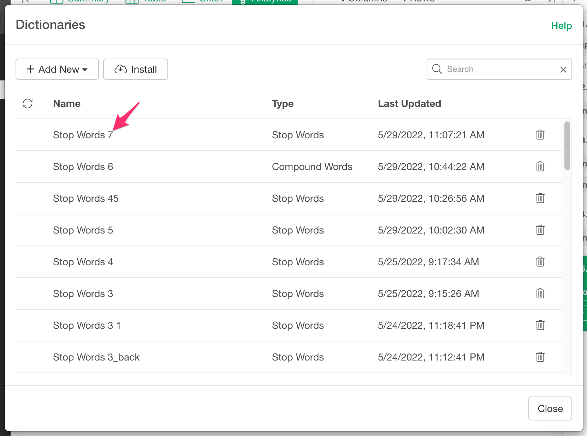
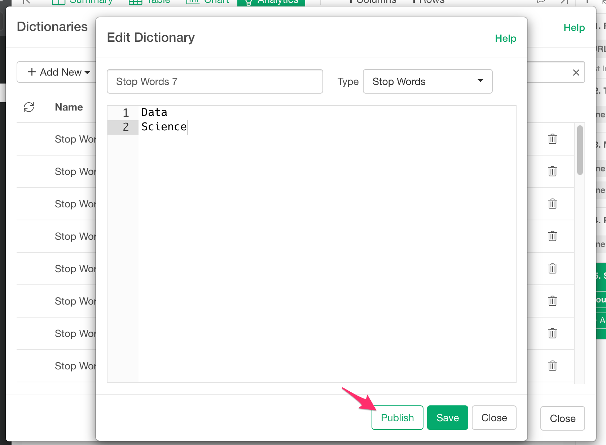
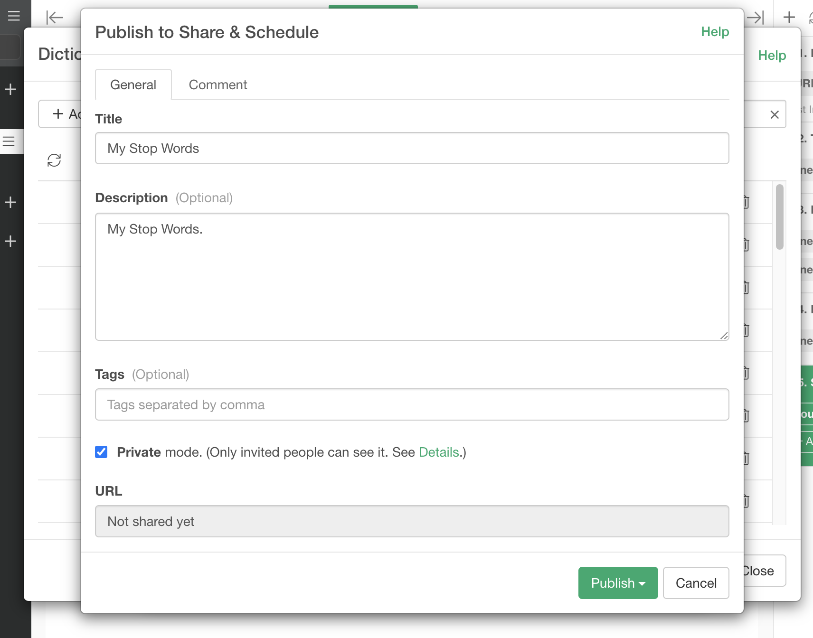
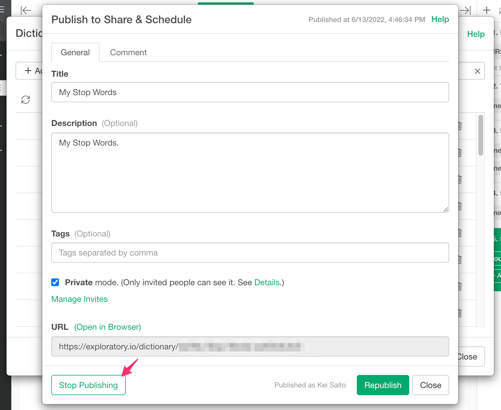
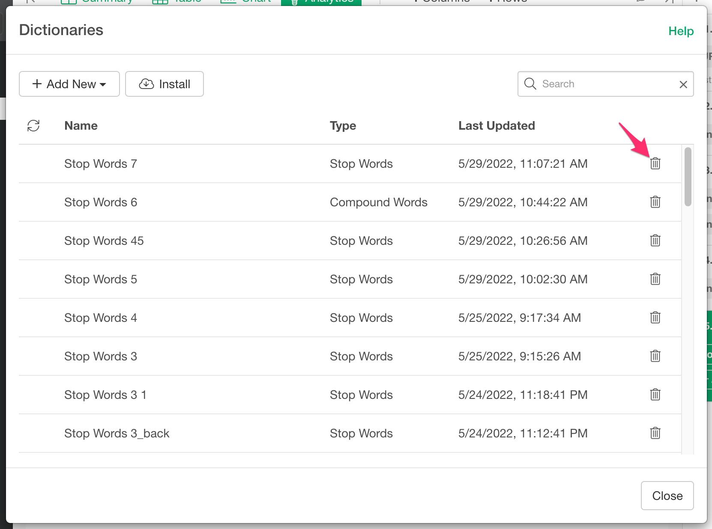

There are 2 types of dictionaries. 

* Stop Word Dictionary
* Compound Word Dictionary

## How to manage Dictionaries

You can manage your dictionaries from the Dictionaries dialog. You can access the Dictionaries dialog from the following locations.

From the project menu at the top left of the screen.

From the dictionary icon in the Property dialog of the Topic Model (LDA) Analytics.

### Create

You can create a new dictionary by clicking the "Add New" button.

It opens the dictionary edit dialog. Edit the dictionary and click the "Save" button.

### Update 

You can update your existing dictionary by clicking the name of the dictionary in the dictionary list. 

### Publish / Republish 

You can publish/unpublish/update your existing dictionary by clicking the "Publish" button in the dictionary edit dialog. 

It opens up the publish dialog. Enter the title, description, etc, and click the "Publish" to publish or republish. 

### Unpublish
You can unpublish the published dictionary by clicking the "Stop Publishing" button.

### Delete

You can delete your dictionary by clicking the trash icon in the dictionary list. 

