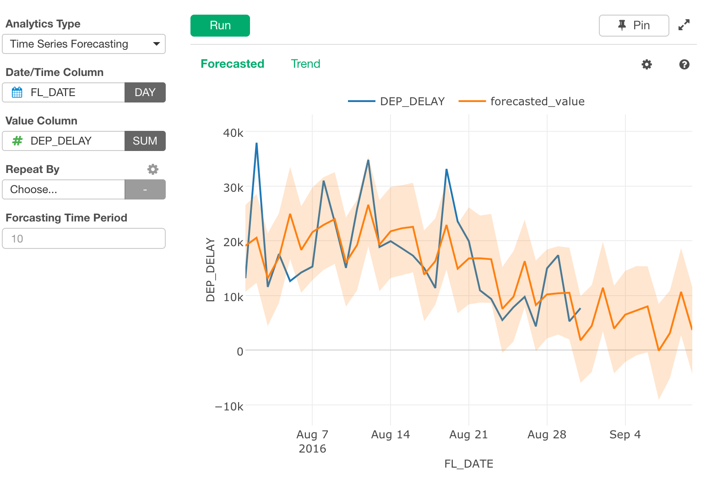
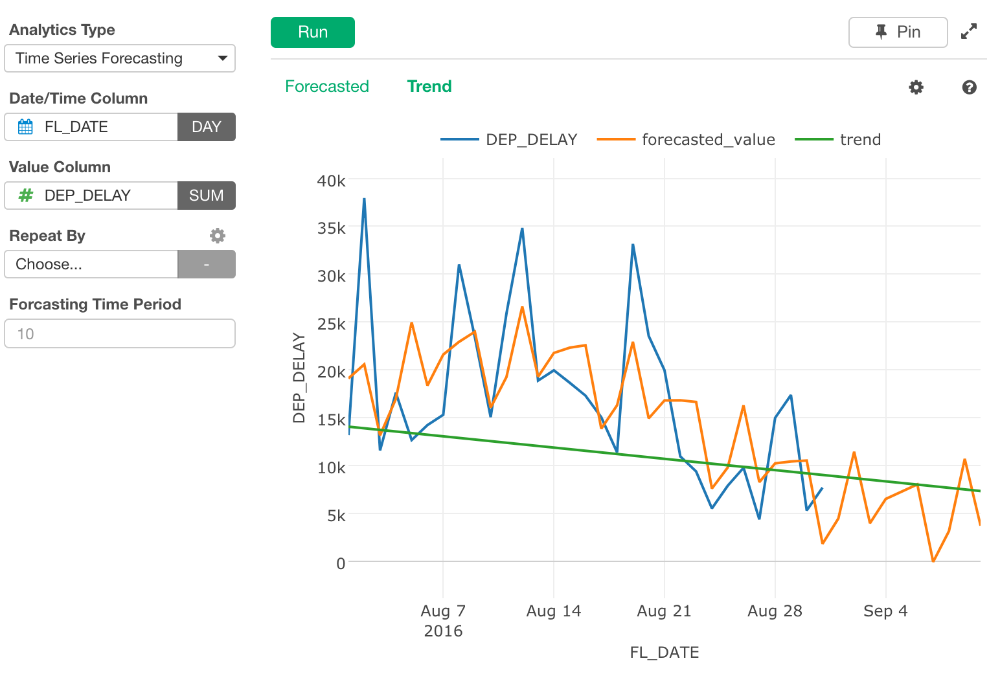
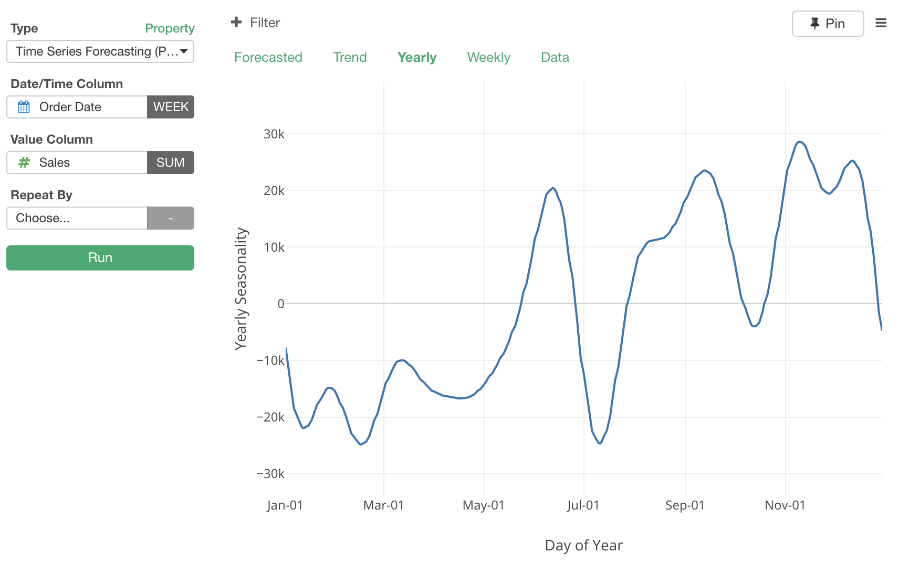
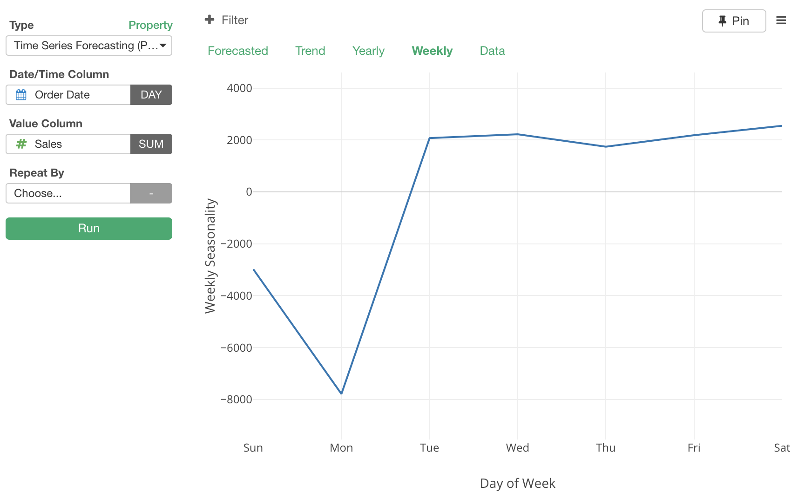
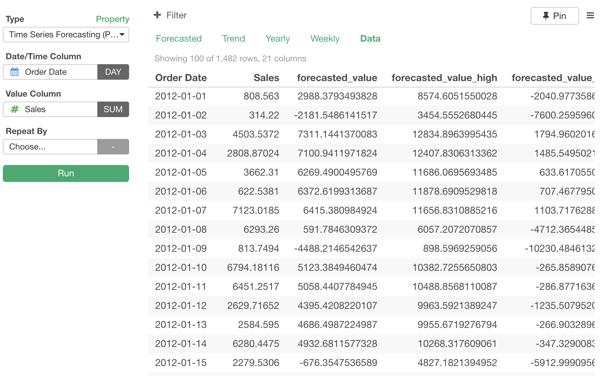
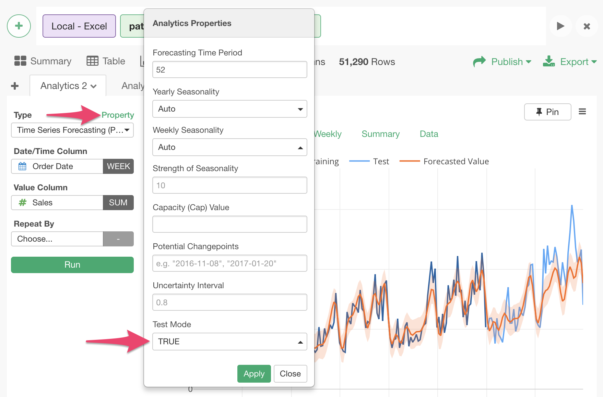
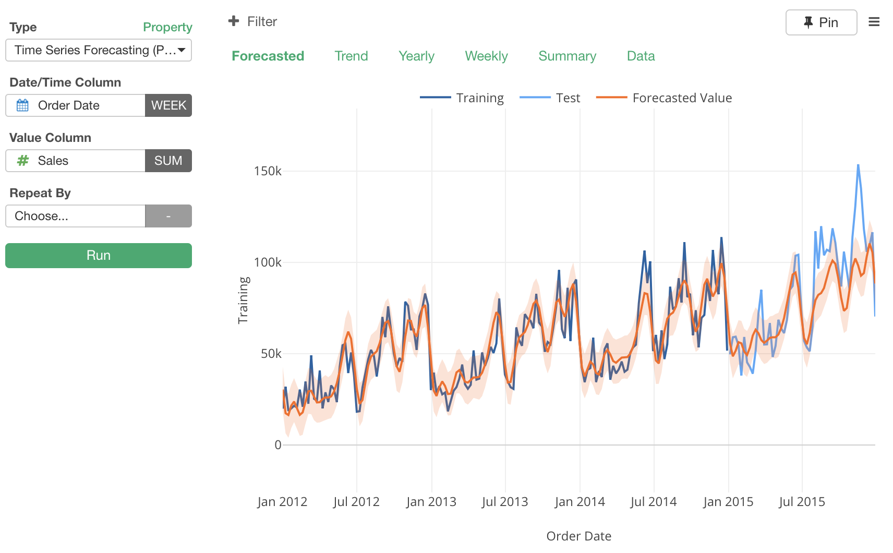
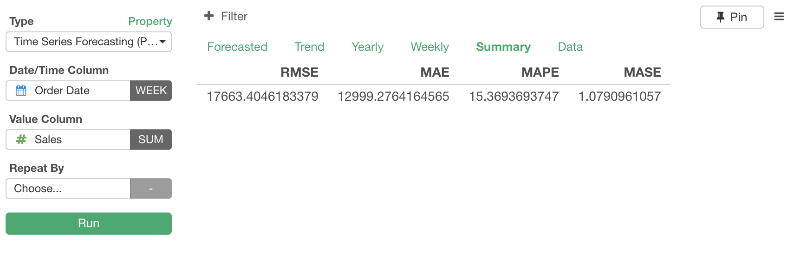

# Time Series Forecasting

With past time series data as training data, it creates a model that forecasts values for future dates/times, and plots the predicted values on a Line Chart.

# Input Data

Input data should be a time series data. Each row should represent one observation with date/time. It should have the following columns.

  * Date/Time Column - A Date or POSIXct column to indicate when the observations were made.
  * Value Column - A Numeric column that stores observed values.
  * External Predictors - Optional. If specified, forecast is made based on those columns, in addition to the trend and seasonality seen in the Value Column.
  * Holiday Column - A categorical column that indicates type of holiday for the day of the observation. When logical column is selected, TRUE means it is a holiday and FALSE means it is not.

## Properties

There are many properties to configure how to build the models and how to transform the data before passing it to the algorithm.

  * Analytics Properties
    * Forecasting Time Period - Length of periods (e.g. days, months, years...) to forecast.
    * Uncertainty Interval - Controls the width of displayed uncertainty intervals. The default is 0.8. Probability which is covered by uncertainty interval.
    * Simulations for Uncertainty Interval - Number of simulations to estimate uncertainty interval.
  * Seasonalities
    * Yearly Seasonality - By default, whether to use yearly seasonality is automatically determined, but you can explicitly specify it here.
    * Weekly Seasonality - By default, whether to use weekly seasonality is automatically determined, but you can explicitly specify it here.
    * Daily Seasonality - By default, whether to use weekly seasonality is automatically determined, but you can explicitly specify it here.
    * Strength of Seasonality - Controls the strength of seasonality taken into account in the forecasting.
    * Seasonality Mode - This option controls whether the Seasonality, Holiday, and External Predictors have additive or multiplicative effect in the forecasting. Default is Additive.
  * Holidays
    * Strength of Holiday Effect - Controls the strength of holiday effect taken into account in the forecasting.
    * Countries for Holidays - You can specify list of country codes whose holidays should be considered in making forecast.
  * Limits
    * Trend Upper Limit - Upper Limit of trend. Largest possible value for the trend to be forecasted. e.g. Size of entire market, etc.
    * Trend Lower Limit - Lower limit of trend. Takes effect only when Trend Upper Limit is specified.
  * Changepoints
    * Changepoint Period (Ratio) - Change points are detected only within specified ratio of training period from the beginning of data. Default is 0.8, which means change points are detected only within the first 80% period of the training data.
    * Number of Potential Changepoints - Number of automatically selected candidates for changepoints. Used when Potential Changepoints are not specified.
    * Flexibility of Changepoint Selection - Larger value makes the trend line more flexible, by allowing more changepoints.
    * Potential Changepoints - You can specify points of time at which trend could have changed, as candidates of changepoints.
  * Other Properties
    * MCMC Samples for Full Bayes - If a value greater than 0 is set, full Bayesian inference with the specified number of MCMC samples is performed. If 0, which is the default, is set, MAP estimation is performed instead of full Bayesian inference.
  * Data Preprocessing
    * Missing Value Handling for Value - How to fill missing values after aggregation of data. There are following options. The default is No Fill.
      * No Fill
      * Fill with Previous Value
      * Fill with Zero
      * Linear Interpolation
      * Spline Interpolation
    * Missing Value Handling for Predictors - How to fill missing values of External Predictors after aggregation. Options are same as "Missing Value Handling for Value".
  * Evaluation
    * Test Mode - When this option is set to TRUE, the last part of the input data for the period specifed by "Forecasting Time Period" is not used for training data, and kept to test predictive performance of the model.
    * Time Period for Test Data - Length of periods (e.g. days, months, years...) at the end of the data to be kept as test data.

# How to Use This Feature

1. Under Analytics view, select "Time Series Forecasting (Prophet)" for Analytics Type.
2. Select a column for Date and select an appropriate scale (e.g. Floor to Week).
3. (Optional) Select Numeric column and aggregate function for Y Axis. The default is Number of Rows.
4. (Optional) Select a column to group subjects with "Repeat By" column selector. For each group, a separate small chart will be displayed.
5. Click Run button to run the analytics.
6. Select each view type (explained below) see the detail of the analysis.

## "Forecasted" View

"Forecasted" View displays how the future values look like. with a line chart. Blue line is for actual values and orange line is for forecasted values. Orange band shows uncertainty interval.

## "Trend" View

"Trend" View displays actual values (blue line), and trend line (orange line). It also displays change points of the trend line, and how much change of slope was made at each change point (green bars).

## "Yearly" View

"Yearly" View displays yearly seasonality.

## "Weekly" View

"Weekly" View displays weekly seasonality, when time unit is DAY or smaller.

## "Data" View

"Data" View shows a table with both past data and forecasted data.

# Evaluation of Forecasting Models

You can enable 'Test Mode' to evaluate the forecasting model. This will split the data into Training and Test periods, build a model based on the training data and evaluate the forecasted values against the test data.

You can enable it from the property.

Take a look at [this note](https://blog.exploratory.io/a-gentle-introduction-to-backtesting-for-evaluating-the-prophet-forecasting-models-66c132adc37c) for more details on how the evaluation method works.

## "Forecasted" View in Test Mode

The dark blue line is the actual data in the training period, and the light blue line is the actual data in the test period. You can compare the orange line with the light blue line to see how close the forecasted values are against the actual values.

## "Summary" View in Test Mode

There are several metrics to help you evaluate the forecasting model's performance. They are presented under "Summary" tab.

* RMSE (Root Mean Square Error) : Root of mean of squares of difference between actual value and forecasted value.
* MAE (Mean Absolute Error) : Mean of absolute differences between actual value and forecasted value.
* MAPE (Mean Absolute Percentage Error) : Mean of absolute differences in percentage of actual value.
* MASE (Mean Absolute Scaled Error)

Take a look at [this note](https://blog.exploratory.io/a-gentle-introduction-to-backtesting-for-evaluating-the-prophet-forecasting-models-66c132adc37c) for more details on each metric.

## Countries for Holidays

TBD

## R Package

Time Series Forecasting view uses the [Prophet](https://cran.rstudio.com/web/packages/prophet/index.html) R Package under the hood.

- [prophet R package's Function Reference Guide](https://cran.r-project.org/web/packages/prophet/prophet.pdf)
- [Prophet's Official Documents](https://facebook.github.io/prophet/docs/quick_start.html)

## Exploratory R Package

For details about `prophet` usage in Exploratory R Package, please refer to the [github repository](https://github.com/exploratory-io/exploratory_func/blob/master/R/prophet.R)
