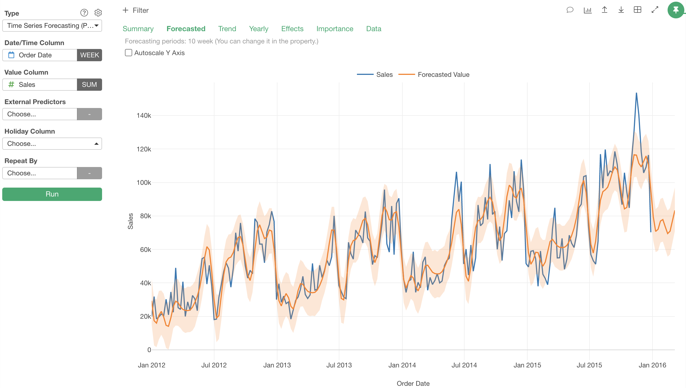

# Time Series Forecasting

With past time series data as training data, it creates a model that forecasts values for future dates/times, and plots the predicted values on a Line Chart.

## Input Data
Input data should be a time series data. Each row should represent one observation with date/time. It should have following columns.

  * Date - A Date or POSIXct column when the observation was made.
  * Some measure value - Numeric column that stores observed value.

## How to Use This Feature
1. Click Analytics View tab.
2. If necessary, click "+" button on the left of existing Analytics tabs, to create a new Analytics.
3. Select "Time Series Forecasting" for Analytics Type.
4. Select Date column and associated Round Function for X Axis.
5. (Optional) Select Numeric column and aggregate function for Y Axis.
6. (Optional) Select a column to group subjects with "Repeat By" column selector. For each group, a separate small chart will be displayed.
10. Click Run button to run the analytics.
11. Select view type (explained below) by clicking view type link to see each type of generated visualization.

### "Forecasted" View
"Forecasted" View displays how the future values look like. with a line chart. Blue line is for actual values and orange line is for forecasted values. Orange band shows uncertainty interval.

### "Trend" View
"Trend" View displays actual values (blue line), and trend line (orange line). It also displays change points of the trend line, and how much change of slope was made at each change point (green bars).

### "Yearly" View
"Yearly" View displays yearly seasonality.

### "Weekly" View
"Weekly" View displays weekly seasonality, when time unit is DAY or smaller.

### "Data" View
"Data" View shows a table with both past data and forecasted data.

### Test Mode
In Test Mode, the last part of the data for the length specified by "Forecasting Time Period" is not used for training the model, and kept for testing how well the model forecasts.
Test Mode can be enabled by setting the "Test Mode" property to TRUE.

#### "Forecasted" View in Test Mode
Dark blue line is the part of actual data used for training, and light blue line is the part that is used for test. Orange line is the forecasted values. You can compare the orange line with the light blue line to see how close the forecast was to the actual value.

#### "Summary" View in Test Mode
In Test Mode, "Summary View" shows the metrics for the model's forecasting performance.
For the detail of the metrics, we recommend reading [this online textbook](https://otexts.org/fpp2/accuracy.html).

## Analytics Properties
Time Series Forecasting Analytics View has following other properties.

- Forecasting Time Period - Length of the forecasting period.
- Yearly Seasonality - By default, whether to use yearly seasonality is automatically determined, but you can explicitly specify it here.
- Weekly Seasonality - By default, whether to use weekly seasonality is automatically determined, but you can explicitly specify it here.
- Strength of Seasonality - Controls the weight of seasonality taken into account in the forecasting.
- Capacity (Cap) Value - Largest possible value to be forecasted. e.g. Size of entire market, etc.
- Potential Changepoints - You can specify points of time at which trend could have changed, as candidates of changepoints.
- Uncertainty Interval - Probability which is covered by uncertainty interval.

## Analytics Properties
  * Forecasting Time Period - Length of periods (e.g. days, months, years...) to forecast.
  * Yearly Seasonality - By default, whether to use yearly seasonality is automatically determined, but you can explicitly specify it here.
  * Weekly Seasonality - By default, whether to use weekly seasonality is automatically determined, but you can explicitly specify it here.
  * Strength of Seasonality - Controls the weight of seasonality taken into account in the forecasting.
  * Trend Upper Limit - Upper Limit of trend. Largest possible value for the trend to be forecasted. e.g. Size of entire market, etc.
  * Trend Lower Limit - Lower limit of trend. Takes effect only when Trend Upper Limit is specified.
  * Potential Changepoints - You can specify points of time at which trend could have changed, as candidates of changepoints.
  * Uncertainty Interval - Controls the width of displayed uncertainty intervals. The default is 0.8. Probability which is covered by uncertainty interval.
  * Test Mode - When this option is set to TRUE, the last part of the input data for the period specifed by "Forecasting Time Period" is not used for training data, and kept to test predictive performance of the model.

## R Package

Time Series Forecasting view uses [`prophet`](https://cran.rstudio.com/web/packages/prophet/index.html) R Package under the hood.

- [prophet R package's Function Reference Guide](https://cran.r-project.org/web/packages/prophet/prophet.pdf)
- [Prophet's Official Documents](https://facebook.github.io/prophet/docs/quick_start.html)

## Exploratory R Package

For details about `prophet` usage in Exploratory R Package, please refer to the [github repository](https://github.com/exploratory-io/exploratory_func/blob/master/R/prophet.R)
