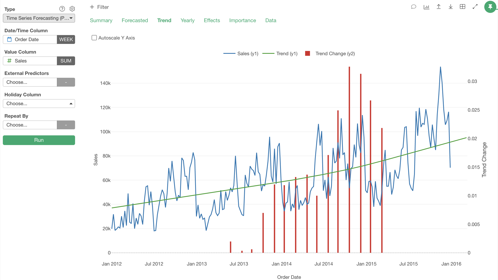

# Time Series Forecasting

With past data as training data, it creates a model that predicts future value for a specific date and plot the predicted values on a Time Series Chart.

## Input Data
Input data should be a time series data. Each row should represent one observation with date/time. It should have following columns.

  * Date - A Date or POSIXct column when the observation was made.
  * Some measure value - Numeric column that stores observed value.

## How to Use This Feature
1. Click Analytics View tab.
2. If necessary, click "+" button on the left of existing Analytics tabs, to create a new Analytics.
3. Select "Time Series Forecasting" for Analytics Type.
4. Select Date column and associated Round Function for X Axis.
5. (Optional) Select Numeric column and aggregate function for Y Axis.
6. (Optional) Select a column to group subjects with "Repeat By" column selector. For each group, a separate small chart will be displayed.
10. Click Run button to run the analytics.
11. Select view type (explained below) by clicking view type link to see each type of generated visualization.

### "Forecasted" View
"Forecasted" View displays how the future values look like. with a line chart. Blue line is for actual values and orange line is for forecasted values. Orange band shows confidence interval.

### "Trend" View
"Trend" View displays actual values (blue line),  forecasted values (orange line) and trend line(green line).

## R Package

The `Time Series Forecasting` uses [`prophet`](https://cran.rstudio.com/web/packages/prophet/index.html) R Package under the hood.

## Exploratory R Package

For details about `prophet` usage in Exploratory R Package, please refer to the [github repository](https://github.com/exploratory-io/exploratory_func/blob/master/R/prophet.R)
