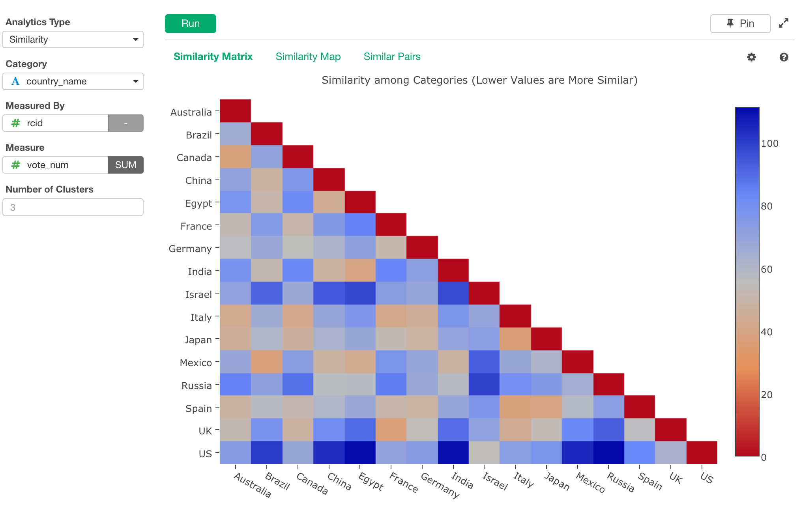
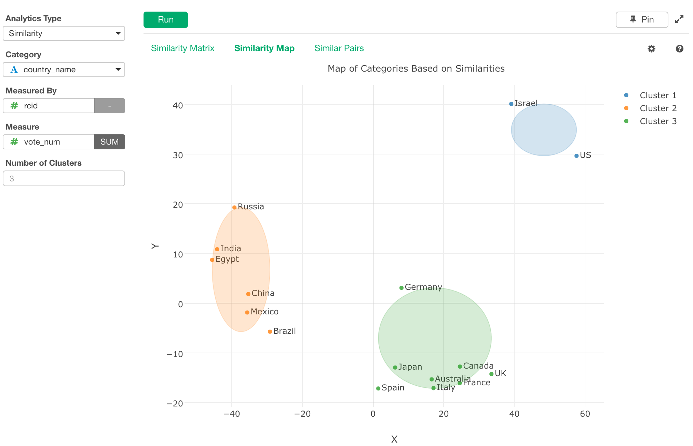
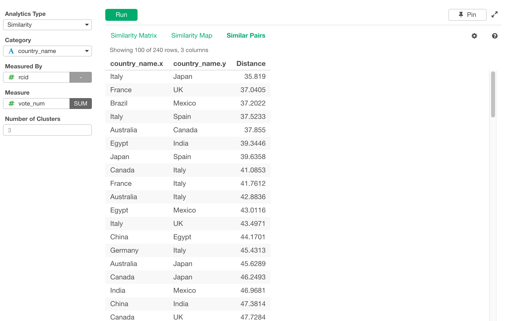

# Similarity
Calculates similarity among the given category items.

## Input Data
Each row of should represent one observation of any of category items. It should have following columns.

* Category - A column with the category data that you want compare. Number data or logical data is treated as categorical data.
* Measured By - A column that you want to group by the measure value you select at "Measure". Number data or logical data is treated as categorical data.
* Measure - A numeric data column that you want to use to compare categories.  
* Number of Clusters - A number of clusters to group categories. It is used in "Similarity Map" view. 

For example, suppose you have a product sales revenue data by countries and product types, and if you want to companre the similarity among the countries based on the revenue data by product types, you can assign columns like following.

* country column to "Category"
* product type column to "Measured By" 
* revenue column to "Measure".  

This one gives you which countries have the simliar sales patterns/trends.

## How to Use This Feature
1. Click Analytics View tab.
2. If necessary, click "+" button on the left of existing Analytics tabs, to create a new Analytics.
3. Select "Similarity" for Analytics Type.
4. Select Category column with "Category" column selector.
5. Select Measured By column with "Measured By" column selector.
6. Select Measure column with "Measure" column selector.
7. (Optional) Type in the number of clusters. 
8. Click Run button to run the analytics.
9. Select view type (explained below) by clicking view type link to see each type of generated visualization.

### "Similarity Matrix" View
It displays all the similarity combinations between categories by the heatmap. Lower values (closer to red color) are more similar.
This example is with Color By.

  

### "Similarity Map" View
It displays how categories are similar by plotting the categories on the 2-dimensional scatter view based on the similarity data. 

### "Similar Pairs" View
It displays raw data of the similarities among countries used for "Similarty Matrix". 

#### Output Data
Following is the list of columns in the "Similar Pairs" view.
* [category column name].x Category items for category pairs.  
* [category column name].y Category items for category pairs.  
* Distance - Distance between those 2 categories. The smaller, the similar.
