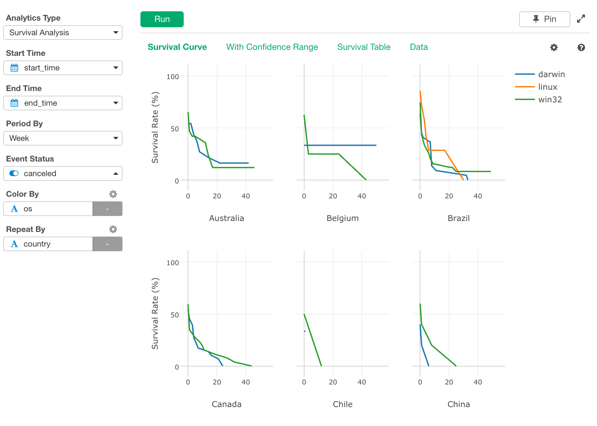
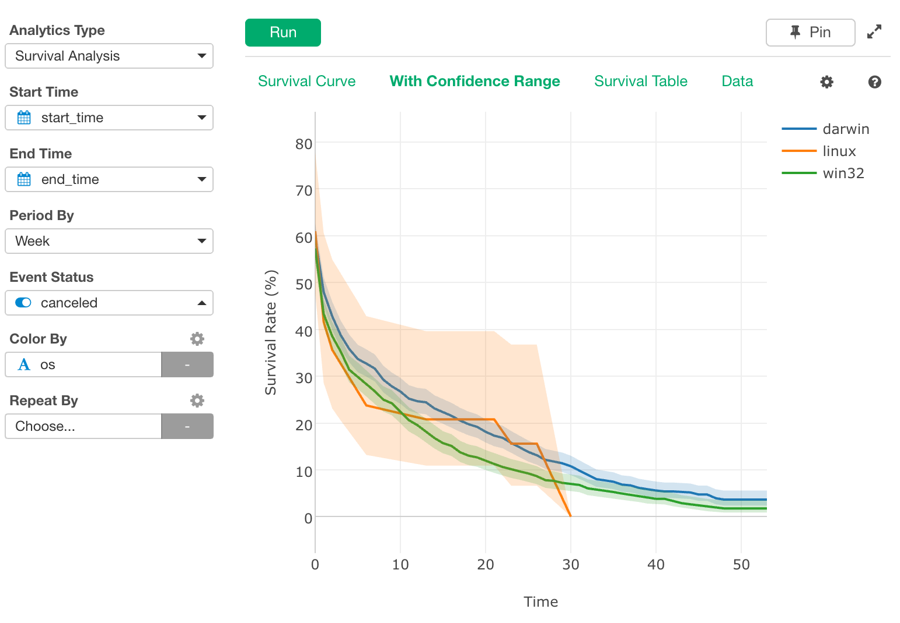
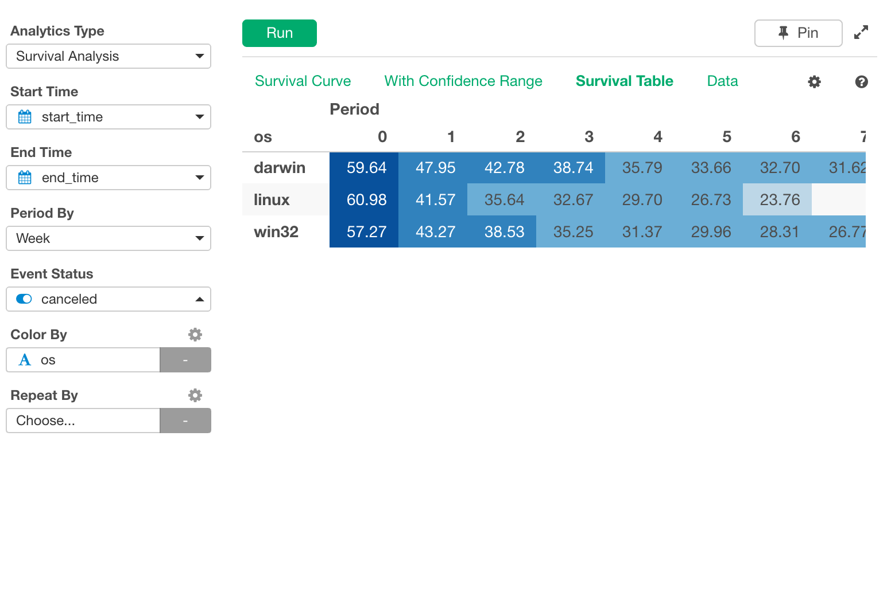

# Survival Analysis
Calculates Survival Curve (Kaplan-Meier estimator) from start time, end time, and survival status.

## Input Data
Input data should be a survival data. Each row should represent one observation (e.g. one user of a subscription service). It should have following columns.

(Note that this analytics calculates survival time from Start Time and End time, rather than taking numeric survival time as input.)
  * Start Time - A Date or POSIXct column with the beginning of the observation of the subject.
  * End Time - A Date or POSIXct column with the end of the observation of the subject.
  * Event Status - A boolean or binary numeric value (can take value of 1 or 0) column with whether the event of interest (death) happened. When this column is true or 1, it means the event of interest happened to the subject at the End Time. If it is false or 0, it means we know that the event had not happened to the subject at least until the End Time, but we don't know what happened or will happen to the subject after that point.
  * Other columns to group observations - Optionally, if there are other columns that groups subjects, they can be used to draw separate survival curves for each group, for comparison between groups.

## Analytics Properties
  * Fill NA in End Time - How to fill NA in End Time column. One of the following.
    * Use Latest Date/Time - Use the latest date/time that appear in the data.
    * Use Today - Use today to fill NA.
    * Enter Manually  - Use manually entered value
  * Date to Fill NA in End Time - Date to fill NA in End Time column. This value takes effect when "Enter Manually" is selected for "Fill NA in End Time".

## How to Use This Feature
1. Click Analytics View tab.
2. If necessary, click "+" button on the left of existing Analytics tabs, to create a new Analytics.
3. Select "Survival Analysis" for Analytics Type.
4. Select Start Time column with "Start Time" column selector.
5. Select End Time column with "End Time" column selector.
6. Select unit of time (Day, Week...) with "Period By" dropdown. The default "Auto" is mean of observations with event.
7. Select Event Status column with "Event Status" column selector.
8. (Optional) Select a column to group subjects with "Color By" column selector. For each group, a survival curve with a different color will be drawn in a same chart.
9. (Optional) Select a column to group subjects with "Repeat By" column selector. For each group, a separate small chart will be displayed.
10. Click Run button to run the analytics.
11. Select view type (explained below) by clicking view type link to see each type of generated visualization.

### "Summary" View
"Summary" View shows up only when Color By column is set. It shows the result of log-rank test that tests if the difference in survival of the subjects that belongs to different Color-By column groups is statistically significant or not.

* Chi-Square - The rest statistic of the log-rank test.
* P Value (Log-Rank Test)
* Degree of Freedom - The degree of freedom of the chi-square distribution used for the log-rank test.
* Number of Rows - Number of observations.
* Number of Events - Number of events (death) in the entire observation data.

### "Survival Curve" View
"Survival Curve" View displays how the subjects survives (without experiencing event/death) as time goes by with a line chart.
This example is with Color By.

This example is with Repeat By in addition to Color By.

By checking "With Confidence Range" checkbox, range for 95% confidence interval can be displayed.

### "Survival Table" View
"Survival Table" View displays how the subjects survives as time goes by with a table with color.

### "Data" View
"Data" View displays raw data for the survival curve.

#### Output Data
Following is the list of columns in the raw survival curve data displayed in the "Data" View.
* Group Columns - If Color By or Repeat By is specified, the columns appears in the output data frame. Survival curve data rows for each group comes with corresponding group column values.
* time - Survival time. This column should be used as X-axis when drawing survival carve in line chart.
* n_risk - The number of subjects that were surviving at the time.
* n_event - Out of n_risk, to how many of the subjects the event occurred at the time.
* n_censor - Out of n_risk, how many of the subjects we lost track of at the time.
* estimate - Estimated survival probability at the time. This column should be used as Y-axis when drawing survival carve in line chart.
* std_error - Standard error of the estimated survival probability value.
* conf_high - Upper bound of the confidence interval for the estimated survival probability value.
* conf_low - Upper bound of the confidence interval for the estimated survival probability value.

## R Package

The `Survival Analysis` uses [`survival`](https://cran.r-project.org/web/packages/survival/index.html) R Package under the hood.

## Exploratory R Package

For details about `survival` usage in Exploratory R Package, please refer to the [github repository](https://github.com/exploratory-io/exploratory_func/blob/master/R/broom_wrapper.R)
