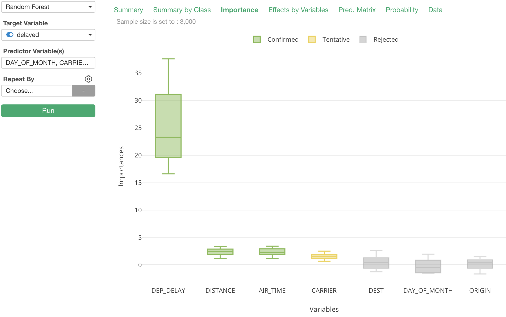
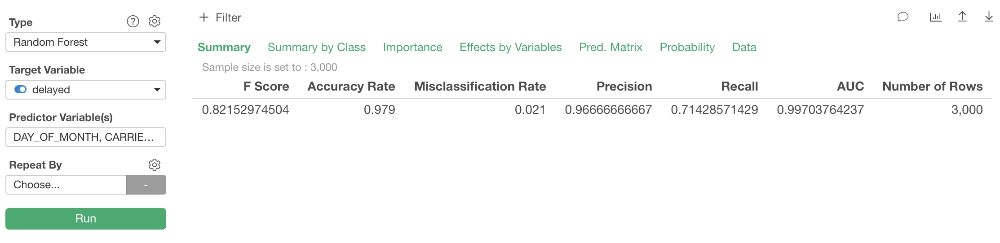
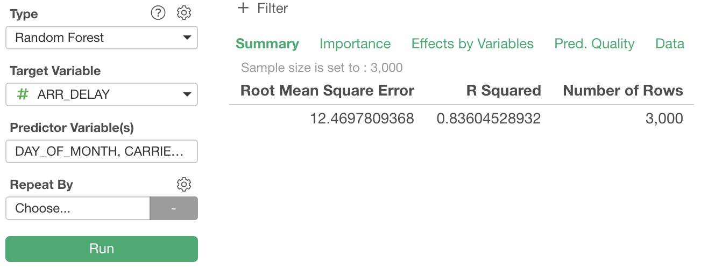
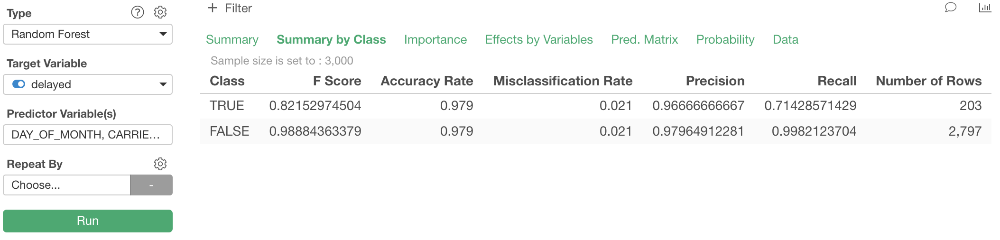
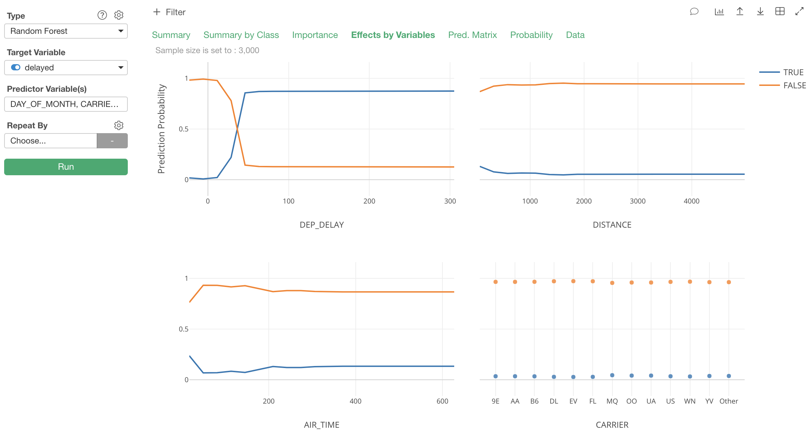
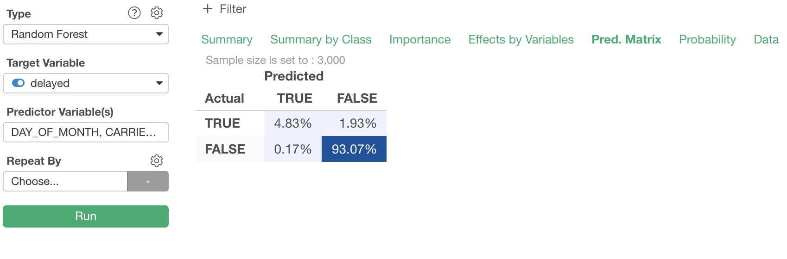
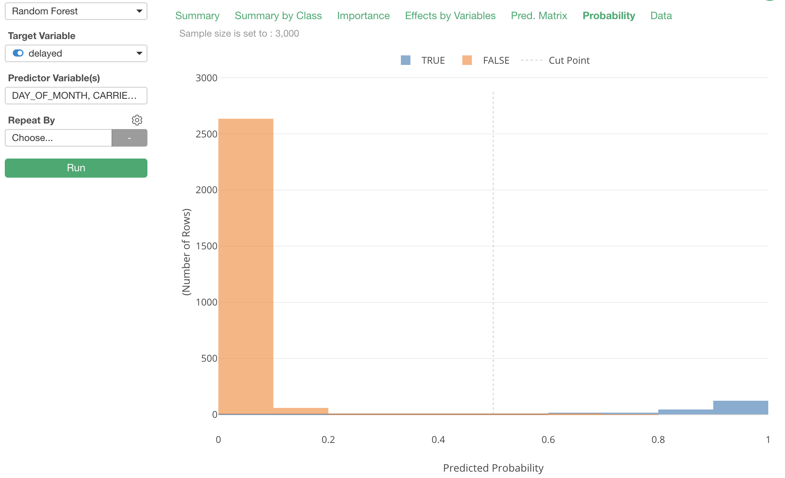
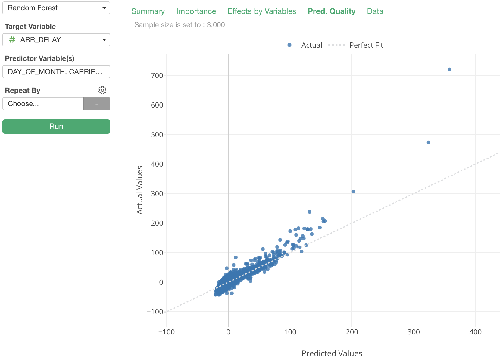
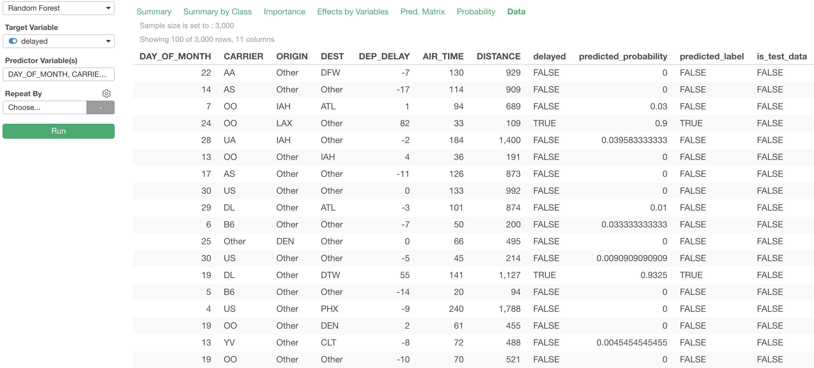

# Random Forest

Build Random Forest Model

## Input Data
Input data should contain one categorical or numeric column for "Target Variable" and more than one categorical or numeric columns as "Predictor Variable(s)".

  * Target Variable - Numeric or Categorical column that you want to Predict.

  * Predictor Variable(s) - Numeric or Categorical columns. Prediction is made based on the values of those columns.

## Analytics Properties
  * Random Forest
    * Number of Trees - Number of trees to grow.
    * Sample Data Size for a Tree - Size of data used to grow one tree. If no value is set, half of the value specified for Sample Data Size is used.
    * Minimum Size of Terminal Nodes - Spliting of nodes is stopped so that the sizes of terminal nodes are larger than or equal to this value.
    * Random Seed - Seed used to generate random numbers. Specify this value to always reproduce the same result.
  * Binary Classification
    * Cut Point for TRUE/FALSE
  * Variable Importance
    * Method - Method of how to calculate variable importance.
      * Permutation - Importance of variable is measured by how much the prediction worsens when random permutation is applied to the variable, nullifying its contribution in prediction.
      * Gini Impurity - Importance of variable is meassured by its contribution in reducing Gini Impurity while building the model.
    * Enable Boruta - Boruta is the method that calculates variable importance with statistical significance, by repeatedly building Random Forest model. It is enabled by default.
    * Maximum Number of Iterations for Boruta
    * P Value Threshold for Boruta - P value threshold Boruta uses to determine whether a variable's contribution to prediction is statistically significant or not.
  * Effects by Variables
    * Max # of Variables - Maximum number of most important variables to display on Effects by Variable view.
  * Data Pre-processing
    * Sample Data Size - Number of rows to sample before building Random Forest model.
    * Max # of Categories for Target Variable - If categorical Target Variable column has more categories than this number, less frequent categories are combined into 'Other' category.
    * Max # of Categories for Predictor Vars - If categorical predictor column has more categories than this number, less frequent categories are combined into 'Other' category.
  * Imbalanced Data Adjustment
    * Adjust Imbalanced Data - Adjust imbalance of data in Target Variable (e.g. FALSE being majority and TRUE being minority.) by SMOTE (Synthetic Minority Over-sampling Technique) altorithm.
    * Target % of Minority Data
    * Maximum % Increase for Minority Size
    * Neighbors to Sample for Populating Data
  * Evaluation
    * Test Mode - Enable/Disable Test Mode. In Test Mode, data is split into training data and test data, and test data is not used for building model, so that it can be used for later test, without bias.
    * Ratio for Test Data - A value between 0 and 1.
    * Data Splitting Method
      * Random - Specified ratio of data that is picked randomly is used as test data.
      * Reserve Order in Data - Specified ratio of data that appears last are used as test data.

## How to Use This Feature
1. Click Analytics View tab.
2. If necessary, click "+" button on the left of existing Analytics tabs, to create a new Analytics.
3. Select "Random Forest" for Analytics Type.
4. Select "Target Variable" column.
5. Click "Predictor Variable(s)" and open Column Selector Dialog.

6. Select Columns that you want to see importance.
7. Click Run button to run the analytics.
8. Select view type (explained below) by clicking view type link to see each type of generated visualization.

### "Importance" View
"Importance" View displays importance of variables with decision on statistical significance of their contributions to prediction, making use of R Package Boruta. The variables in green has statistically significant contributions. The result is not decisive on the ones in yellow yet with the performed iterations. Ones in gray are decided not to have statistically significant contributions.

### "Summary" View
"Summary" View displays metrics that describes the quality of the Random Forest model.

- F Score - A measure of Test Accuracy. The score ranges between 0 and 1 and Higher is better.  It's harmonic mean of precision and recall.
- Accuracy Rate - Another measure of Test Accuracy, which is calculated as `(Total True Positive + total True Negative) / Total Population.`
- Misclassification Rate - The rate the model fails to classify correctly. (i.e. 1 - Accuracy Rate)
- Precision - (also called positive predictive value) is the fraction of relevant instances among the retrieved instances.
- Recall -  (also known as sensitivity) is the fraction of relevant instances that have been retrieved over the total amount of relevant instances.
- AUC - Area under ROC (Receiver Operating Characteristic) curve.
- Number of Rows

If the Target Variable column is numeric, you will see

- Root Mean Square errors - The Root Mean Square Error (RMSE) (also called the root mean square deviation, RMSD) is a frequently used measure of the difference between values predicted by a model and the values actually observed from the environment that is being modeled.

- R Squared - A statistical measure of how close the data are to the fitted regression line. It is also known as the coefficient of determination, or the coefficient of multiple determination for multiple regression. 1 (100%) indicates that the model explains all the variability of the response data around its mean.

- Number of Rows

### "Summary by Class" View
"Summary by Class" View shows metrics for prediction of each class of the categorical Target Variable column.

### "Effects by Variables" View
"Effects by Variables" View shows how the predicted value or probability by the model changes when only one of the predictor changes, on average on sampled data points.

### "Prediction Matrix" View
"Prediction Matrix" View displays a matrix where each column represents the instances in a predicted class while each row represents the instances in an actual class. It makes it easy to see how well the model is classifying the two classes. The darker the color, the higher the percentage value.

### "Probability" View

### "Prediction Quality" View

### "Data" View

## R Package

`Random Forest` Analytics View uses [`ranger`](https://cran.r-project.org/web/packages/ranger/index.html) R Package under the hood.

## Exploratory R Package

For details about `ranger` usage in Exploratory R Package, please refer to the [github repository](https://github.com/exploratory-io/exploratory_func/blob/master/R/randomForest_tidiers.R)
