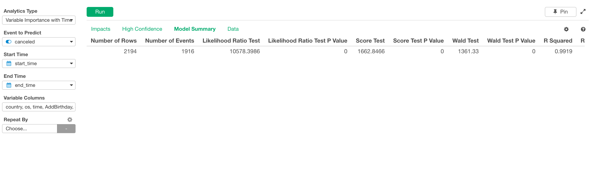
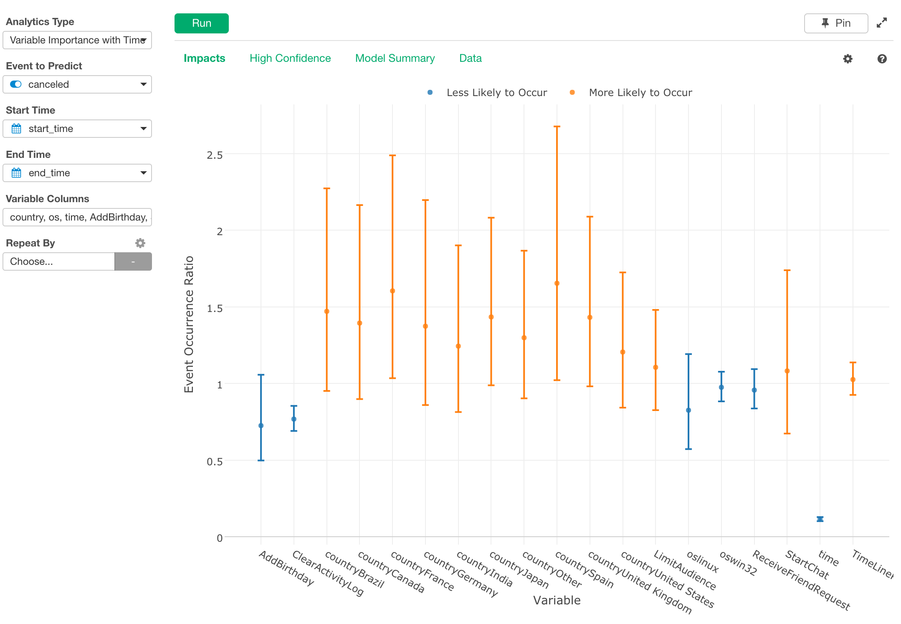
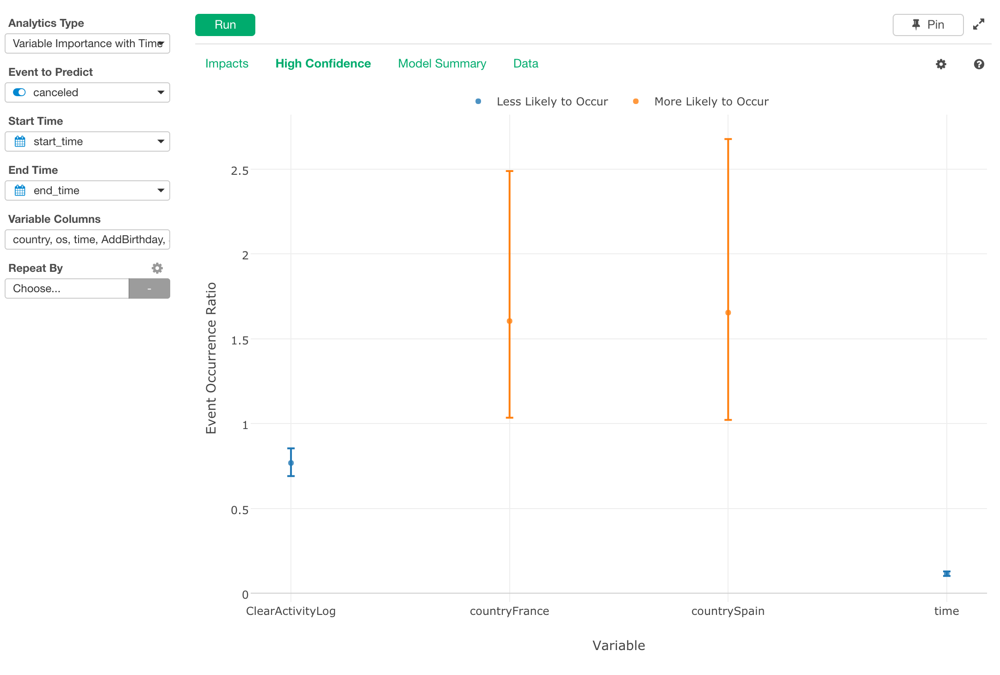
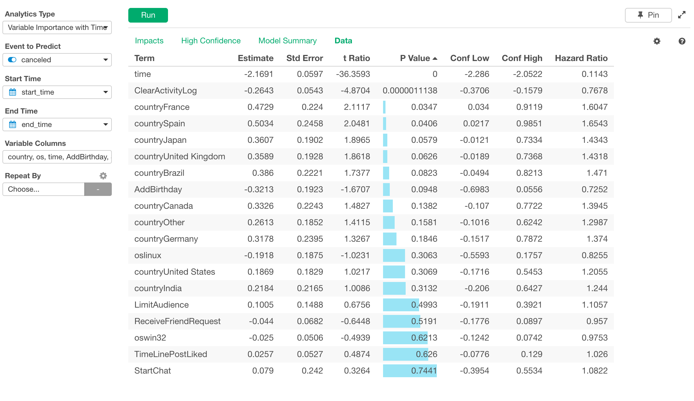

# Cox Regression Analytics

Builds Cox Regression Model, which predicts survival curves of subjects based on the specified predictor variables.

## Input Data
Input data should be a survival data. Each row should represent one observation (e.g. one user of a subscription service). It should have following columns.

* Start Time - A Date or POSIXct column with the beginning of the observation of the subject.
* End Time - A Date or POSIXct column with the end of the observation of the subject.
* Period By - Time unit used for survival curves.
* Event Status - A boolean or binary numeric value (can take value of 1 or 0) column with whether the event of interest (death) happened. When this column is true or 1, it means the event of interest happened to the subject at the End Time. If it is false or 0, it means we know that the event had not happened to the subject at least until the End Time, but we don't know what happened or will happen to the subject after that point.
* Predictor Variables - Variables that are used as the basis of the prediction of survival curves.

## Analytics Properties
  * Prediction
    * Survival Time for Prediction - Time for the survival rate plotted on the "Prediction" View.
    * Max # of Variables - Maximum number of variables to plot on the "Prediction" View or "Survival Curves" View.
  * Coefficients
    * P Value Threshold to be Significant - P value must be smaller than this value for coefficients to be considered statistically significant.
    * Sort Variables by Coefficients - If set to TRUE, variables displayed in Coefficients View are sorted by coefficients.
  * Data Preprocessing
    * Sample Data Size - Number of rows to sample before building Cox regression model.
    * Random Seed - Seed used to generate random numbers. Specify this value to always reproduce the same result.
    * Max # of Categories for Predictor Vars - If categorical predictor column has more categories than this number, less frequent categories are combined into 'Other' category.
    * Fill NA in End Time - How to fill NA in End Time column. One of the following.
      * Use Latest Date/Time - Use the latest date/time that appear in the data.
      * Use Today - Use today to fill NA.
      * Enter Manually  - Use manually entered value
    * Date to Fill NA in End Time - Date to fill NA in End Time column. This value takes effect when "Enter Manually" is selected for "Fill NA in End Time".
    * Remove Outliers from Predictor Variable(s) - If TRUE is selected, rows with predictor variables values that are outliers are removed in the preprocessing.
    * Type of Outlier Detection - IQR (1.5 IQR rule), Percentile, or Standard Deviation
    * Threshold - Threshold value to identify outliers. Default is 0.95 for Percentile, and 2 for Standard Deviation.

## How to Use This Feature
1. Click Analytics View tab.
2. If necessary, click "+" button on the left of existing Analytics tabs, to create a new Analytics.
3. Select Start Time column with "Start Time" column selector.
4. Select End Time column with "End Time" column selector.
5. Select unit of time (Day, Week...) with "Period By" dropdown.
6. Select Event Status column with "Event Status" column selector.
7. Select Variable Columns with Column Selector Dialog.

8. Select Predictor Variables.
9. Click Run button to run the analytics.
10. Select view type (explained below) by clicking view type link to see each type of generated visualization.

### "Summary" View
"Summary" View displays the quality of the Cox regression model created for this Variable Importance with Time Analytics.

- Likelihood Ratio Test - This value tells how well the model explains the data. The bigger is better.
- Likelihood Ratio Test P Value - If the value is small enough (for example 005), we can assume that it's better to consider the variable instead of ignoring it.

### "Prediction" View
"Prediction" View plots how the predicted event occurrence rate (1 - survival rate) varies as each variable changes. The event occurrence rates are predicted at the period specified in the properties. This is so called partial dependence plot.

### "Importance" View
"Importance" View displays importances of variables for the prediction of survival. Importances are calculated by permutation importance with Efron approximation as the cost function.

### "Survival Curves" View
"Survival Curves" View displays how the predicted survival curve varies as each variable changes.

### "Coefficients" View
"Coefficients" View displays parameter estimate and confidence interval information on scatter plot. Blue means "Less Likely to Occur" and Orange means "More Likely to Occur".

### "Coef. (Significant)" View
"Coef. (Significant)" View displays the variables whose both confidence interval edges are more than 1 (or less than 1). With this threshold, we can see only variables that have clear impact on the event.

### "Coef. Table" View

### "Collinearity" View
"Collinearity" View displays VIF (Variance Inflation Factor) of each predictor variables. VIF greater than 10 is commonly considered to be the indicator of problematic degree of multicollinearity.

### "Data" View
"Data" View displays prediction results on each subject in the data.

- Survival Time - Survival time of the subject.
- Linear Predictor - Linear predictor for the subject.
- Std Error - Standard error of the linear predictor.
- Residual - Martingale residual of the prediction.
- Survival Time for Prediction - Survival time used for the prediction of survival rate below. 
- Predicted Survival Rate - Predicted survival rate at the point of time above.

## R Package

The `Variable Importance with Time` uses [`survival`](https://cran.r-project.org/web/packages/survival/index.html) R Package under the hood.

## Exploratory R Package

For details about `survival` usage in Exploratory R Package, please refer to the [github repository](https://github.com/exploratory-io/exploratory_func/blob/master/R/build_coxph.R)
