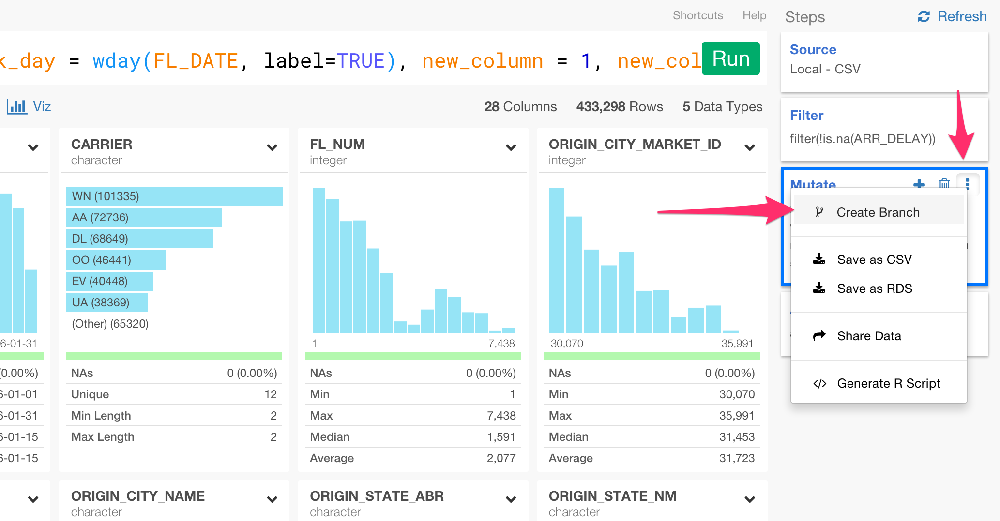
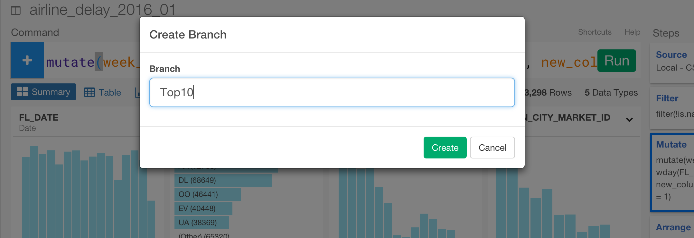
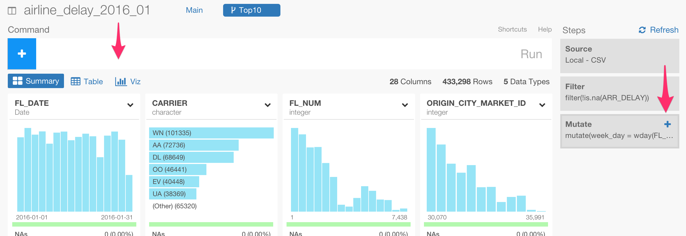
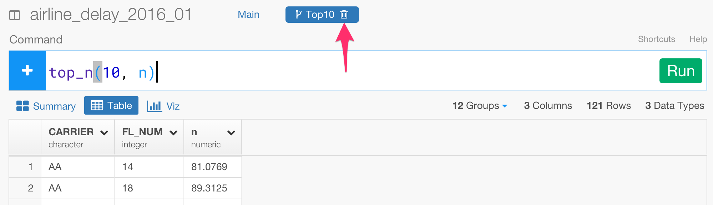
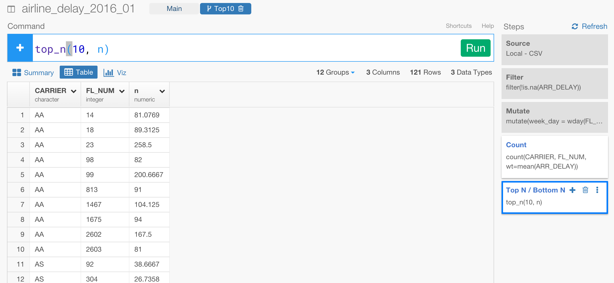
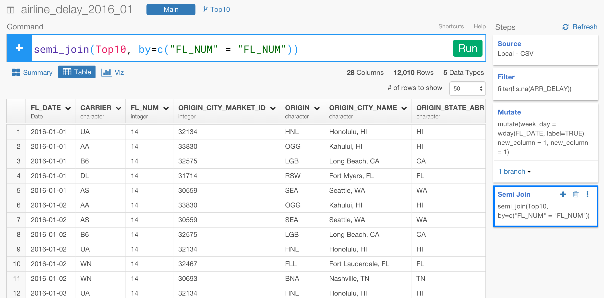
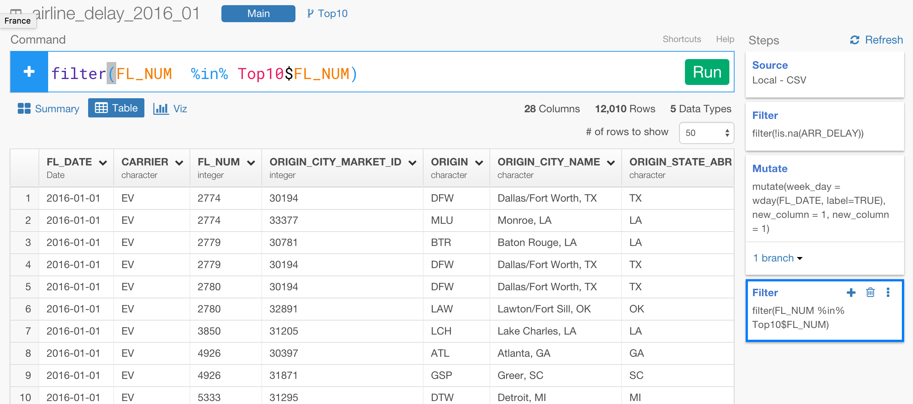

# Branch feature

‘Branch’ is similar to the ‘branch’ of source control management system like Git, if you are familiar with the source code management. You can create branches off of the main data frame to have different data wangling steps. All the branches share the same main data frame that they were branched off so any update on the data wangling steps in the main will be automatically reflected in all the branches. Branch can be used for aggregating the data, filtering with different conditions, running multiple experiments, building multiple models, etc.

The following blog posts talk about more detail and some use cases.

* [Introducing Branch for Running Multiple Experiments Quickly](https://blog.exploratory.io/introducing-branch-for-running-multiple-experiments-quickly-84352ce245b6#.iddruhpde)
* [Filtering Detail Data, not Aggregated, for Top10 Countries](https://blog.exploratory.io/filtering-detail-data-not-aggregated-for-top10-countries-33d5724d022f#.q35pduny2)

## Create Branch

You can click 'more (three dots)' menu in any data wrangling step at right hand side and select 'Create Branch' to create a branch.



You can type a branch name in a pop-up.



You can start adding your data wangling step by either clicking on the command input area or clicking on 'Plus' icon in the last Step box.



## Delete Branch

You can delete a branch by clicking on 'Trash' icon next to the branch name.



## Join with Branch / Filter with Branch

You can join the branch data to the main data frame or to other data frames. Let's say you have created a branch to filter the data to top 10 flights for each airline carrier based on their arrival delay time, and now you want to use this data to filter the detail data in the main. You can do with two ways. One is to use one of the 'Filter Join' commands, 'semi_join'. Another is to use the column name in 'filter' command with '%in%' operator.

Here's a Top 10 flights for each carrier in a branch 'Top10'.



### Use semi_join command to filter

```
semi_join(Top10, by=c("CARRIER" = "CARRIER", "FL_NUM" = "FL_NUM"))
```




### Use filter command to filter

```
filter(FL_NUM  %in% Top10$FL_NUM)
```


