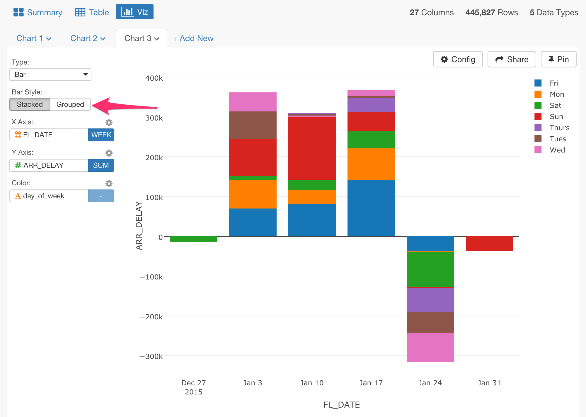

# Setting Color for Chart

You can assign a column to Color for most of the visualization types.

## Stack or Group Bar chart

For Bar chart, you can assign a column with discrete values (text column) to Color and make it a Stack or Group bar chart.

Switch between Stack Bar and Group Bar Charts.

## Multi-Series Line chart

For Line chart, you can assign a column with discrete values (text column) to make it a multiple series line chart.

## Switch the color palette

You can switch the color palette for Bar, Line, and Area charts.

1. Click the gear icon next to 'Color' label text and select one of the pre-defined ones from Color Palette dropdown menu.

## Customize the color palette

You can assign your preferred color to Bar, Line, and Area charts.

1. Click the gear icon next to 'Color' label text and select 'Custom' from Color Palette dropdown menu.
2. Type your preferred color in hex-code and use comma to separate the values.
