# Google Analytics Data

For the detail, take a look at this page.
https://developers.google.com/analytics/solutions/r-google-analytics#query

## Get Client ID and Client Secrete

Go to [Google Developers Console](https://console.developers.google.com/project)

Create a New Project and Open it

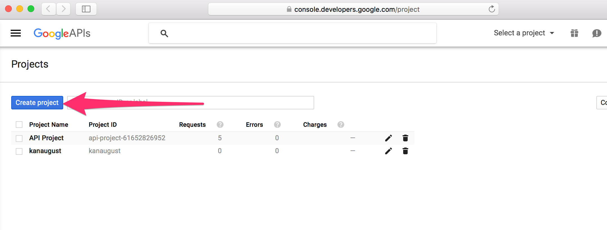


Make Analytics API enabled for your project

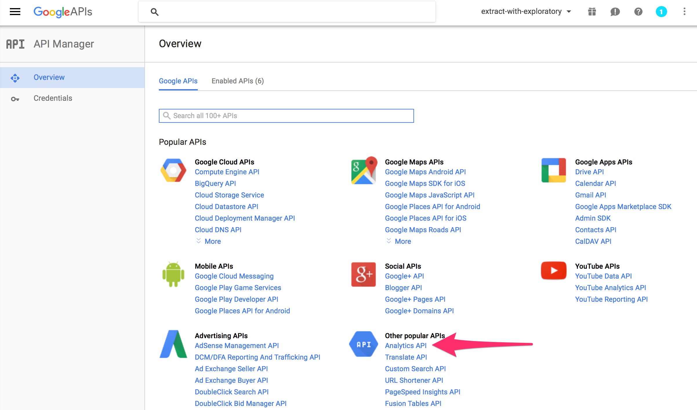

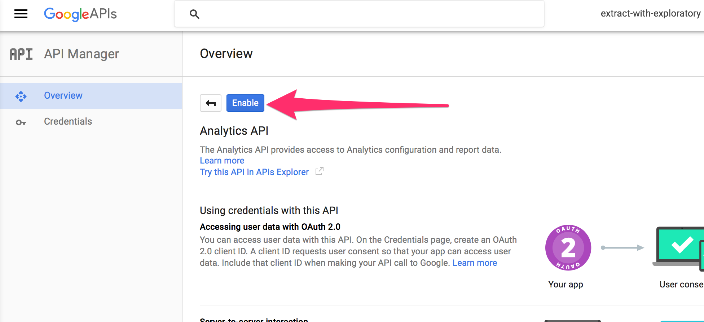

Go to Credentials

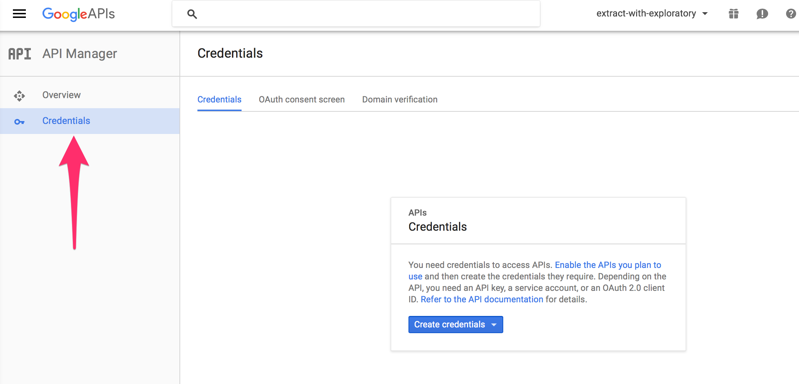

Create OAuth Client ID

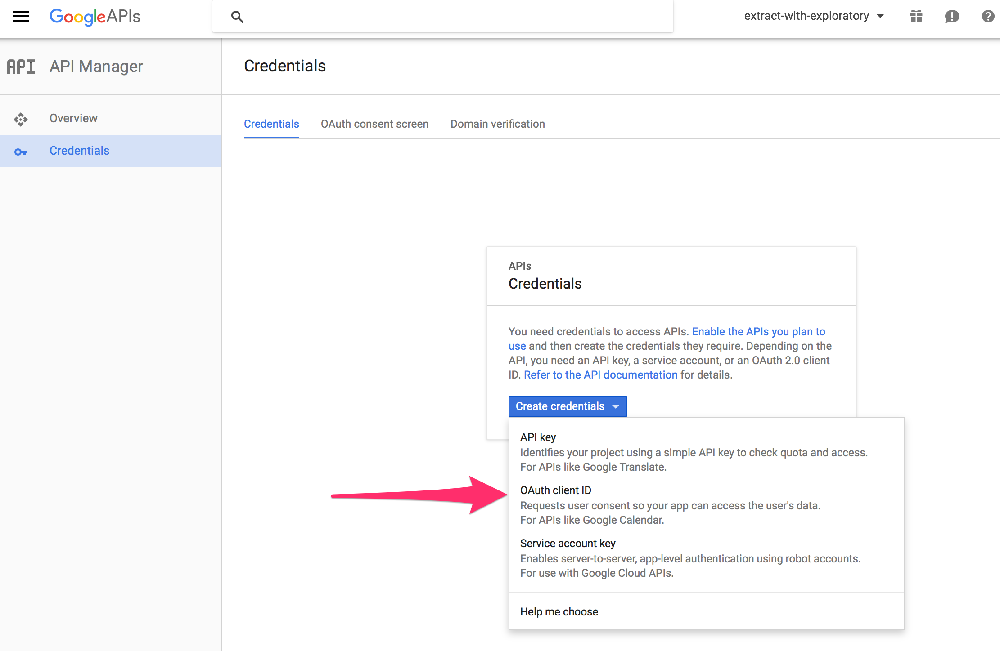

Set a product name for Consent Screen

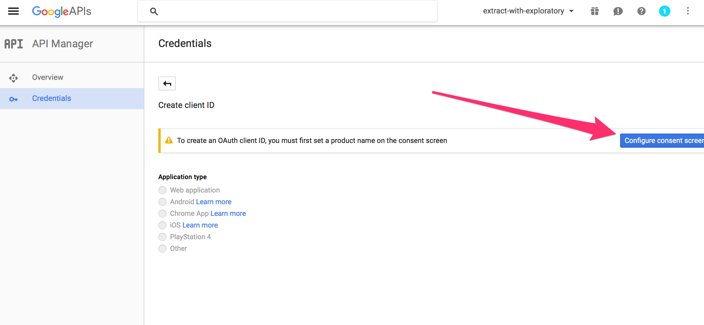

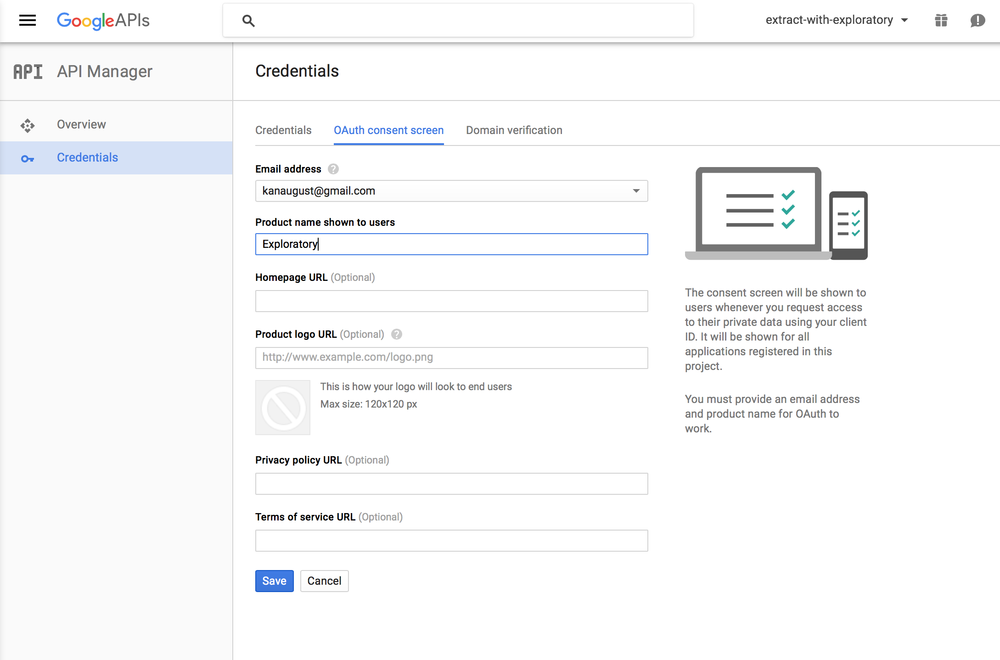

Select 'Other' for Application type and type any name for Name, and click 'Create' button

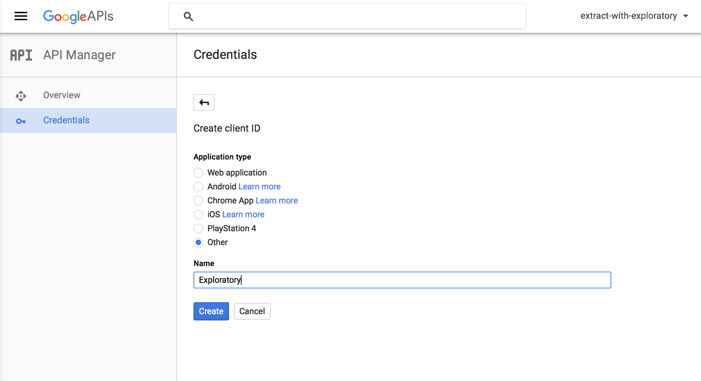

Now, you get Client ID and Client Secret.

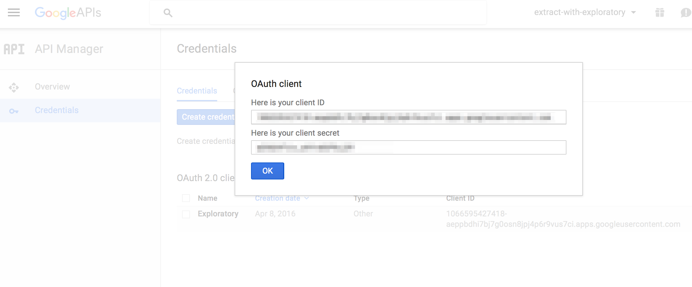

## Get Table ID (View ID)

Go to [Google Analytics web page](https://analytics.google.com).

Go to Admin page.

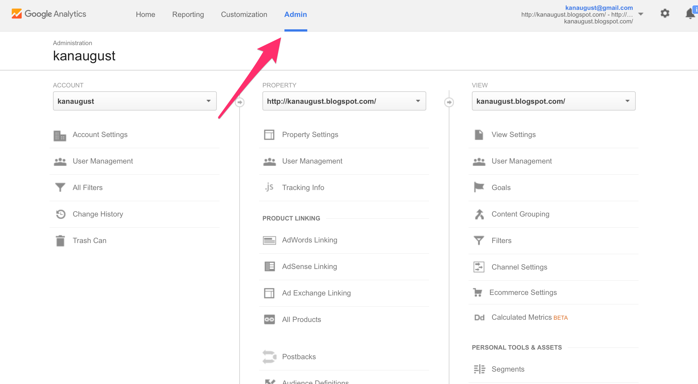

Go to View Setting for the view (web site) you're interested in.

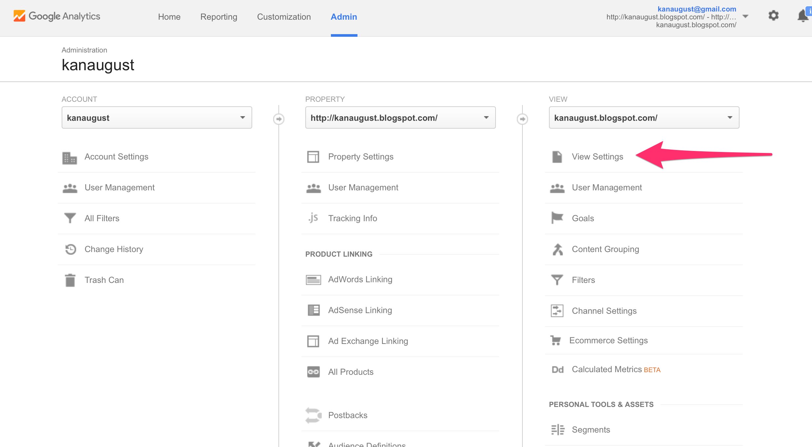

Now you can find View ID.
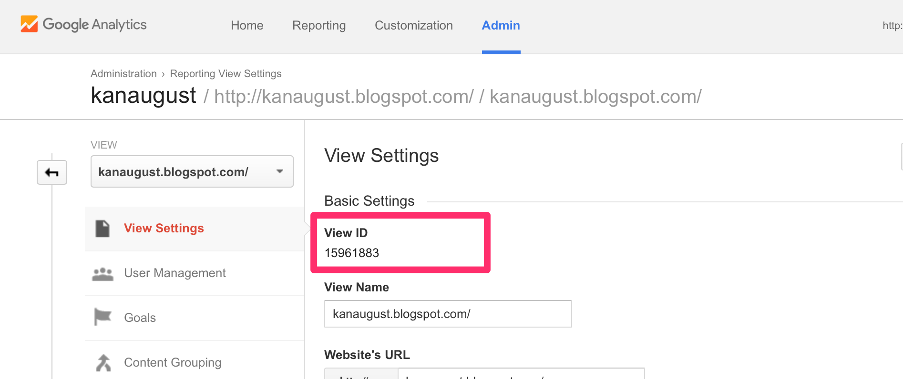

You'll need to use this id for 'Table ID' parameter.


## Decide which Dimensions and Measures you need for Google Analytics data

You can use [Google Analytics Query Explorer tool](https://ga-dev-tools.appspot.com/query-explorer/) to find the dimensions and measures you would be interesting.


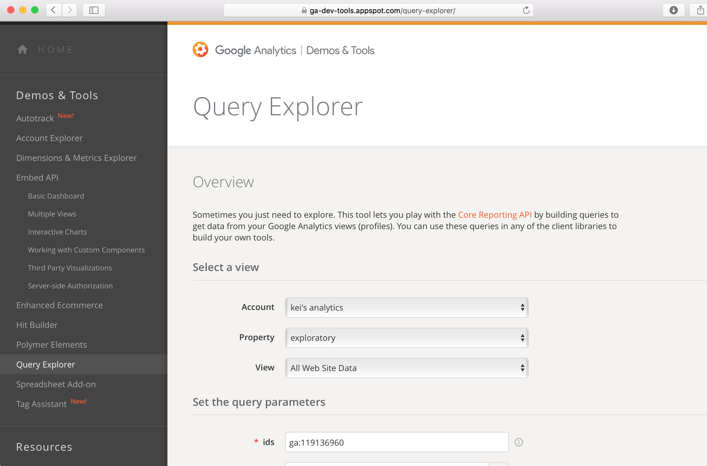

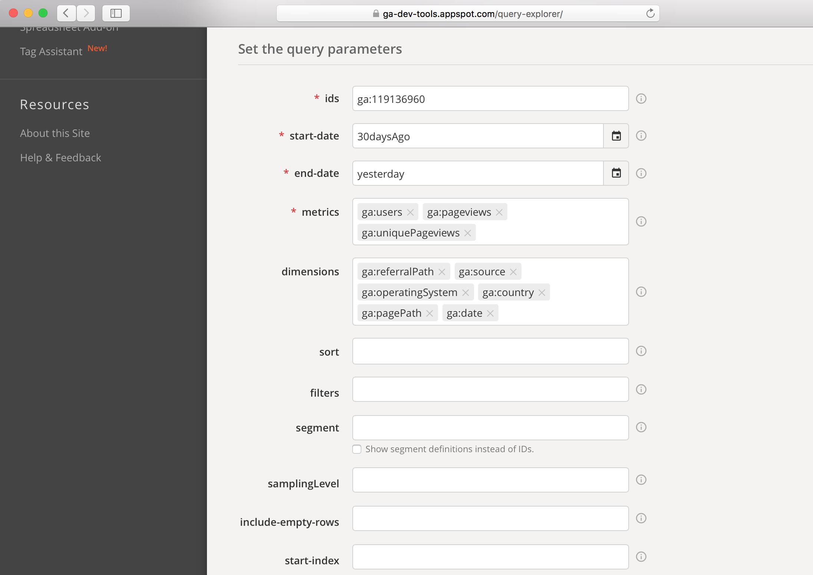

Take a look at [Query Parameter reference page](https://developers.google.com/analytics/devguides/reporting/core/v3/reference) for the detail about the query parameters.


## Write R custom script

```
require(RGoogleAnalytics)
  client.id <- <Your Client ID>
  client.secret <- <Your Client Secret>
  view.id <- <Your View ID>
  last.n.days <- 30

  token <- Auth(client.id, client.secret)
  # Save the token object for future sessions
  save(token,file="./token_file")
  ValidateToken(token)
  start_date <- as.character(today() - days(last.n.days))
  #end_date <- as.character(today() - days(1))
  end_date <- as.character(today())
  query.list <- Init(start.date = start_date,
                     end.date = end_date,
                     dimensions = "ga:date,ga:pagePath,ga:hour,ga:source, ga:country, ga:operatingSystem, ga:referralPath",
                     metrics = "ga:users, ga:uniquePageviews,ga:pageviews",
                     max.results = 10000,
                     sort = "-ga:date",
                     table.id = paste0("ga:", view.id))

  ga.query <- QueryBuilder(query.list)
  ga.data <- GetReportData(ga.query, token)
  ga.data

```
