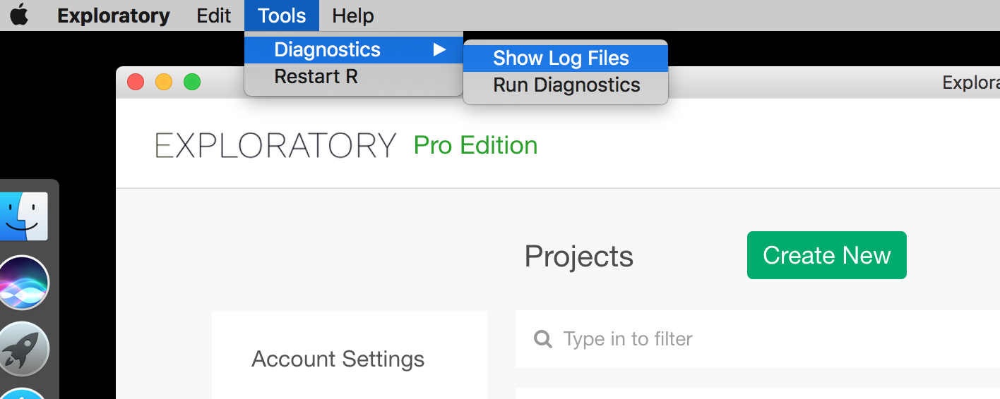
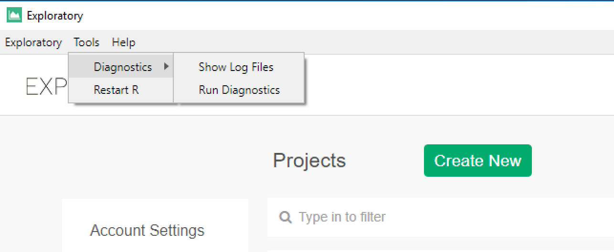

# Log file for debugging

When you see some issues on Exploratory, you can check log files which are available at following location. And you can send the log files to Exploratory Support team (support@exploratory.io) so that we can diagnostic the issue.

`<Your Home Directory>/.exploratory/log`

You can access to log file from Exploratory Desktop Tool Bar Menu.

On Mac, Tools -> Diagnostics -> Show Log Files.

On Windows, Tools -> Diagnostics -> Show Log Files.

