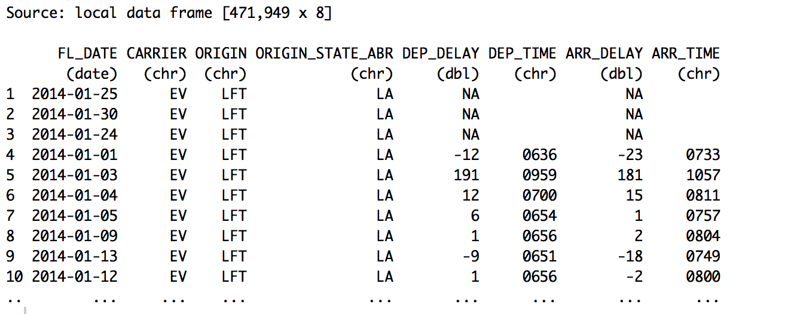

# Select

Select columns with select() function. 

## Basic

Select <column(s)> by column names.

**Syntax**

select(```<column(s)>```,...)  

**Example**

```
select(FL_DATE, CARRIER, ORIGIN, ORIGIN_STATE_ABR, DEP_DELAY, DEP_TIME, ARR_DELAY, ARR_TIME)
```



## Drop

Drop <column(s)> by column names using '-' (minus) sign.

**Syntax**

select(-```<column(s)>```,...)  

**Example**

```
select(-CARRIER_DELAY, -WEATHER_DELAY, -`NA`)
```


## starts_with

Returns the column names that starts with a given text.

**Syntax**

select(starts_with(```<text>```, ignore.case = ```<logical>```))  

**Arguments**
- ignore.case - The default is TRUE. Decides whether it should ignore the text case (uppercase/lowercase) or not.


**Example**

```
select(-starts_with("user."), -starts_with("milestone."), -starts_with("pull_"))
```

```
select(starts_with("X", ignore.case = TRUE))
```

## ends_with

Returns the column names that ends with a given text.

**Syntax**

select(ends_with(```<text>```, ignore.case = ```<logical>```)) 

**Arguments**
- ignore.case - The default is TRUE. Decides whether it should ignore the text case (uppercase/lowercase) or not.

**Example**

```
select(-ends_with("url"))
```

## contains

Returns the column names that contain a given text.

**Syntax**

select(contains(```<text>```, ignore.case = ```<logical>```))  

**Arguments**
- ignore.case - The default is TRUE. Decides whether it should ignore the text case (uppercase/lowercase) or not.


**Example**

```
select(-contains("user."), -contains("milestone."), -contains("pull_"))
```

## matches

Returns the column names that matches with a given text.

**Syntax**

select(matches(```<text>```, ignore.case = ```<logical>```))  

**Arguments**

- ignore.case - The default is TRUE. Decides whether it should ignore the text case (uppercase/lowercase) or not.


**Example**

Select only the columns whose names contains digits (regular expression)

```
select(matches("[:digit:]+", ignore.case = TRUE))  
```

## num_range

Returns the column names that starts with a given text with numbers that are within a given range. It's useful especially when you have column names like X1, X2, X3, X4, etc.

**Syntax**

select(num_range(```<text>```, ```<start_num>:<end_num>```))  


**Example**

```
select(num_range("X", 1:6))
```

## one_of

Returns the column names that are one of the given names.

**Syntax**
select(one_of(```<text1>```, ```<text2>```, ...))  


**Example**

select(one_of("x", "y", "z”))  
__  


## everything

Returns all the column names. It's useful when you want to have particular column(s) first before everything else.  

**Syntax**

select(```<column>```, everything())  


**Example**

select(X, everything())  
_Reorder columns: keep the column “X" in the front_  


## Select only numeric columns 

```
select(which(sapply(., is.numeric)))
```