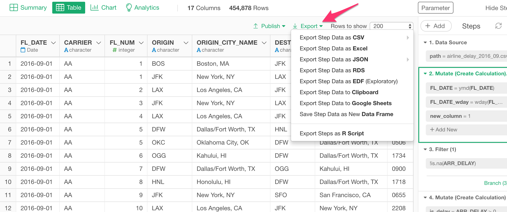

# Export Data

You can click the "Export" link anytime to export your data in various formats.

## Standard Options

Following options are always available.

#### Export Data as CSV

You can export your data to a CSV file. You can choose one of the separator characters from following.

* Comma (,)
* Space ( )
* Semicolon (;)
* Dash (-)
* Tab (  )

#### Export Data as JSON

You can export your data to a JSON file. You can choose one of the formats from following.

* Rows
* Columns
* Values

#### Export Data as RDS

You can export your data to an RDS (R binary data format) file.

#### Export Data as EDF

You can export your data to an EDF (Exploratory Data Format) file. This EDF file includes not only the final data output but also the data wrangling steps to reproduce the data. This means that you can import it in another project and all the steps that would produce the data will be reproduced and shown at the right hand side. This would be useful when others want to not only see the data but also want to understand how the data wrangling has been done and want to update the steps.

#### Export Data to Clipboard

You can export your data to the Clipboard.

#### Export Data as Google Sheets

You can export your data to the Google Sheets.

#### Export Steps as R Script

You can export your reproducible steps as an R Script file.

If you want to create an environment on a different machine (Windows or Mac) where you want to run this exported R script as a standalone, you can follow the instruction in [this document](https://exploratory.io/note/hideaki/6838376453273360). 

## Chart Options

In addition to the standard options, if you are in the chart view, you have chart specific options depending on the chart type.

#### Export Chart as PNG
You can export your chart to a PNG file. It is available for any chart types except Pivot and Table.

#### Export Chart as SVG
You can export your chart to an SVG file. It is available for any chart types except Map, Pivot and Table.

#### Export Chart as EDF
You can export your chart and data to an EDF (Exploratory Data Format) file. It is available for any chart types. Take a look at [Export as EDF](/viz/save-as-edf.html) for more details.

## Pivot Options

In addition to the standard options, if you are in a chart view and viewing a Pivot Table, you have following Pivot Table specific options.

#### Export Pivot Table as EDF
You can export your Pivot Table and data to an EDF (Exploratory Data Format) file.

#### Export Pivot Table as CSV
You can export your Pivot Table to an CSV file. You can choose one of the separator characters from following.

* Comma (,)
* Space ( )
* Semicolon (;)
* Dash (-)
* Tab (  )

#### Export Pivot Table as JSON

You can export your Pivot Table to a JSON file. You can choose one of the formats from following.

* Rows
* Columns
* Values

#### Export Pivot Table to Clipboard
You can export your Pivot Table to the Clipboard.
