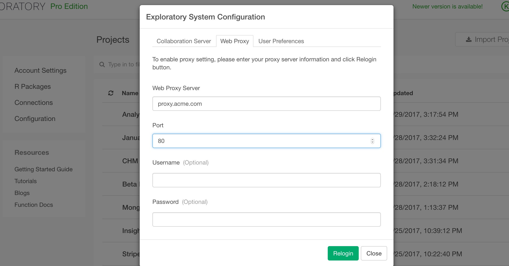

# FAQ - Frequently Asked Questions

## I have very sensitive data. Is my data safe?

Any data you import into Exploratory Desktop always stays on your PC and never leave your PC unless you explicitly publish (share) it to Exploratory Cloud (exploratory.io). If you decided to publish the data to Exploratory Cloud for sharing or scheduling, you can share it in a private way so that so that only you and others you have invited can view it. The data is also stored in encrypted. Please take a look at our [Privacy Policy](https://exploratory.io/privacy/) for more details.

## Where exactly my data is stored after importing?

All the data you import into Exploratory Desktop is saved as a binary form (R's Rdata format) inside your repository, which is located under '<your_home_directory>/.exploratory' on your PC.

## What happens when I change my subscription plan periods between Yearly and Monthly?

If you change the subscription plan period from Monthly to Yearly, the plan will start from the date you update through the next 12 month periods. If you change it from Yearly to Monthly, then we’ll refund you the amount for the months that have not been used yet.

## What happens when I upgrade or downgrade my subscription plan between Starter, Personal and Pro?

If you are on Monthly plan, then you will be charged with the new price from the next month. If you are on Yearly plan, then we will refund you for the difference when you downgrade, say from Pro to Personal, or we will charge you an extra for the difference when you upgrade, say from Personal to Pro.

## How can I cancel my plan?

You can cancel the plan anytime from your account page with just a click of a button. If you have subscribed Yearly subscription plan, then we will refund you for the amount of the remaining months.

## I'm currently a student at my school, but I have mistakenly started a trial for non Community plan. How can I fix?

You can cancel the plan first, then click ‘Upgrade’ button at your account page. You will see ‘Community’ option available this time, and you can select it and fill the forms to apply for Community plan.

## How can I share my insights with others privately?

You can invite others to view your insights (Data, Chart, or Note) privately by email addresses. They will receive an invitation email, and they can click the link to open your insights at Exploratory Cloud. If they don’t have the accounts created yet, they will be asked to create free accounts before opening your insights. They don’t need to subscribe any plan as long as they just want to view the shared insights. If they like to use Exploratory Desktop to customize the insights or create new ones, then they will need to subscribe one of the plans at this point.

## How many users can I share my insights (Chart / Data / Note)?

If you like to share only the named users, which means they will need to have their accounts created at Exploratory Cloud and sign in first, you can share as many users as your plan supports. If you like to share with anybody without asking them to create the accounts, then you could share a uniquely generated URL for each insight with them. This is a convenient way to share with a mass audience, though this means anybody happens to have this URL can open the insights. There is no limitation of how many people can access to your insights with this URL share option.

You can also share your insights publicly with a unlimited number of people regardless of the plan you subscribe.

## How can I report issues, bugs, or enhancement requests?

We have a [community page](https://community.exploratory.io) to raise any questions and suggestions or report product issues. If you need an immediate help feel free to contact [support@exploratory.io](mailto:support@exploratory.io).

## What is the best way to keep myself updated with the news?

Please follow [@ExploratoryData](https://twitter.com/ExploratoryData) at Twitter or subscribe our blog: http://blog.exploratory.io .

## What platforms are supported?

There are MacOS and Windows versions available at our download page.

## Is there a server version of Exploratory Desktop?

Yes! We have a docker image of Exploratory Web Server and Exploratory Collaboration Server for beta.

**Exploratory Web Server** is a server version of Exploratory Desktop. Users can access to Exploratory through Web Browsers. This would be great when you need to work with large data sets that won't fit into your PC's memory or you have your organization's policy that prohibits an access to the data sources from your PC directly.

**Exploratory Collaboration Server** is a server version of Exploratory.io that you can install on your server or cloud services like AWS EC2. You can share your data, charts, and notes through this collaboration server inside your firewall.

Both them are available through our support. Please contact support@exploratory.io.

## Is there licensing or pricing information available?

Yes, here is [the pricing page](https://exploratory.io/pricing).

Also, here are the direct links to:

- [End User License Agreement](https://exploratory.io/eula)
- [Terms & Conditions](https://exploratory.io/terms)
- [Privacy Statement](https://exploratory.io/privacy)


## I'm having a network connection issue, what should I do?

Exploratory Desktop requires an internet connection for authenticating the users, downloading the required software like Git and R if you don't have them installed yet, accessing to remote data sources like Google Analytics, Web Scraping, and sharing Data, Chart, and Note.

If you use a proxy server at your organizations to connect to the internet, as default it automatically tries to detect the proxy server and connect through the server. This should work for most of the times, but unfortunately it doesn't sometimes. In such cases you can manually add your proxy server information in Configuration dialog UI. Check <a target="_target" href="https://exploratory.io/note/2ac8ae888097/How-to-setup-Web-Proxy-on-your-Exploratory-Dekstop-xFn0fip7Zd">this note</a> for setup details.



If you are still having the network issue please contact at support@exploratory.io .

## Why are you asking my password for OS X at the initial installation time?

If you don't have R and/or Git previously installed you will be asked to enter your Mac OS admin username and password. This is because R and Git installation requires the system administrator's privilege. We don't see or capture this information, it's completely done by R and Git installers and that's outside of Exploratory. ;)

## I have already installed R (rstats) 3.4, are you going to install another R ?

No. we check the R version that is installed on your pc, but as long as it is 3.4 or grater then Exploratory will use that one, without installing another R.

## I don't have R installed, what are you going to do ?

Just download Exploratory Desktop by simply clicking on Download button on the download page. It will install R 3.4 as part of the initial setup. For Mac, you will be asked to enter your Mac OS admin username and password, this is because R installation would require the system administrator's privilege. We don't capture this information, it's completely done by R installer itself. For Windows, you need to perform this initial step with a user account with Admin privilege.

## I have installed R with Homebrew on Mac OS X, does that work ?

Unfortunately the configuration of R installed with Homebrew is not supported currently. Exploratory Desktop requires a set of R packages to make your data wrangling and analysis more efficient from the day one. To install those packages we use the binary versions of the packages, which assume that R is installed with the standard installer with '.pkg' from CRAN. If you would like to use Exploratory Desktop, the workaround is to uninstall R with Homebrew with the command below, then restart Exploratory Desktop, which will install R 3.4 with the standard installer from CRAN.

```
> brew uninstall r
```

## I'm on Windows and getting error stating "Could not install R" or "Could not install Git".

If you change the installation path for R and Git during the installation you will see these errors. Please select the locations where R and Git are installed respectively in the pop-up UI and click OK. This will register the custom R and Git installed location and use them moving forward.

## I can't open a project. I'm seeing a loading icon when I try to create a new project.

One possible reason for this is, your home directory path on your PC has a space(s). If that's the case please perform the following steps to workaround it.

1. Create or pick a directory to install R packages for Exploratory, which does not have space in the path. Let’s say your home directory is '/Volumes/Another HD/kanaugust' and you created ‘/Users/KanAugust’ as a directory to install the R packages for Exploratory.
2. Open ‘/Volumes/Another HD/kanaugust/.exploratory/userconf.json’ with text editor.
3. Add “r_lib_path” attribute that specifies the directory you picked.
Your userconf.json should look something like the following.

{
    "user": "kanaugust",
    "r_lib_path": “/Users/KanAugust”
}

4. Restart Exploratory
5. Follow the setup step.

This will install the R packages to the specified location. After that, you should be able to open the project. Otherwise, please contact support@exploratory.io .

## What version of Git is required?

The latest Exploratory Desktop requires Git 2.0.0 or greater. Unless it detects an older version of Git it won't try to install Git. Exploratory Desktop assumes that Git is installed under /usr/bin or /usr/local/bin, so for any reason if your Git is installed somewhere else then it might try to install Git because it thinks that Git is not there. If that's the case and you don't want another Git to be installed please contact support@exploratory.io .

## What R packages are you installing and why?

Exploratory Desktop uses a number of amazing R packages, most of which are coming from '[tidyverse](http://tidyverse.org/)' - a set of R packages to make your data wrangling and analysis more effective and fun. You can see a list of the R packages to be installed in the initial setup UI by clicking a blue text 'See a list of software and libraries to be installed.' or select 'View Licenses' from Toolbar menu / Help. These are the packages that we use to make your data access and data analysis more effective.

## Where are you installing R packages?

Exploratory Desktop installs them into Exploratory's repository, which is different from the regular R installation location. This is to avoid any conflict with your own R environment if you happen to have.

## Can I add my preferred R packages?

Yes! Here's an [introduction](https://blog.exploratory.io/installing-r-packages-from-cran-in-exploratory-desktop-36eae50cffb0#.u2iee7i5j) on how to install and use R packages from CRAN.

## Can I change my username?

We are not currently supporting it, but we will in future releases. If you need it to be changed now, please contact support@exploratory.io, we can manually change it at the server for you.

## Can I change the location of the repository?

Yes. Here's an [instruction](https://docs.exploratory.io/howto/set_exploratory_home.html) on how to do that.
