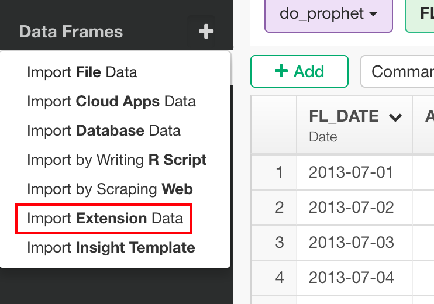
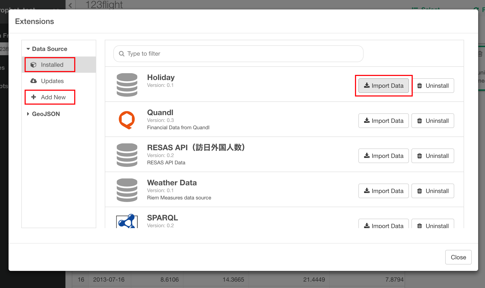
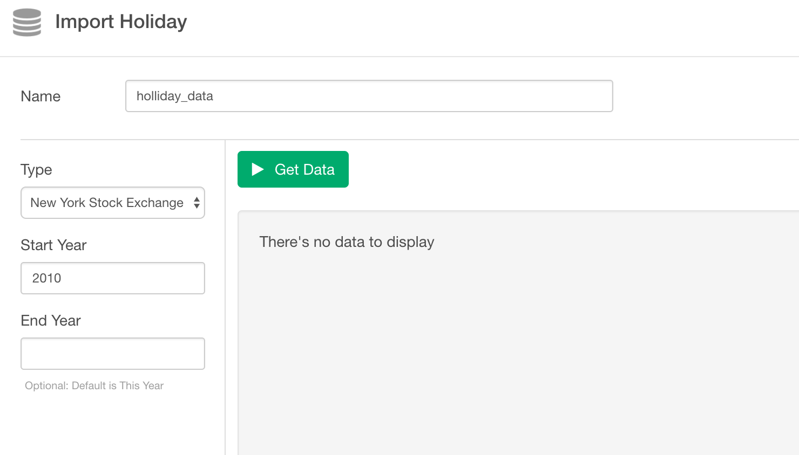
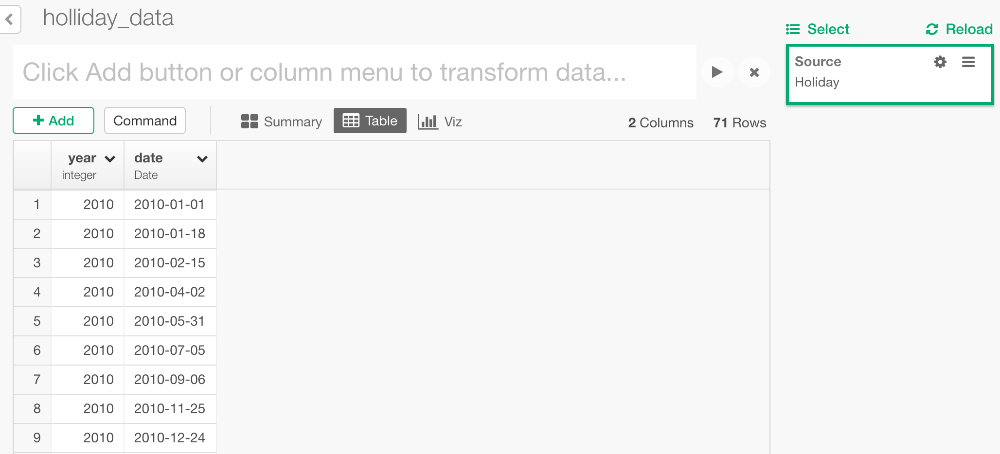
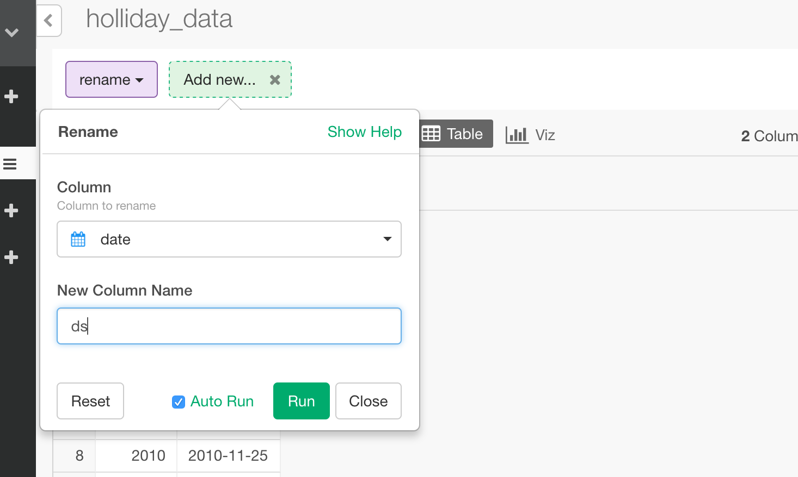
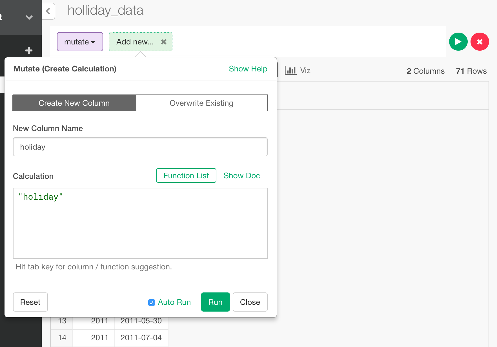
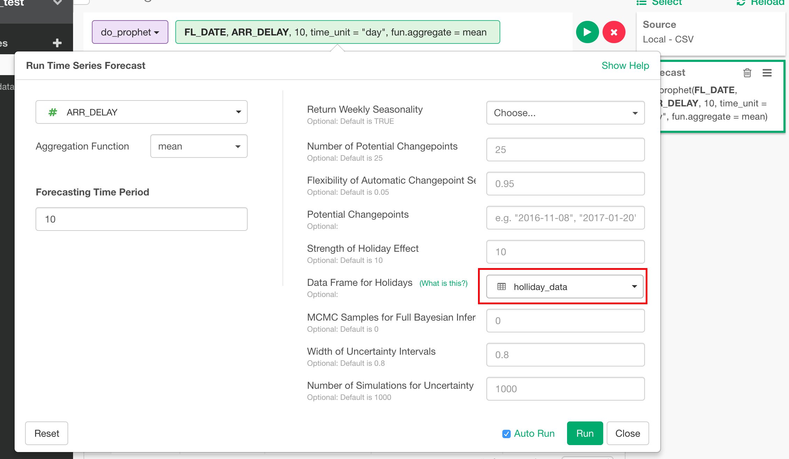

# How to Set Holidays Data for Time Series Forecast

In this page, I will introduce how to set holidays data for time series forecasting.

## Import Holiday Data
We provide a data extension to get bank holidays, so let's import data from it.

It can be used from this "Import Extension Data" dropdown menu.

If you haven't installed the extension yet, please add it from "Add New" button. Then, the plugin is added to "Installed" and you can import data from "Import Data".

You can choose holiday type, start year and end year.

If you import the data, it will be like this.

## Set Up Data Format
do_prophet, which is the function for time series forecast, expect the name of the date column to be "ds", so let's rename it.

And it also need "holiday" column, so let's create it.

## Use it from Time Series Forecast
Then, you can choose this data frame from Time Series Forecast dialog and the dates in the data frame are recognized as holidays.

