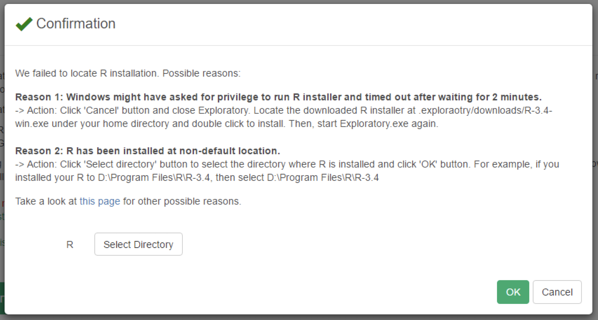

# Possible Reasons for Installation Errors

## Starting up Exploratory.exe from TCC console
Starting up Exploratory.exe from TCC console is known to cause failure in running R, resulting in a dialog that looks like following to show up.

Please start Exploratory by double-clicking icon, or from default windows CMD console.
