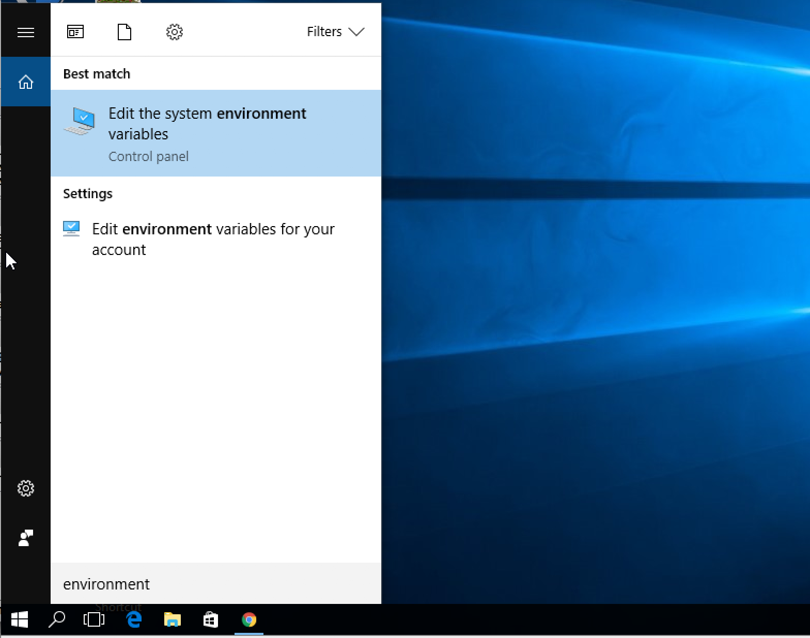
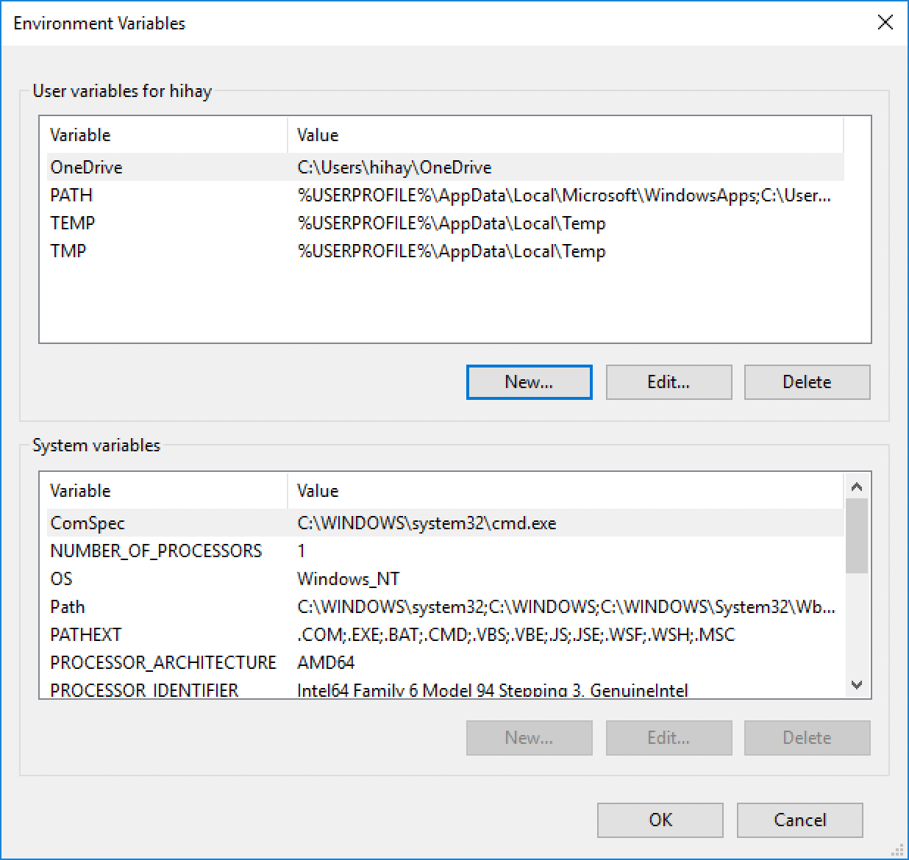
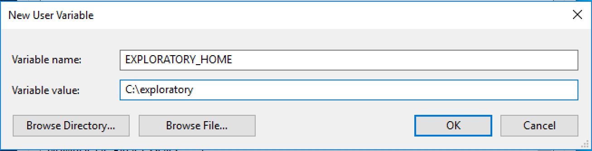
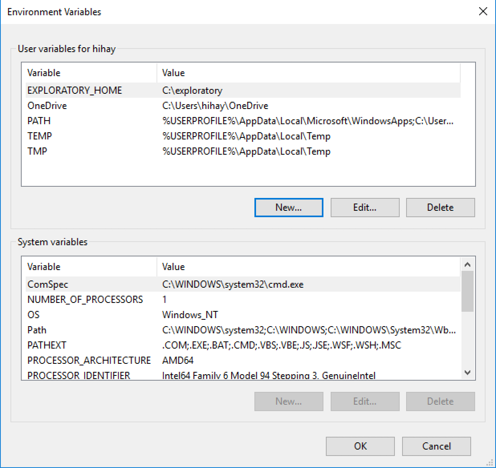

# レポジトリの場所の変更

Exploratoryは、ユーザーのホームディレクトリの下の .exploratory ディレクトリの中に、レポジトリを作成します。
.exploratoryディレクトリは、インストール時に作成されますが、ホームディレクトリの名前が空白やマルチバイト文字を含む場合には、作成に失敗することがあります。
ホームディレクトリの名前が空白やマルチバイト文字を含むことが原因でインストールに失敗しているときには、他の空白やマルチバイト文字を含まないディレクトリを
リポジトリ用ディレクトリとして指定することによって問題を回避できます。
EXPLORATORY_HOME環境変数を設定することによって、ホームディレクトリの下の .exploratory ディレクトリの代わりに、指定されたディレクトリがレポジトリとして使用されるようになります。

## WindowsでEXPLORATORY_HOMEを設定する方法

1. Create a new directory for repository. Let's say we created "C:\exploratory" here as an example.

2. Start typing "environment" into Windows's search box, and you will see search result that says "Edit environment variables for your account". Click to open it.

  

3. "Environment Variables" dialog opens.

  

4. Click "New..." to create a new environment variable.

  

5. Set "EXPLORATORY_HOME" to Variable name, "C:\exploratory" to Variable value. Click "OK".

  

6. As you can see, EXPLORATORY_HOME variable is set.

7. Logout from Windows, and Log back in.

8. Install Exploratory by clicking Exploratory.exe. As Exploratory is installed, it uses "C:\exploratory" directory instead of .exploratory directory under home directory.

## Steps to set up EXPLORATORY_HOME environment variable on Mac

1. Open a shell and create a new directory for repository. Let's say we create "/exploratory" here as an example.
```
sudo mkdir /exploratory
```

2. Set ownership of the directory so that Exploratory run by you can read/write in the directory. Let's say your Mac OS username is john here.
```
sudo chown john /exploratory
```

3. Create `environment.plist` under `~/Library/LaunchAgents/` with the following content. (Replace "/exploratory" with the directory you are using for repository.)
```
<?xml version="1.0" encoding="UTF-8"?>
<!DOCTYPE plist PUBLIC "-//Apple//DTD PLIST 1.0//EN" "http://www.apple.com/DTDs/PropertyList-1.0.dtd">
<plist version="1.0">
<dict>
  <key>Label</key>
  <string>my.startup</string>
  <key>ProgramArguments</key>
  <array>
    <string>sh</string>
    <string>-c</string>
    <string>
    launchctl setenv EXPLORATORY_HOME /exploratory
    </string>
  </array>
  <key>RunAtLoad</key>
  <true/>
</dict>
</plist>
```

4. Logout and Log back in to your Mac OS. This will enable EXPLORATORY_HOME environment variable we set at the previous step.

5. Start Exploratory, and it will start using /exploratory as the repository.
