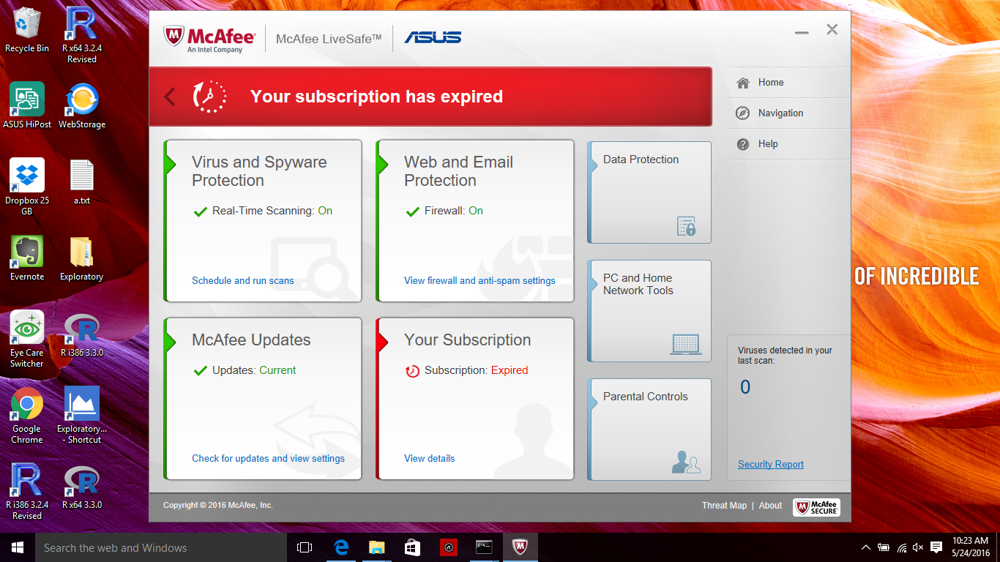
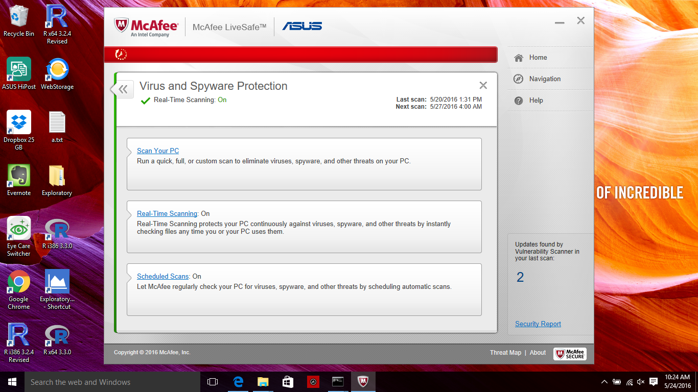
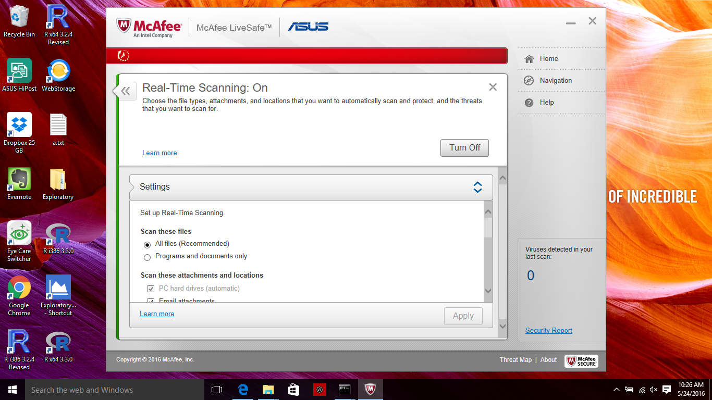
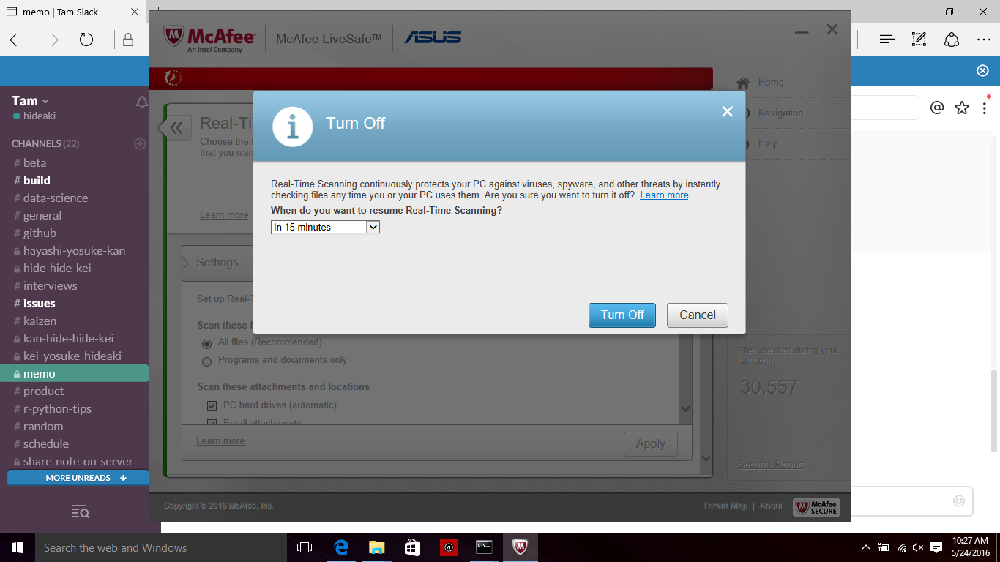

# How to disable McAfee Real Time Virus Scan temporarily for allowing Exploratory to install R packages.

McAfee Real Time Virus Scan prevents the required R packages from being installed correctly. Please disable the real time scanning temporarily during the installation of the R packages with Exploratory Desktop.

## Steps to disable it temporarily

#### 1. Open McAfee Windows

#### 2. Click the panel for “Virus and Spyware Protections"

#### 3. Click the panel for “Real-Time Scanning”

#### 4. Click Turn Off button

#### 5. Click Turn Off button on the dialog

Now 'Real-Time' scanning should be turned off. You can click on 'Start Setup' button in Exploratory Desktop's setup UI or restart Exploratory Desktop, which will show you the setup UI.
