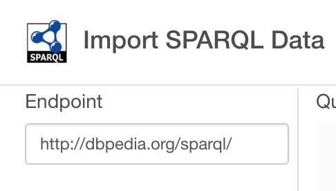
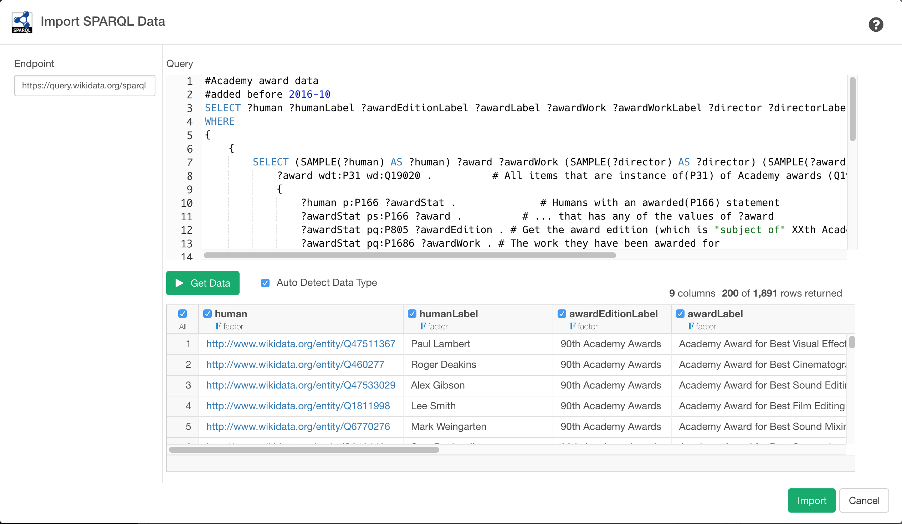

# SPARQL Data Import

Allows to get data with SPARQL which is a RDF query language and protocol produced by the W3C RDF Data Access Working Group (DAWG)

## 1. Parameters

### 1.1 Endpoint

You can find list of SPARQL endpoint examples from [this site](https://www.w3.org/wiki/SparqlEndpoints).


For example, if you want to get data from [DBPedia](https://wiki.dbpedia.org/) you can use `http://dbpedia.org/sparql/` as your Endpoint URL.




### 1.2 Query

You can write a SPARQL Query in Query field.
For example, if you want to query Universities in United States, you can write a query like this.

```sql
PREFIX dbpedia-owl: <http://dbpedia.org/ontology/>
PREFIX dbpedia: <http://dbpedia.org/resource/>
PREFIX dbpprop: <http://dbpedia.org/property/>

SELECT ?label ?homepage ?lat ?long ?endowment
WHERE {
  ?school a <http://schema.org/CollegeOrUniversity> 
  { ?school dbpedia-owl:country dbpedia:United_States }
  UNION
  { ?school dbpprop:country dbpedia:United_States }
  UNION 
  { ?school dbpprop:country "U.S."@en }
  UNION 
  { ?school dbpprop:country "United States"@en }

  OPTIONAL { ?school rdfs:label ?label .
             FILTER (LANGMATCHES(LANG(?label), 'en')) }
  OPTIONAL { ?school foaf:homepage ?homepage }
  OPTIONAL { ?school geo:lat ?lat ; geo:long ?long }
  OPTIONAL { ?school dbpedia-owl:endowment ?endowment }
}
```

You can find a list of SPARQL query example in [this site](https://www.wikidata.org/wiki/Wikidata:SPARQL_query_service/queries/examples)

As for SPARQL syntax, please refer [this site](https://www.w3.org/TR/sparql11-overview/)

## 2. Import

Once you confirmed the query result, click `Import` button to import the data as a data frame in Exploratory.

