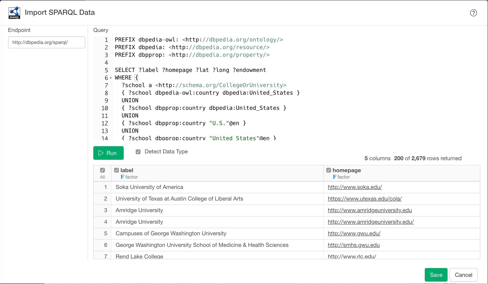

# SPARQL Data Import

Allows to get data with SPARQL which is a RDF query language and protocol produced by the W3C RDF Data Access Working Group (DAWG)

## 1. Parameters

### 1.1 Endpoint

You can find list of SPARQL endpoint examples from [this site](https://www.w3.org/wiki/SparqlEndpoints).

From the list, copy an endpoint URL and paste it to endpoint Input Field. Or type in your endpoint URL.

For example, if you want to get data from [Wikidata](https://www.wikidata.org/wiki/Wikidata:Main_Page) you can use `https://query.wikidata.org/sparql` as your Endpoint URL.


### 1.2 Query

You can write a SPARQL Query in Query field.
For example, if you want to query Academy award data, you can write a query like this.

```sql
#Academy award data
#added before 2016-10
SELECT ?human ?humanLabel ?awardEditionLabel ?awardLabel ?awardWork ?awardWorkLabel ?director ?directorLabel ?time
WHERE
{
	{
		SELECT (SAMPLE(?human) AS ?human) ?award ?awardWork (SAMPLE(?director) AS ?director) (SAMPLE(?awardEdition) AS ?awardEdition) (SAMPLE(?time) AS ?time) WHERE {
			?award wdt:P31 wd:Q19020 .			# All items that are instance of(P31) of Academy awards (Q19020)
			{
				?human p:P166 ?awardStat .              # Humans with an awarded(P166) statement
				?awardStat ps:P166 ?award .     	 # ... that has any of the values of ?award
				?awardStat pq:P805 ?awardEdition . # Get the award edition (which is "subject of" XXth Academy Awards)
				?awardStat pq:P1686 ?awardWork . # The work they have been awarded for
				?human wdt:P31 wd:Q5 . 				# Humans
			} UNION {
				?awardWork wdt:P31 wd:Q11424 . # Films
				?awardWork p:P166 ?awardStat . # ... with an awarded(P166) statement
				?awardStat ps:P166 ?award .     	 # ... that has any of the values of ?award
				?awardStat pq:P805 ?awardEdition . # Get the award edition (which is "subject of" XXth Academy Awards)
			}
			OPTIONAL {
				?awardEdition wdt:P585 ?time . # the "point of time" of the Academy Award
				?awardWork wdt:P57 ?director .
			}
		}
		GROUP BY ?awardWork ?award # We only want every movie once for a category (a 'random' person is selected)
	}

	SERVICE wikibase:label {            # ... include the labels
		bd:serviceParam wikibase:language "[AUTO_LANGUAGE],en" .
	}
}
ORDER BY DESC(?time)
```

You can find a list of SPARQL query example in [this site](https://www.wikidata.org/wiki/Wikidata:SPARQL_query_service/queries/examples)

As for SPARQL syntax, please refer [this site](https://www.w3.org/TR/sparql11-overview/)

## 2. Import

Once you concirmed the query result, click `Import` button to import the data as a data frame in Exploratory.


