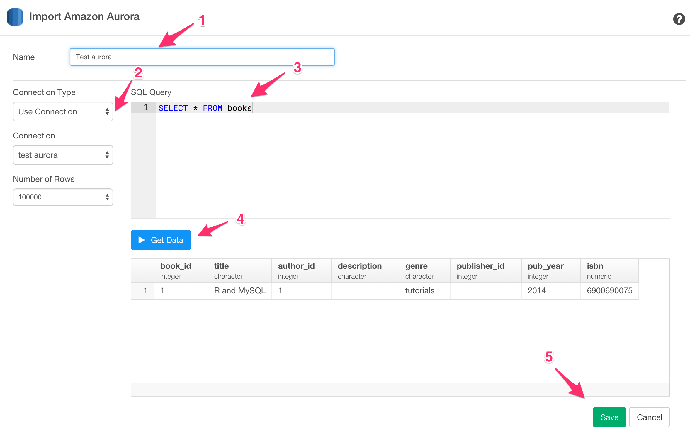

# Aurora Data Import

You can quickly import data from your Amazon Aurora Database into Exploratory.

## 1. AWS Security Group Setup

Make sure you added your client PC's IP address to your DB Security Group associated with the Aurora database instance.

## 2. Create a Connection to use

Create a connection following [this instruction](connection.html).

## 3. Open Aurora Import dialog

Select 'Import Remote Data' from Add New Data Frame menu.

Click Amazon Aurora.

## 4. Choose connection

1. Put data frame name.

2. Select connection from left box in the dialog.

3. Write a query in the input field.

4. Click "Get Data" button. Then you will see the preview of the data.

5. Click "Save" button to import.

