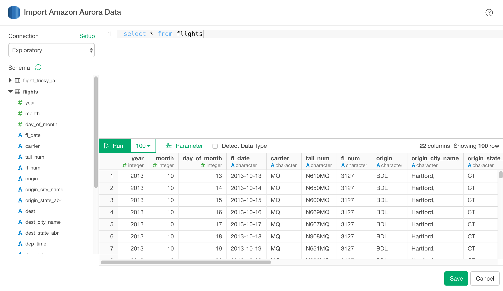
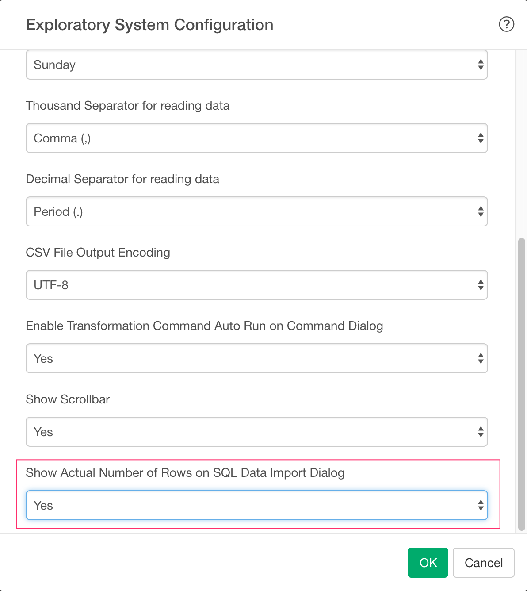
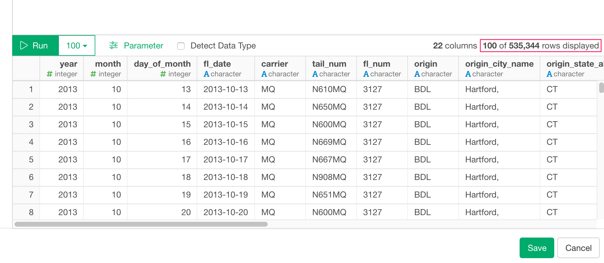

# Aurora Data Import

You can quickly import data from your Amazon Aurora Database into Exploratory.

## 1. AWS Security Group Setup

Make sure you added your client PC's IP address to your DB Security Group associated with the Aurora database instance.


## 2. Create a Connection to use

Create a connection following [this instruction](https://docs.exploratory.io/data_import/database-data/connection).

* Whether the connection is SSL or not is automatically detected.

## 3. Open Aurora Import dialog

Click '+' button next to 'Data Frames' and select 'Import Database Data'.


Click Amazon Aurora.


## 4. Preview and Import


1. Select connection from left box in the dialog.

2. Write a query in the input field.

3. Click "Preview" button. Then you will see the preview of the data.

4. Click "Save" button to import.



## 4. Using Parameters in SQL

First, click Parameter link on the SQL Data Import Dialog.


Second, define a parameter and click Save button.


Finally, you can use @{} to surround a variable name inside the query like below.

  ```
  select *
  from airline_2016_01
  where carrier = @{carrier}
  ```
  
  If you type @ then it suggests parameters like below.
  
  


Here's a [blog post](https://exploratory.io/note/kanaugust/An-Introduction-to-Parameter-in-Exploratory-WCO4Vgn7HJ) for more detail.

## 5. Number of rows

From performance point of view, we no longer show actual number of rows which can be only fetched by executing whole query again.


If you still want to show the actual number of query for your query, you can do so by setting System Configuration.


Then set "Yes" For "Show Actual Number of Rows on SQL Data Import Dialog"



This will show you Actual Number of Rows like below.


