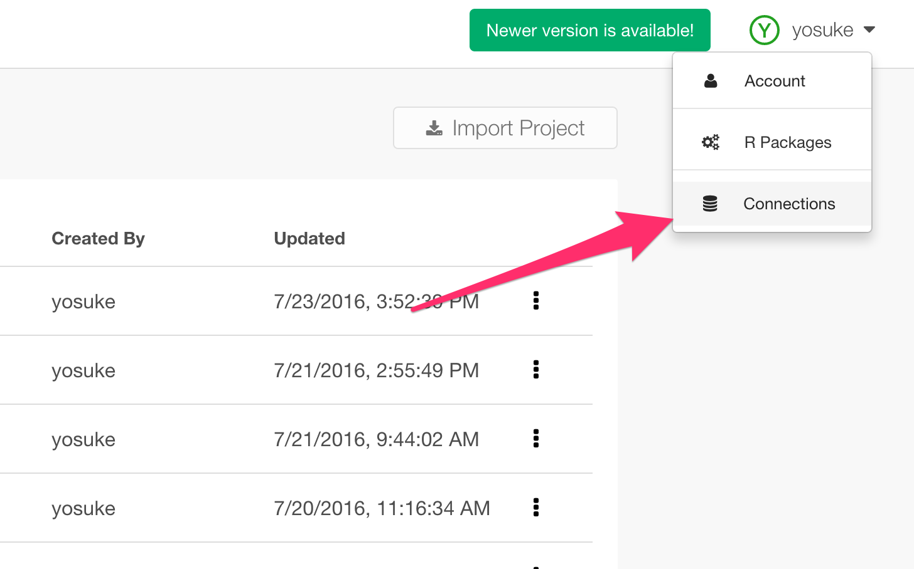
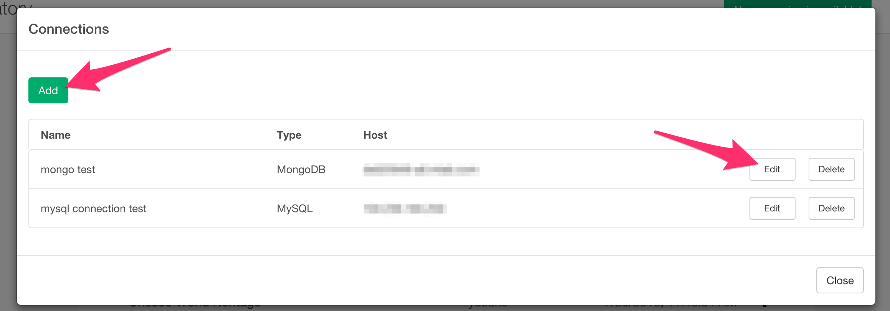
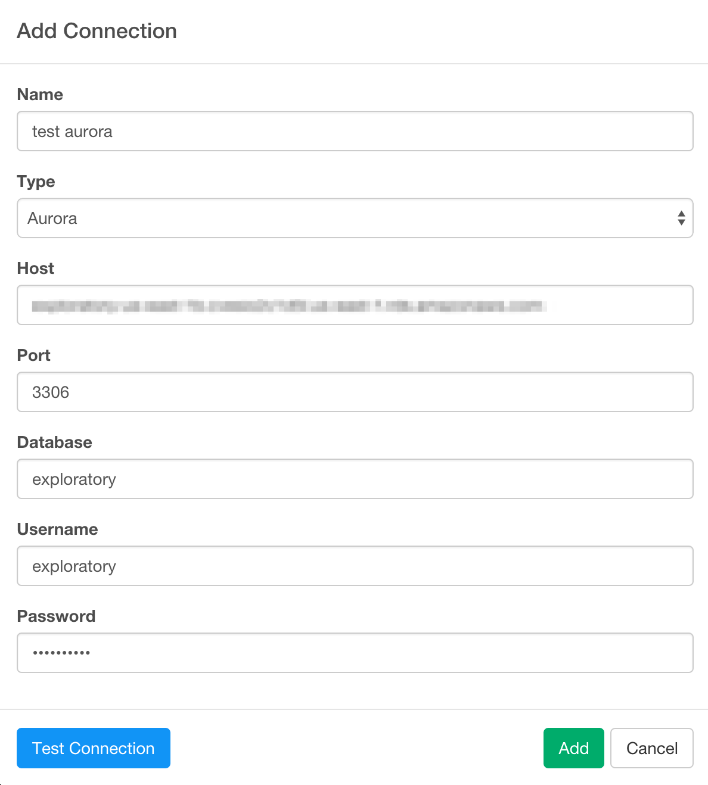
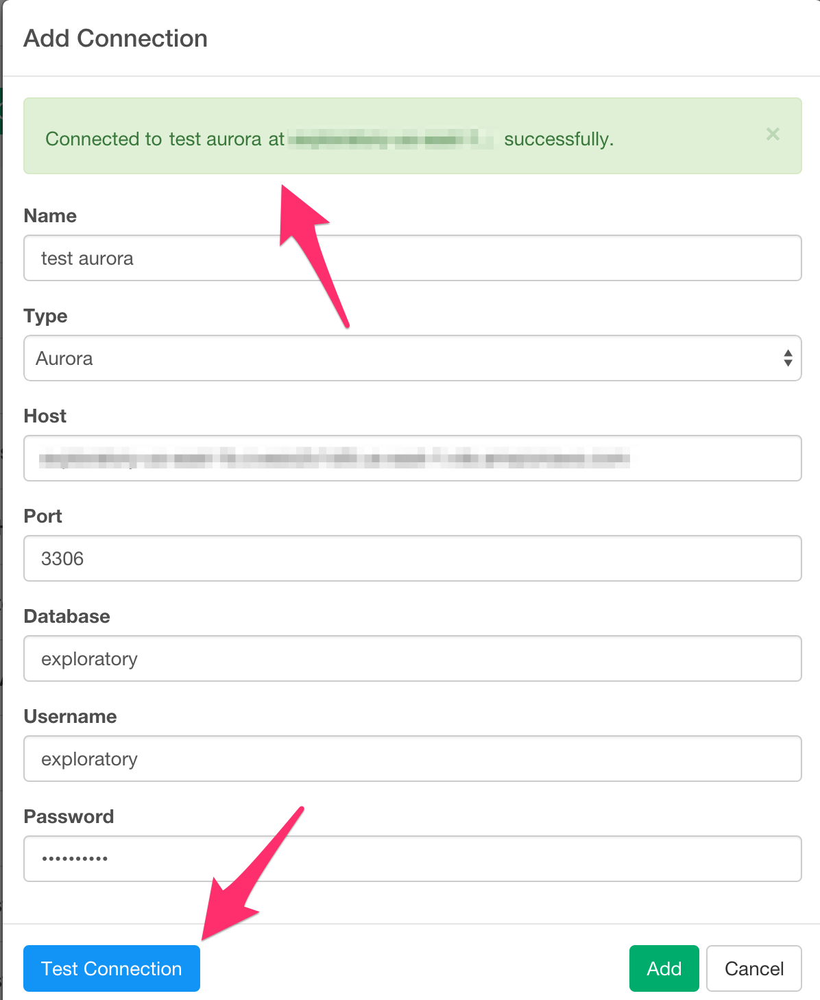
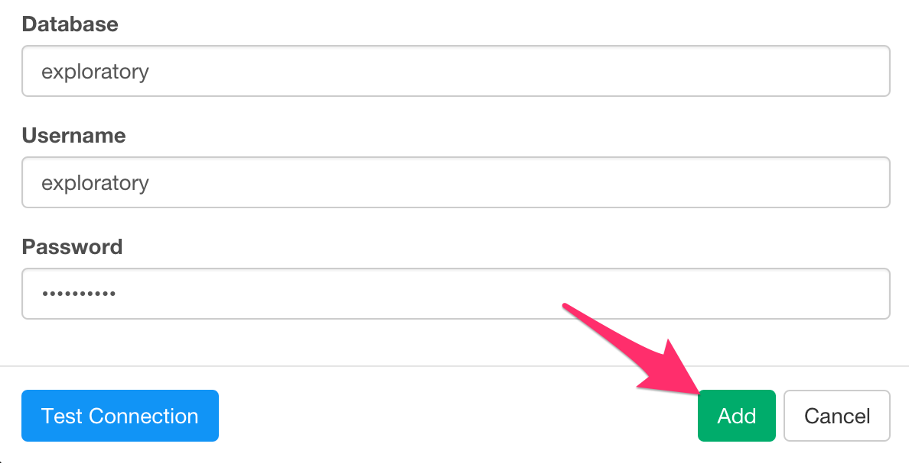
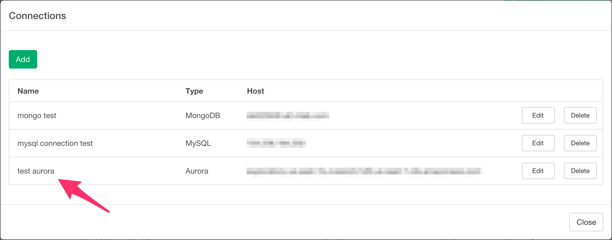

# Connection

You can register database connection configuration.

## 1. Open Connection dialog

Open your configuration dropdown and click "Connection" there.

Click "Add" to create a new connection or "Edit" to modify existing connection.

## 2. Set parameters

Set parameters for the database.

You can check the parameters from "Test Connection" button.
You will see the result on top of the dialog.

If you are okay with the configuration, click "Add" Button.

You will see the connection from the dialog.

## 3. Import data from connection.

You can choose those registered connection from Remote Data Frame Import dialog.

