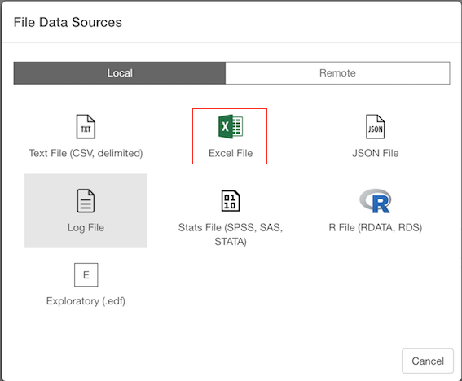
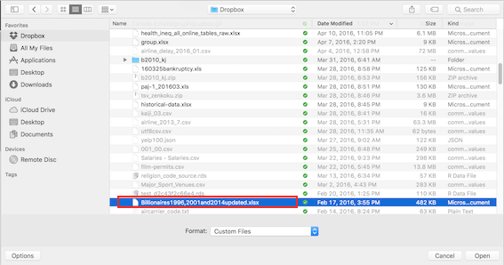
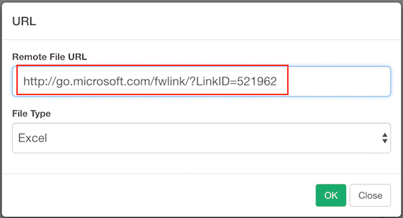
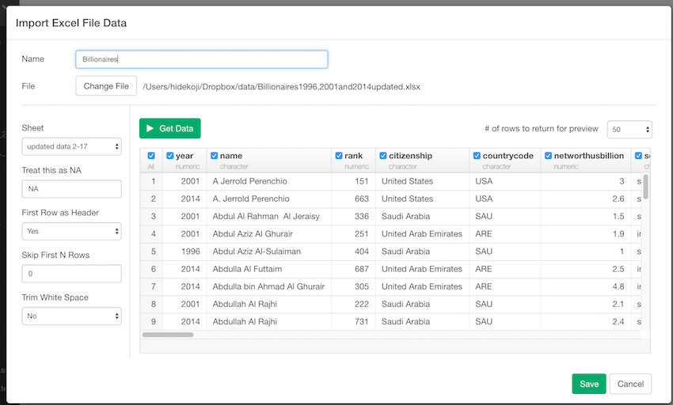

# Import Excel File Data

You can import both local and remote Excel File Data quickly.

## 1. Select Excel File Data Menu

Click '+' button next to 'Data Frames' and select 'Import File Data'.

If you import Excel File on your desktop or laptop, make sure Local tab is selected. If you import a file from remote server like Amazon S3, Dropbox, etc make sure Remote tab is selected. Click 'Excel File'

## 2. Select File.
If you select local, file picker shows up so select a file to import.
### 2.1 Local File

### 2.2 Remote File
if you select remote, small dialog shows up so enter a URL for the file.

## 3. Input parameters

Input parameters are same for local and remote file import.

Set these parameters.

* Sheet - Sheet name of the Excel File that you want to import.
* Treat this as NA - String to use for missing values.
* First Row as Header - Either TRUE or FALSE. 
If TRUE, the first row of the input will be used as the column names, and will not be included in the data frame. If FALSE, column names will be generated automatically: X1, X2, X3 etc.
* Skip first N rows - Number of lines to skip before reading data.
enter multiple Strings. (e.g: N/A, Not Applicable)
* Trim White Space - Should leading and trailing whitespace be trimmed from each field before parsing it?

## 4. Column Selection

On top of input parameters, you can also use checkboxes on the preview table to include/exclude columns. if you uncheck the checkboxes on the columns, these columns are excluded when you save the data. 

## 5. Preview and Import

Click Preview button to see the data in Excel File. You can limit number of rows for the preview by selecting number from pulldown list on the preview table. If it looks ok, then you can click 'Import' to import the whole Excel data into Exploratory.

## 6. Column Data Type Auto-Detection

When previewing the data, Exploratory uses the number of rows from preview data to detect column data types. It means if you set 50 rows for your preview, column data types are detect with the 50 rows. When you actually import full data, it will use up to 1,000 rows to detect column data types so you might see different column data types in the imported data than in the preview.