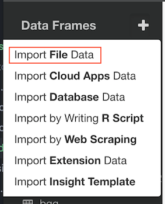
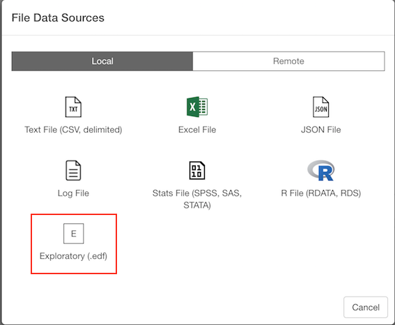
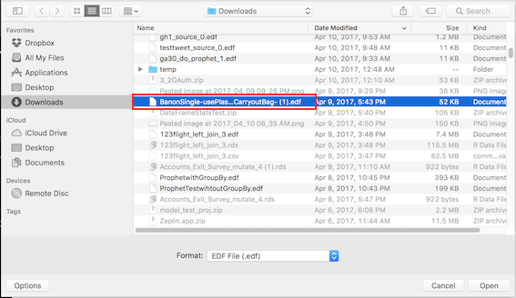
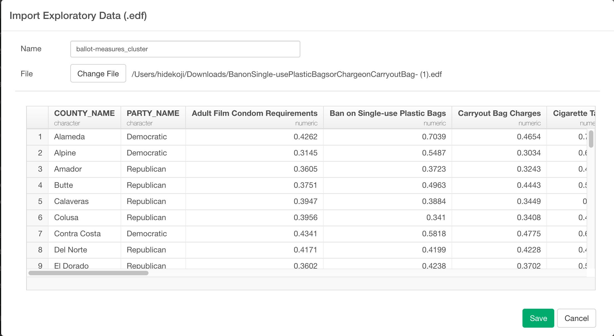

# Import Exploratory (EDF) File Data

You can import local Exploratory (EDF) File Data quickly.

## 1. Select Exploratory (EDF) File Data Menu

Click '+' button next to 'Data Frames' and select 'Import File Data'.

Make sure to select Local tab and Click 'Exploratory (.edf)'

## 2. Select File.
EDF import is supported for local so select a file to import on File Picker.

## 3. Input parameters

No Input Parameters or EDF file import.

## 4. Preview and Import

Click Preview button to see the data in Exploratory (EDF) File. If it looks ok, then you can click 'Import' to import the whole Exploratory (EDF) data into Exploratory.
