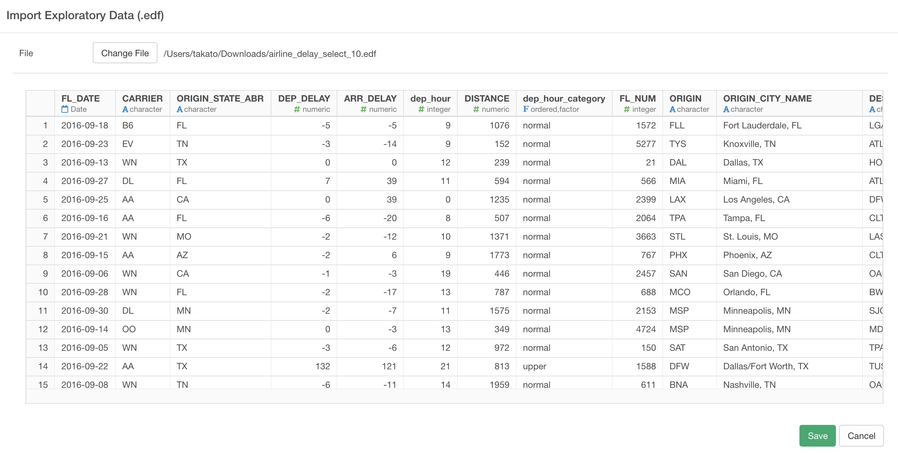

# Import Exploratory (EDF) File Data

You can import local Exploratory (EDF) File Data.

## 1. Select Exploratory (EDF) File Data Menu

Click '+' button next to 'Data Frames' and select 'Import EDF'.

## 2. Select File.
EDF import is supported for local so select a file to import on File Picker.

## 3. Input parameters

No Input Parameters or EDF file import.

## 4. Preview and Import

 If it looks ok, then you can click 'Save' to import the whole Exploratory (EDF) data into Exploratory.
