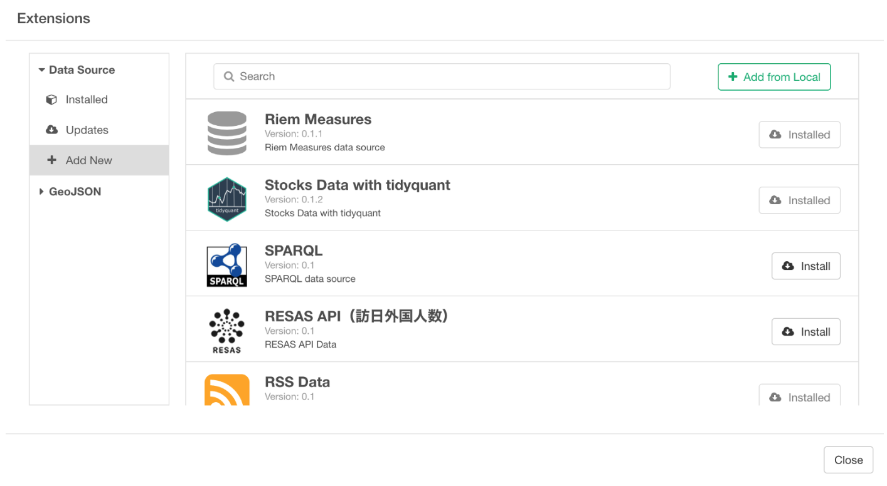
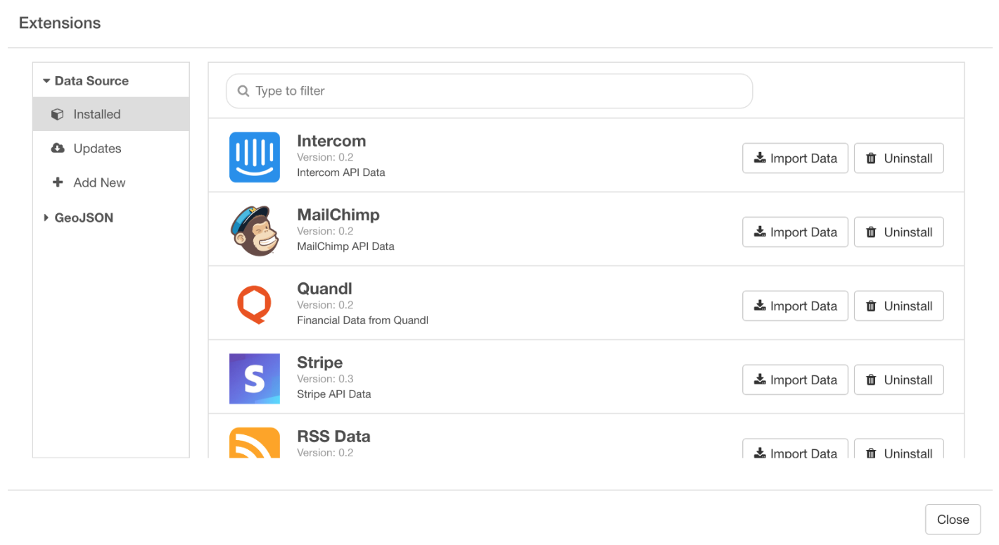

# Data Source Extension

You can select ‘Import Extension Data’ from ‘+’ (Add Data Frame) button.

This will open Data Source Extensions dialog UI. You can choose the one you like from the list of the pre-seeded data source extensions, which keeps rapidly growing, under ‘Add New’ menu at the left hand side and click ‘Install’ button. If you want to build your own data source extension then you can import them by clicking on ‘Add from Local’ button.

Once it’s installed, then you can click on ‘Import Data’ button, which will open the data import dialog that is specific to the data source you have selected.

We have written a separate post [introducing Quandl data extension](https://blog.exploratory.io/an-introduction-to-quandl-data-source-extension-c4dce2842412), which makes it super easy to download a wide range of financial data. I’d recommend you take a look.
