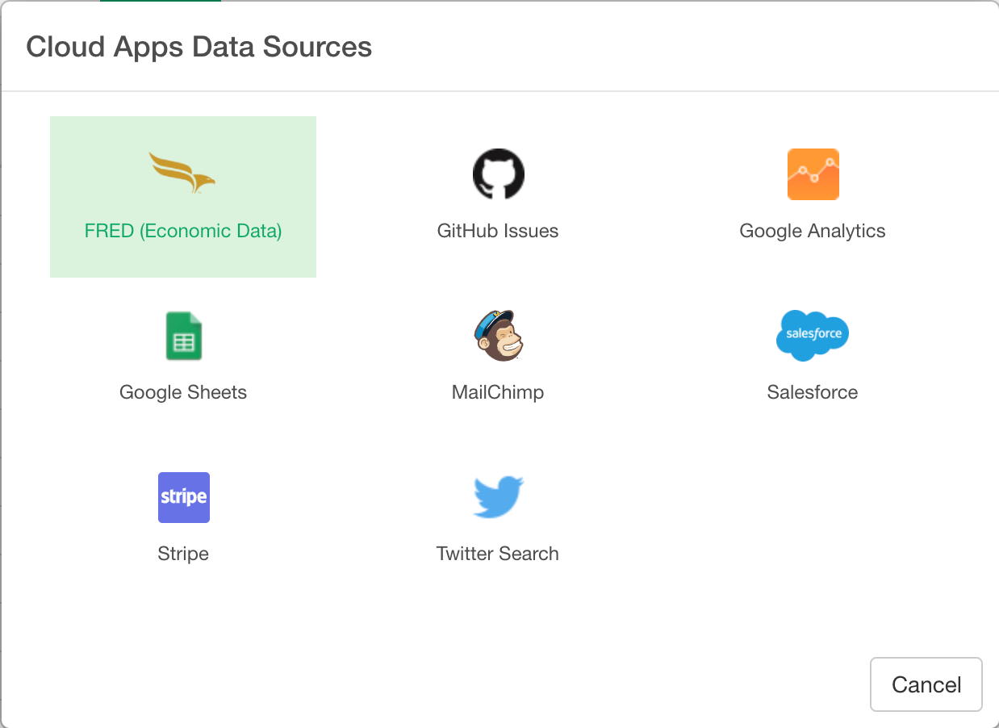
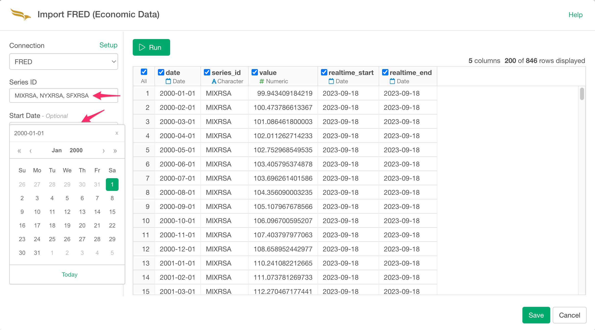

# FRED (Federal Reserve of Economic Data) Data Import

## 1. Obtain API Key.

Go to https://research.stlouisfed.org/docs/api/api_key.html and obtain your API Key to use FRED APIs.

## 2. Open FRED Import Dialog

Click '+' button next to 'Data Frames' and select 'Import Cloud Apps Data'.

Click 'FRED (Federal Reserve of Economic Data)'.

Create connection from here if you don't have.

Select "FRED".

Type connection name and FRED API Key. Test connection and if it works ok, click "Add" button.

Type in Series ID, e.g. UNRATE for unemployment rate, and select Start Date. 

Click "Run". If the preview is okay, click "Import".

