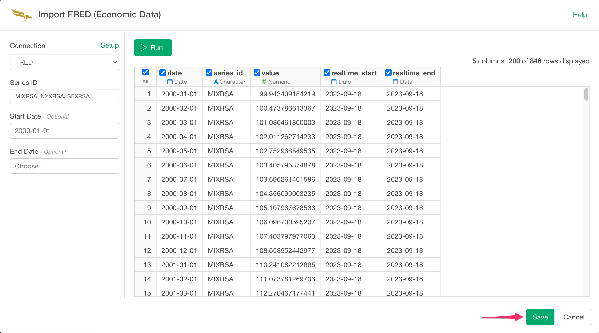

# FRED (Federal Reserve of Economic Data) Data Import

## 1. Obtain API Key.

Go to https://research.stlouisfed.org/docs/api/api_key.html and obtain your API Key to use FRED APIs.

## 2. Open FRED Import Dialog

Click '+' button next to 'Data Frames' and select 'Import Cloud Apps Data'.

Click 'FRED (Economic Data)'.

Create connection from here if you don't have.

Type connection name and FRED API Key. Test connection and if it works ok, click "Add" button.

Type in Series ID, e.g. UNRATE for unemployment rate. You can set multiple Series ID by separating them by comma(,).
For example, you can type in MIXRSA, NYXRSA, SFXRSA as Series IDs to get Real State Price Index for Miami, New York, and San Francisco.

You can search Series ID in https://fred.stlouisfed.org/tags/series 

Start Date and End Date are optional. If you leave them blank, it will get all data available.

Click the "Run" button to preview data. If the preview looks okay, click the "Save" button.

