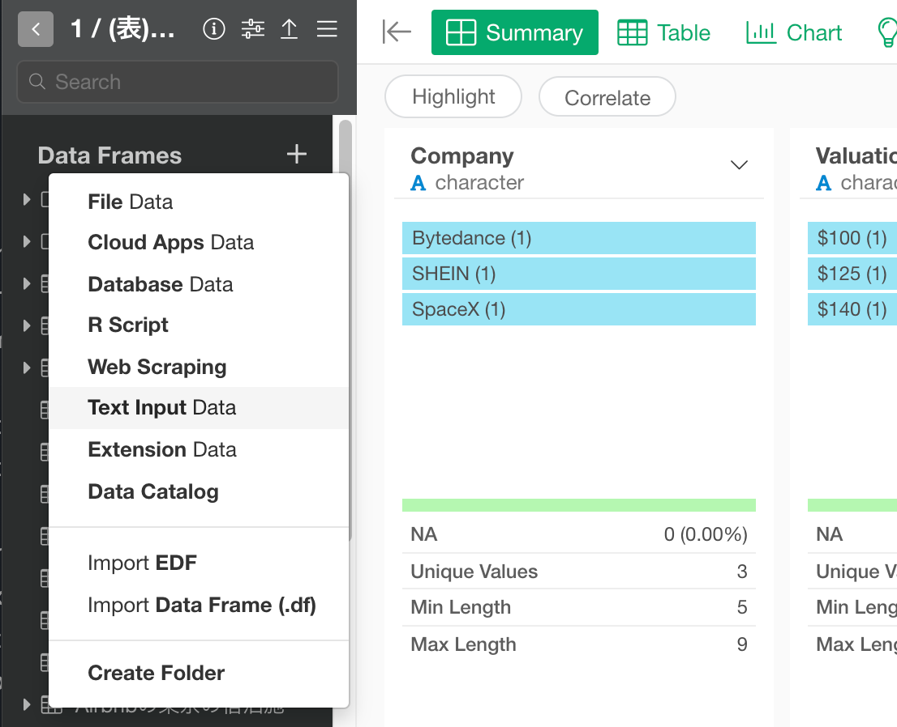
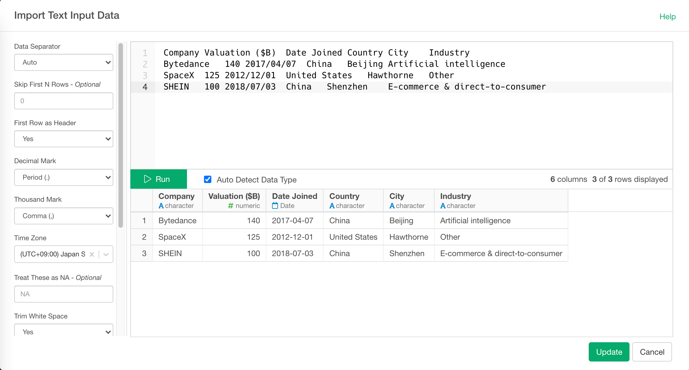
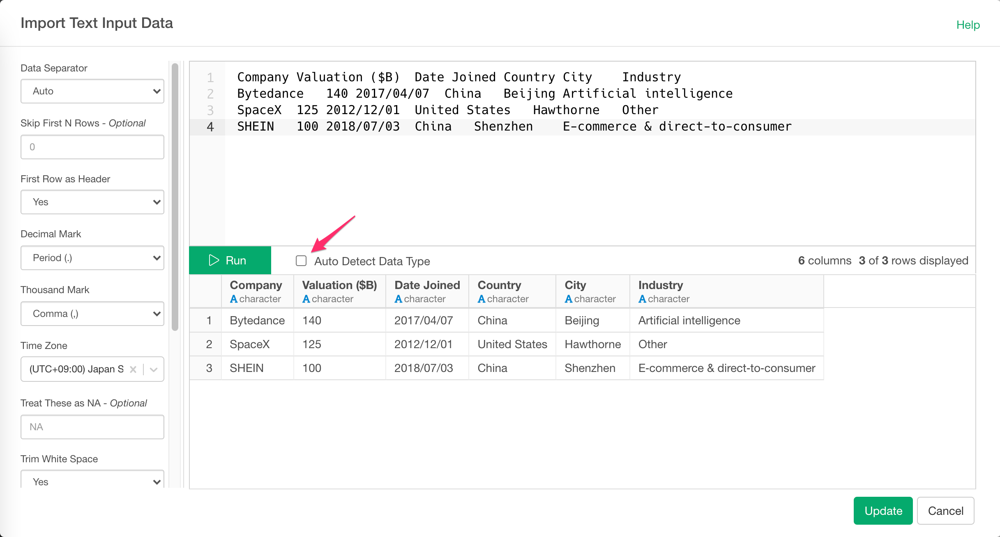

# Text Input Data

The Text Input Data makes it possible for users to manually type text to create small data frames, which can be useful in creating Lookup tables.

## 1. Import Text Input Data Menu

Click '+' button next to 'Data Frames' and select 'Text Input Data'.

## 3. Input parameters

You can copy and paste delimited text to Text Editor area. Input parameters are same for local and remote file import.

Set these parameters.

* Separator - Single character used to separate fields within a record.
* Skip first N rows - Number of lines to skip before reading data.
* First Row as Header - Either TRUE or FALSE.
If TRUE, the first row of the input will be used as the column names, and will not be included in the data frame. If FALSE, column names will be 
* Decimal mark - Decimal mark used for numeric values in the Delimited Text.
* Thousand mark - Thousand mark used in numeric vales in the Delimited Text.
* Time Zone - Time zone used for date values in the Delimited Text.
* Treat these as NA - String(s) to use for missing values. Use comma(,) to enter multiple Strings. (e.g: N/A, Not Applicable)
generated automatically: X1, X2, X3 etc.
* Comment Character - A string used to identify comments. Any text after the comment characters will be silently ignored.
* Trim White Space - Should leading and trailing whitespace be trimmed from each field before parsing it?
* Quote - Single character used to quote strings. Either double or Single
* Treat All Columns as Text - Should all columns be treated as text?
* Column Types - See below section for details.

## 4. Column Types

you can override column type by passing column name and data type pair with ` columnName = 'type'` syntax.
For Example, if `value` column is detected as integer but you want to import it as double, you can set `value = 'd'`. (d is for double). If you want to override multiple column types, you can do so by separating each pair with comma(,) like this. ` key = 'i', value = 'd'`

Supported data types for overrides are:

- c (character)
- i (integer)
- n (number)
- d (double)
- l (logical)
- D (date)
- T (Date time)
- t (time)

**Note :** To specify Column Types, you need to disable "Auto Detect Data Type" like the screenshot below.

Also, if the column name contains special characters, use backtick \` to escape column names like \`Column A\` = 'c'

## 6. Preview and Import

Click Preview button to see the data. If it looks ok, then you can click 'Import' to import the whole Delimited Text into Exploratory.

## 7. Column Data Type Auto-Detection

When previewing the data, Exploratory uses the number of rows from preview data to detect column data types. It means if you set 50 rows for your preview, column data types are detect with the 50 rows. When you actually import full data, it will use up to 1,000 rows to detect column data types so you might see different column data types in the imported data than in the preview.

