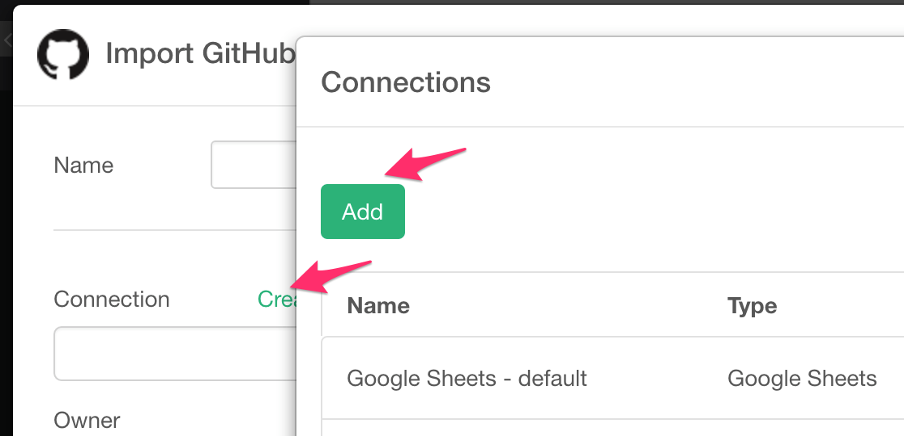
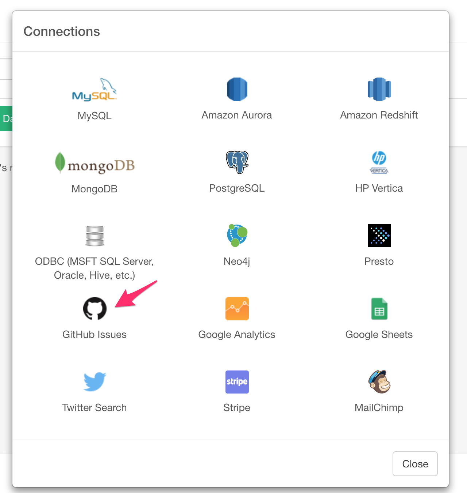
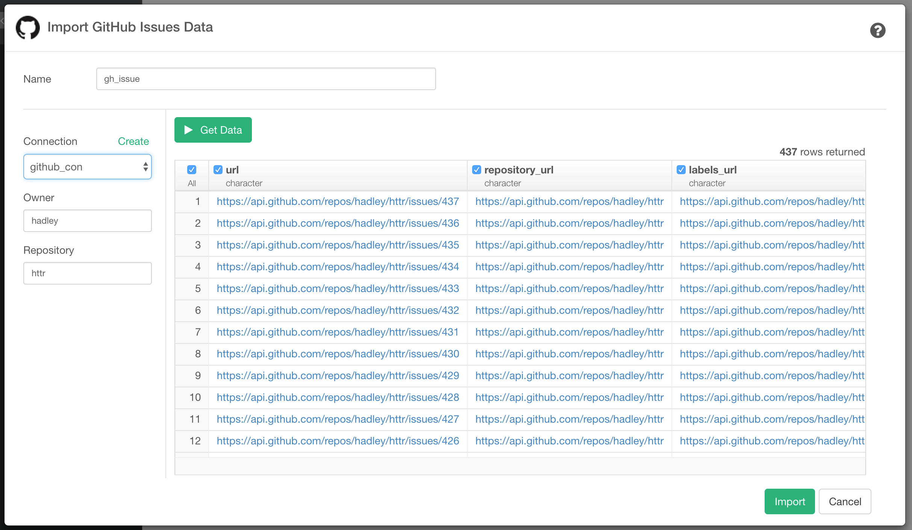

# Github Issue Data Import

For Basic Authentication, you can simply type your Github username and password.

### Steps

Select 'Import Cloud Apps Data' from Add New Data Frame menu.

Click 'Github Issues'.

Create connection from here if you don't have.

Select "GitHub Issues".

Type connection name, Github username and password. Then, "Add" button.

Type Owner and Repository and click "Get Data". If the preview is okay, click "Import".

Repository Owner and Repository Name are something like below. (just in case!)

