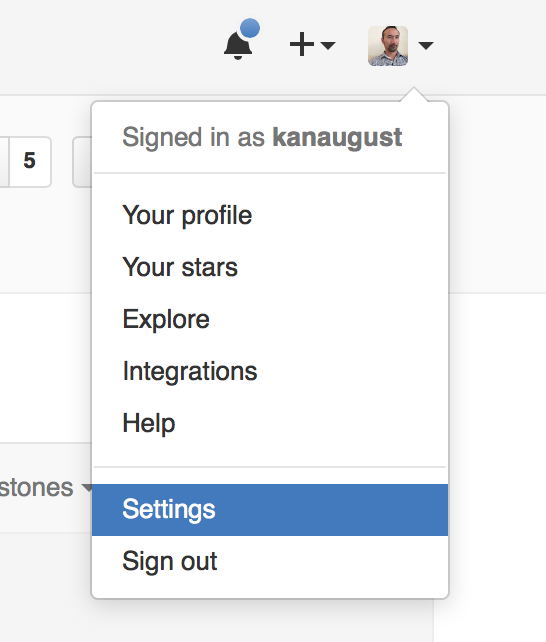
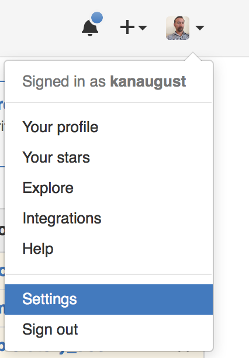

# Github Issue data import

## Github Authentication Types

There are three Authentication types for using Github REST API.

- Basic Authentication
- Personal Access Token
- OAuth 2.0

Currently, Exploratory supports only Basic Authentication.

## Import Data with Basic Authentication

For Basic Authentication, you can simply type your Github username and password.

### Steps

Select 'Import Remote Data' from Add New Data Frame menu.

Click 'Github Issue'.

Type Data Frame name, and type your Github username, password, repository owner, and the repository name.

Repository Owner and Repository Name are something like below. (just in case!)

Click Preview button and see the result.

Click Import button to import the data.

## OAuth 2.0 (This is not supported yet, but will be coming shortly)

### Get Client ID and Client Secret

First, in order to use OAuth option, you need these. If you don’t have them yet, go to Github page and go to Setting page.

And go to ‘OAuth applications’ section.

And, select ‘Developer applications’ and create a developer application if you don’t have one yet.

Once you filled out the forms you will get the Client ID and Client Secret. You will need these to authenticate with OAuth.

## Personal Access token (This is not supported yet, but will be coming shortly

Personal Access Token is a key that is generated by Github for your personal use. You can generate multiple tokens and configure each token to scope the access. You can always delete the token at Github to disable the access. Because of these, it’s a bit more secure and more convenient than Basic Authentication with which you need to type Github username and password.

### Obtain Personal Access Token from Github

Go to Github website and select ‘Setting’.

Click on ‘Personal access tokens’ menu.

Click ‘Generate new token’ button to generate the token.

Enter some description for ‘Token description’ and check at least ‘repo:status’.

Once you save it you will get the token text like below. Make sure you copy this text right away because this is the only time you will see this text.

