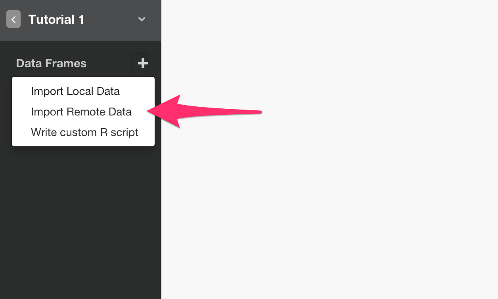

# Github Issue Data Import

For Basic Authentication, you can simply type your Github username and password. 

### Steps

Select 'Import Remote Data' from Add New Data Frame menu.

Click 'Github Issue'.

Type Data Frame name, and type your Github username, password, repository owner, and the repository name.

Repository Owner and Repository Name are something like below. (just in case!)

Click Preview button and see the result.

Click Import button to import the data.

