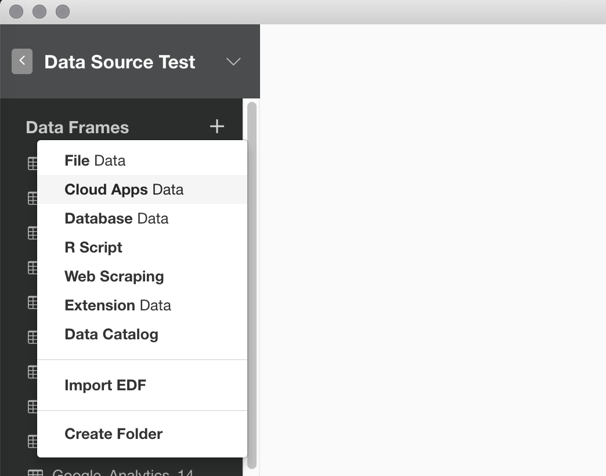
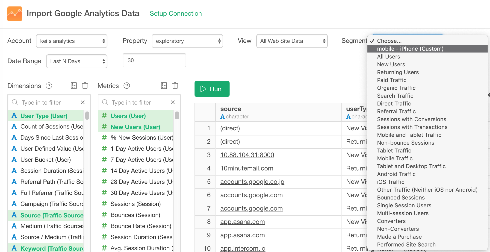

# Google Analytics Data

## 1. Google Analytics Dataのメニューを選択

データフレームの隣にある'+' ボタンをクリックして、クラウドアプリケーションデータをインポートをを選択。

Google Analyticsをクリック

## 2. OAuthの設定

[この説明](https://blog.exploratory.io/how-to-setup-oauth-cloud-apps-connections-in-exploratory-a5c20d18e7c7)にしたがってコネクションを作成

## 3. パラメタを設定

- ドロップダウンメニューからアカウント、プロパティ、ビューを選択します。
- 期間
以下のオプションから選択します。
  - 今日
  - 昨日
  - 今週 (昨日まで)
  - 今月 (昨日まで)
  - 今年 (昨日まで)
  - 直近N日
  - 直近N週間
  - 直近Nヶ月
  - 直近N年
  - この日より後
  
 「直近N日」、「直近N週間」、「直近Nヶ月」、「直近N年」のいずれかを選択すると、追加のフィールドが表示されので数値を入力します。例えば、直近30日のデータを表示するには、期間として「直近N日」を選択し、フィールドに30と入力します。この値は必要に応じて更新できます。「この日付より後」を選択すると、日付ピッカーから日を選択できます。
 
- リストから、ディメンションと指標を選びます。

- セグメント: パラメタ詳細を参照

## 4. プレビューとインポート

'データの取得'ボタンをクリックして、Google Analyticsからのデータを確認します。 よければ'インポート'ボタンをクリックしてデータをExploratoryに取り込みます。

## 5. パラメタの詳細

### ディメンションと指標

ドロップダウンリストから、データを見たいディメンションと指標の一覧を選択できます。

ディメンションと指標についての詳細は、[Query Parameter reference page (英語)](https://developers.google.com/analytics/devguides/reporting/core/v3/reference)や[ディメンションと指標(日本語)](https://support.google.com/analytics/answer/1033861?hl=ja)を参照してください。また、[Google Analytics Query Explorer tool page(英語)](https://ga-dev-tools.appspot.com/query-explorer/) は、Google Analyticsがサポートする様々なパラメタを試すのに便利です。

### セグメント

#### 概要
セグメントはGoogle Analyticsのデータをフィルタして、必要なデータだけをサブセットとして取り出すのに便利です。たとえば、すべてのユーザーのうち、特定の国や都市のユーザーだけを取り出すことができます。

#### 使い方

値リストからセグメントを選択します。

リストの先頭にはGoogle Analyticsで登録したカスタムのセグメントが表示され、その次にシステムデフォルトのセグメントが表示されます。カスタムで定義したものについては、表示名の次に `(custom)`が付きます。

セグメントの詳細については[セグメントについて(日本語)](https://support.google.com/analytics/answer/3123951?hl=ja)や[Core Reporting API - Segments(英語)](https://developers.google.com/analytics/devguides/reporting/core/v3/segments)を参照してください。
