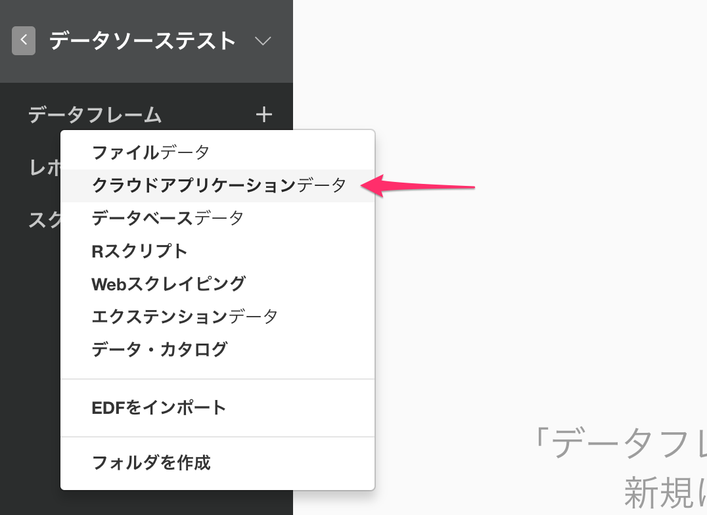

# Google Analytics Data

## 1. Google Analytics Dataのメニューを選択

データフレームの隣にある'+' ボタンをクリックして、クラウドアプリケーションデータを選択します。

Google Analyticsをクリック

## 2. OAuthの設定

[この説明](https://blog.exploratory.io/how-to-setup-oauth-cloud-apps-connections-in-exploratory-a5c20d18e7c7)にしたがってコネクションを作成

## 3. パラメタを設定

- ドロップダウンメニューからアカウント、プロパティ、ビューを選択します。
- 期間を以下のオプションから選択します。

  - 今日
  - 昨日
  - 今週 (昨日まで)
  - 今月 (昨日まで)
  - 今年 (昨日まで)
  - 直近N日
  - 直近N週間
  - 直近Nヶ月
  - 直近N年
  - この日より後
 
- リストから、ディメンションと指標を選びます。ディメンションと指標についての詳細は、[Query Parameter reference page (英語)](https://developers.google.com/analytics/devguides/reporting/core/v3/reference)や[ディメンションと指標(日本語)](https://support.google.com/analytics/answer/1033861?hl=ja)を参照してください。

- セグメント: セグメントを使っている場合はこちらのリストから選ぶことができます。セグメントの詳細については[セグメントについて(日本語)](https://support.google.com/analytics/answer/3123951?hl=ja)や[Core Reporting API - Segments(英語)](https://developers.google.com/analytics/devguides/reporting/core/v3/segments)を参照してください。

## 4. プレビューとインポート

'実行'ボタンをクリックして、Google Analyticsからのデータを確認します。 よければ'保存'ボタンをクリックしてデータをExploratoryに取り込みます。
