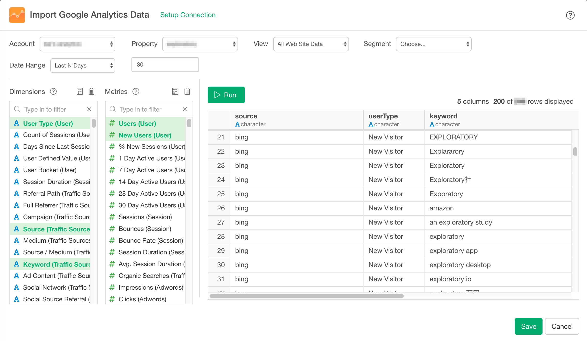

# Google Analytics Data

## 1. Google Analytics Dataのメニューを選択

データフレームの隣にある'+' ボタンをクリックして、クラウドアプリケーションデータをインポートをを選択。

Google Analyticsをクリック

## 2. OAuthの設定

[この説明](https://blog.exploratory.io/how-to-setup-oauth-cloud-apps-connections-in-exploratory-a5c20d18e7c7)にしたがってコネクションを作成

## 3. パラメタを設定

- データフレーム名を入力。
- ドロップダウンメニューからView IDを選択.
- 過去N日。デフォルトは30日です。これは過去30日分のデータを抽出することを意味します。この値は必要に応じて更新できます。
- ドロップダウンリストから、ディメンションと指標を選びます。
- もし結果が10,000行(1回あたりのAPIの限度)以上になる場合は、ページネートクエリーをYesに設定します。
- セグメント: 付録を参照

## 4. プレビューとインポート

'データの取得'ボタンをクリックして、Google Analyticsからのデータを確認します。 よければ'インポート'ボタンをクリックしてデータをExploratoryに取り込みます。

## パラメタの詳細

### ディメンションと指標

ドロップダウンリストから、データを見たいディメンションと指標の一覧を選択できます。

ディメンションと指標についての詳細は、[Query Parameter reference page (英語)](https://developers.google.com/analytics/devguides/reporting/core/v3/reference)や[ディメンションと指標(日本語)](https://support.google.com/analytics/answer/1033861?hl=ja)を参照してください。また、[Google Analytics Query Explorer tool page(英語)](https://ga-dev-tools.appspot.com/query-explorer/) は、Google Analyticsがサポートする様々なパラメタを試すのに便利です。

### セグメント

#### 概要
セグメントはGoogle Analyticsのデータをフィルタして、必要なデータだけをサブセットとして取り出すのに便利です。たとえば、すべてのユーザーのうち、特定の国や都市のユーザーだけを取り出すことができます。

#### 使い方
セグメントを使用する際には、事前定義されているセグメントを、その`id`をパラメタに指定して使う方法と、動的にセグメントをパラメタに指定して使う方法の２種類あります。

##### IDを指定して使う方法

例えば、iOSのデバイスからのアクセスだけにデータをフィルタしたい場合は、
Segmentのパラメタに`gaid::-17`と指定するとiOSのデバイスからのアクセスだけにデータをフィルタできます。

Google Analyticsには上の例であげたiOSのデバイス(`gaid::-17`)の他にも、以下の事前定義のセグメントが用意されています。次の表は事前定義されているIDと、その説明です。

|ID         | 説明                                    |
|-----------|----------------------------------------|
| gaid::-1  | All Users                              |
| gaid::-2  | New Users                              |
| gaid::-3  | Returning Users                        |
| gaid::-4  | Paid Traffic                           |
| gaid::-5  | Organic Traffic                        |
| gaid::-6  | Search Traffic                         |
| gaid::-7  | Direct Traffic                         |
| gaid::-8  | Referral Traffic                       |
| gaid::-9  | Sessions with Conversions              |
| gaid::-10 | Sessions with Transactions             |
| gaid::-11 | Mobile and Tablet Traffic              |
| gaid::-12 | Non-bounce Sessions                    |
| gaid::-13 | Tablet Traffic                         |
| gaid::-14 | Mobile Traffic                         |
| gaid::-15 | Tablet and Desktop Traffic             |
| gaid::-16 | Android Traffic                        |
| gaid::-17 | iOS Traffic                            |
| gaid::-18 | Other Traffic (Neither iOS nor Android)|
| gaid::-19 | Bounced Sessions                       |
| gaid::-100| Single Session Users                   |
| gaid::-101| Multi-session Users                    |
| gaid::-102| Converters                             |
| gaid::-103| Non-Converters                         |
| gaid::-104| Made a Purchase                        |
| gaid::-105| Performed Site Search                  |

#### 動的なセグメント
事前定義のセグメントでは要件を満たさない場合、動的にセグメントを定義してパラメタに渡すこともできます。

##### 条件(conditions)

例えば、「東京からSafariブラウザでアクセスしたセッション」に絞り込みたい場合は

`sessions::condition::ga:region==Tokyo;ga:browser==Safari`

というセグメントをパラメタに指定します。

セグメントはいくつかの構成要素からなります。まず`sessions::`の部分はセッションに対する絞り込みであることを意味します。もしユーザーに対する（複数のセッションをまたがる)絞り込みをする場合は、この代わりに`users::`を指定します。

２つ目の`condition::`は条件を使ったセグメントであることを意味します。`condition::`以外には後述する`sequences::`を使うことができます。

実際にデータを絞り込む条件が`ga:region==Tokyo;ga:browser==Safari`の部分になります。ここでは

- アクセスしてきた地域が東京
- 使用しているブラウザがSafari

という２つの条件を両方満たすものになっています。

まず一つ目の「アクセスしてきた地域が東京」というのは`ga:region==Tokyo`のように記述されます。`ga:region`はGoogle Analyticsの地域ディメンションで、`==Tokyo`はその値がTokyoであるという意味です。もし地域が東京ではないとしたければ、`!=Tokyo`と記述します。２つ目の`ga:browser==Safari`ですが、これはGoogle Analyticsのブラウザ・ディメンションがSafariという意味です。１つ目の条件と２つ目の条件の間にある`;`は `AND`を意味しており、この例に出てくる２つの条件を両方満たすことを意味してます。もし２つの条件のうち、どちらか一方だけ満たしていればよければ`;`の代わりに`,`を指定すると`OR`条件となります。

値を判断するオペレータ
この例では値が等しいか`==`、等しくないか`!=`というオペレータを使いましたがこの他にも以下のオペレータを使うことができます。

|オペレータ|説明|例|使用できるデータ属性
|--|-----|---|--|--|
|==|等しい|ga:region==Tokyo|ディメンション、指標|
|!=|等しくない|ga:region!=Tokyo| ディメンション、指標|
|< |より小さい|ga:hour<12|ディメンション、指標|
|<= |より小さいか等しい|ga:hour<=12|ディメンション、指標|
|> |より大きい|ga:pageview>100|ディメンション、指標|
|>= |より大きいか等しい|ga:pageview>=100|ディメンション、指標|
|<>|間 (範囲はminValue_maxValueのように指定)| ga:pageview<>1_200|ディメンション、指標|
|[]|どれか (候補は&#124;で区切る、最大10候補まで)|ga:city[]Meguro&#124;Shibuya&#124;Ebisu |ディメンション|
|=@|含む|ga:keyword=@exploratory|ディメンション|
|!@|含まない|ga:keywaord!@AI|ディメンション|
|=~|正規表現に適合|ga:keywaord=~machine|ディメンション|
|!~|正規表現に適合しない|ga:keywaord!~machine|ディメンション|

##### シーケンス(sequences)

シーケンスは、ユーザー行動のステップ(順番)を、条件指定で絞り込むことのできるセグメントです。例えば、「最初にデスクトップでアクセスして、そして次にタブレット端末からアクセスしたユーザー」に絞り込みたい場合は、`users::sequence::ga:deviceCategory==desktop;->>ga:deviceCategory==tablet`のように記述します。先ほどの例とは異なり、セグメントの２番目が`sequence::`になっていることに注意してください。

ここでは順番が２つあり、1つ目が`ga:deviceCategory==desktop`ということで、「最初にデスクトップでアクセスした」という条件を表していて、２つ目の`ga:deviceCategory==tablet`がその後タブレット端末でアクセスしたことを意味しています。そしてこの２つが`;->>`(その後)という演算子で繋がっているのがわかります。

この順序の接続ルールには２つのタイプがあります。

- 次のステップ (`;->>`)
- 直後のステップ (`;->`)

「次のステップ」の方が順番の接続判定がゆるく、上の例でいうとデスクトップでアクセスしたあとに、スマフォでアクセスして、その後タブレットでアクセスした場合も考慮されます。しかしながら、「直後のステップ」を選んだ場合は、間にスマフォでアクセスしたケースは絞り込んだ際に外されます。

ちなみに、各ステップでは複数の条件を持つことができます。例えば、「初めにデスクトップでOSがWindowsでアクセスして、次にモバイル端末でOSがアンドロイドのものからアクセスした」というセグメントは以下のように記述できます。

`users::sequence::ga:deviceCategory==desktop;ga:operatingSystem==Windows->>ga:deviceCategory==mobile;ga:operatingSystem==Android`
