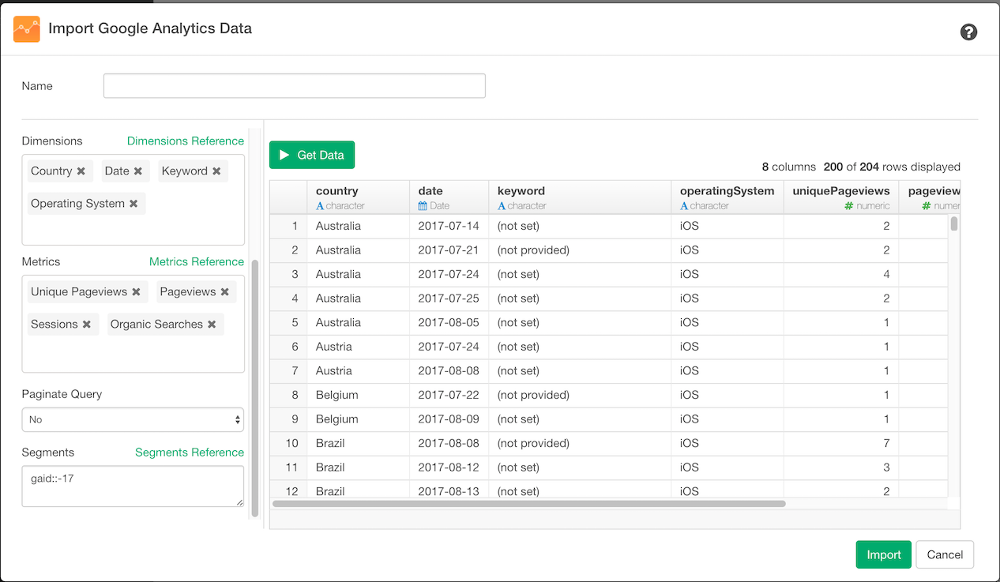
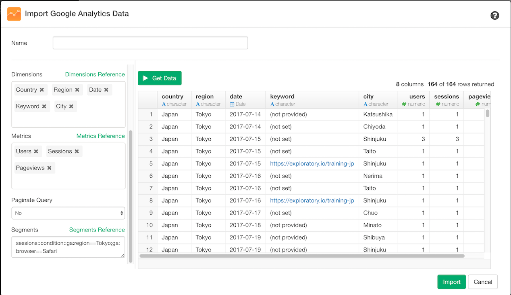

# Google Analytics Data

## 1. Select Google Analytics Data Menu

Click '+' button next to 'Data Frames' and select 'Import Cloud Apps Data'.

Click Google Analytics

## 2. OAuth Setting

Create a connection following [this instruction](https://blog.exploratory.io/how-to-setup-oauth-cloud-apps-connections-in-exploratory-a5c20d18e7c7).

## 3. Set Parameters

- Type a data frame name.
- Select View ID from the dropdown menu.
- Set Last N days. The default is set to 30, which means it will extract the last 30 days. You can update this based on your needs.
- Select Dimensions and Metrics from the dropdown menu.
- Set Paginate Query to Yes if the result is supposed to have more than 10000 rows (max for one api access).
- Segments: please refer Parameter details.

## 4. Preview and Import

Click 'Get Data' button to preview the data from Google Analytics. If it looks ok, then you can click 'Import' button to import the data into Exploratory.

## 5. Parameter Details

### Dimensions and Measures

You can select a list of Dimensions and Measures that you want to see data for from the dropdown list.

You might want to take a look at [Query Parameter reference page](https://developers.google.com/analytics/devguides/reporting/core/v3/reference) for more detail on Dimension and Measures. Also, [Google Analytics Query Explorer tool page](https://ga-dev-tools.appspot.com/query-explorer/) is helpful for you to explore different parameters that Google Analytics support.

### Segments

#### Overview
Segments are useful when you want to filter Google Analytics data and extract meaningful data by sub-setting it. For example, out of all users, you can extract only users who access from specific country and city.

#### How to use Segments
There are two ways to use Segments. The first option is select `id` of the predefined Segments. And the second option is define a segment dynamically and pass it to the Segments parameter.

#### Use segment by specifying ID
For example, if you want to see users who access your site with iOS device, you can pass `gaid::-17` to the Segments parameter like below.

Other than the iOS device (`gaid::-17`), there are following predefined segments available for your analysis. Below table shows the list of predefined segments.

|ID         | description                        |
|-----------|----------------------------------------|
| gaid::-1  | All Users　　　　　　　　　　|
| gaid::-2  | New Users                  |
| gaid::-3  | Returning Users       |
| gaid::-4  | Paid Traffic          |
| gaid::-5  | Organic Traffic  |
| gaid::-6  | Search Traffic          |
| gaid::-7  | Direct Traffic        |
| gaid::-8  | Referral Traffic |
| gaid::-9  | Sessions with Conversions |
| gaid::-10 | Sessions with Transactions |
| gaid::-11 | Mobile and Tablet Traffic           |
| gaid::-12 | Non-bounce Sessions                    |
| gaid::-13 | Tablet Traffic                   |
| gaid::-14 | Mobile Traffic                     |
| gaid::-15 | Tablet and Desktop Traffic        |
| gaid::-16 | Android Traffic                  |
| gaid::-17 | iOS Traffic           |
| gaid::-18 | Other Traffic (Neither iOS nor Android)|
| gaid::-19 | Bounced Session                       |
| gaid::-100| Single Session Users                  |
| gaid::-101| Multi-session Users                   |
| gaid::-102| Converters              |
| gaid::-103| Non-Converters                         |
| gaid::-104| Made a Purchase                        |
| gaid::-105| Performed Site Search  |

#### Dynamic Segments
If you want to perform more complex filter than predefined segments, you can dynamically define segment and pass that to the Segments parameter.

##### Conditions
For example, if you want to filter the data to "Session coming from Tokyo with Safari browser", you can define following segment.

`sessions::condition::ga:region==Tokyo;ga:browser==Safari`

and pass that to Segments parameter.

A Segment consists of couple of elements. The `sessions::` part means the segment is applied to sessions. if you want to apply the segment to users (it could cross multiple sessions), you need to specifiy `users::` instead.

The second element `condition::` means it uses condition to filter data. Other than `condition::`, you can use `sequence::`, which will be explained in the next section.

And the next element `ga:region==Tokyo;ga:browser==Safari` is the place where filtering condition details are defined. In this example, it consists of following two conditions:

- Accessing region is Tokyo
- Browser is Safari

As for the first condition, it is defined as `ga:region==Tokyo`. The `ga:region` is the Region dimension of Google Analytics and `==Tokyo` means the value is Tokyo. If you want to see the data whose accessing region is NOT Tokyo, you can change the condition as `!=Tokyo` instead of `==Tokyo`. As for the second condition `ga:browser==Safari`,  The `ga:browser` is the Browser dimesion of Google Analytics and `==Safari` means the value is Safari. The character `;` which sits between first and second conditions means `AND`, so the resulting data meets both these two conditions. If you want to change this to OR (which means at least one of the conditions is met), you can set `,` instead of `;`.

##### Filter Operators
In this example, it uses `==`, which means `Equal`, and `!=`, which means `Not Equal`, but there are many more operators available for filtering.

|Operator|Description|Example|Supported Data Attributes
|--|-----|---|--|--|
|==|Equal to or exact match.|ga:region==Tokyo|Dimension、Metric|
|!=|Not equal to or is not an exact match.|ga:region!=Tokyo| Dimension, Metric|
|< |Less than|ga:hour<12| Dimension, Metric|
|<= |Less than or equal to.|ga:hour<=12| Dimension, Metric|
|> |Greater than.|ga:pageview>100| Dimension, Metric|
|>= |Greater than or equal to.|ga:pageview>=100| Dimension, Metric|
|<>| Between (Range is defined as minValue_maxValue fashion)| ga:pageview<>1_200| Dimension, Metric|
|[]|In list (value is one of the listed values. Value is separated by &#124; up to 10 values per list)|ga:city[]Meguro&#124;Shibuya&#124;Ebisu | Dimension|
|=@|Contains substring|ga:keyword=@exploratory| Dimension|
|!@|Does not contain substring.|ga:keywaord!@AI| Dimension|
|=~| Contains a match for regular expression. |ga:keywaord=~machine| Dimension |
|!~| Does not contain a match for regular expression.|ga:keywaord!~machine| Dimension |

##### Sequences
Sequences are useful when you want to filter data by sequence of user actions(steps). For example, if you want to filter data to users who "Access with Desktop at first, followed by access from Tablet", you can define a segment like this.`users::sequence::ga:deviceCategory==desktop;->>ga:deviceCategory==tablet`. Unlike the previous example, now you can see the second element is`sequence::`.

With this example, there are two sequences. The first one is `ga:deviceCategory==desktop` which means "At first, access was made with Desktop". And the second one is `ga:deviceCategory==tablet` which means access was made with tablet. These two sequences are connected with `;->>` operator which means `followed by`.

So there are two types of connection rules:

- Followed by (`;->>`)
- Immediately followed by (`;->`)

`Followed by` is less strict operator, so with above example, it considers the case where first access was made with Desktop, then next access was made with phone and lastly accessed with tablet. However, if you select `Immediate followed by`, this case is filtered out since the tablet access should happen "immediately" after desktop access.

By the way, each step can have multiple conditions. For example, "First access was made with Desktop whose OS is Windows and access was made with Mobile device whose OS is Android" can be translated into following segment:

`users::sequence::ga:deviceCategory==desktop;ga:operatingSystem==Windows;->>ga:deviceCategory==mobile;ga:operatingSystem==Android`

For segments details, please refer[About Segments](https://support.google.com/analytics/answer/3123951) and [Core Reporting API - Segments](https://developers.google.com/analytics/devguides/reporting/core/v3/segments)
