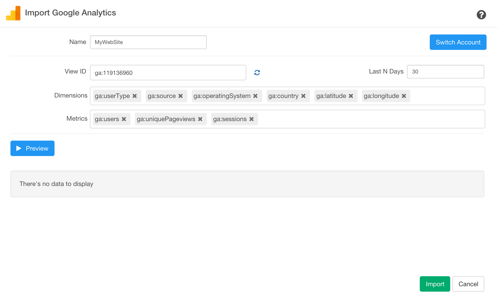

# Google Analytics Data

## 1. Select Google Analytics Data Menu

Click '+' button next to 'Data Frames' and select 'Import Cloud Apps Data'.

Click Google Analytics

## 2. OAuth Setting

Create a connection following [this instruction](https://blog.exploratory.io/how-to-setup-oauth-cloud-apps-connections-in-exploratory-a5c20d18e7c7).

## 3. Set Parameters

- Select Account, Property, and View from the dropdown menu.
- Set Date Range. You can select either of the followings:

  - Last N days
  - Last N Weeks
  - Last N Months
  - Last N Years
  - From this Date
  
Last N days. The default is set to 30, which means it will extract the last 30 days. You can update this based on your needs. If you select "From this Date", you can select a day from Date Picker.

- Select Dimensions and Metrics from the List.
- Segments: You can select both Custom segments as well as predefined segments from list of values.

## 4. Preview and Import

Click 'Get Data' button to preview the data from Google Analytics. If it looks ok, then you can click 'Import' button to import the data into Exploratory.

## 5. Parameter Details

### Dimensions and Measures

You can select a list of Dimensions and Measures that you want to see data for from the dropdown list.

You might want to take a look at [Query Parameter reference page](https://developers.google.com/analytics/devguides/reporting/core/v3/reference) for more detail on Dimension and Measures. Also, [Google Analytics Query Explorer tool page](https://ga-dev-tools.appspot.com/query-explorer/) is helpful for you to explore different parameters that Google Analytics support.

### Segments

#### Overview
Segments are useful when you want to filter Google Analytics data and extract meaningful data by sub-setting it. For example, out of all users, you can extract only users who access from specific country and city.

#### How to use Segments

You can select a segment from list of values.

The list shows your custom segments first the system defined ones next. For your custom segment, it shows `(custom)` at the end.

For segments details, please refer[About Segments](https://support.google.com/analytics/answer/3123951) and [Core Reporting API - Segments](https://developers.google.com/analytics/devguides/reporting/core/v3/segments)
