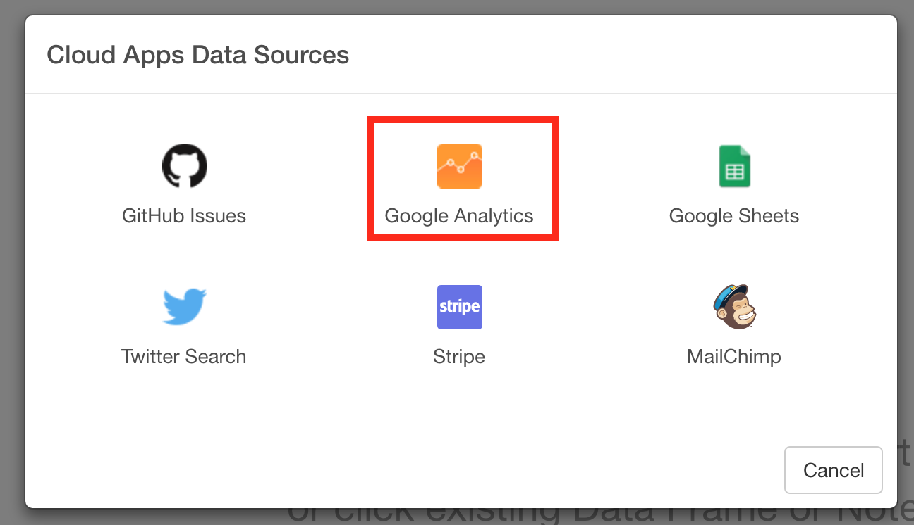

# Google Analytics Data

## 1. Select 'Import Remote Data' from Add New Data Frame menu.

Click Google Analytics

## 2. Set Parameters

### Data Frame name

Type a data frame name.

### Select View ID

You can select which View data you want to see from the dropdown list.

If you are not sure about the view name or view ID you can find this information from Google Analytics page.

Go to [Google Analytics web page](https://analytics.google.com), and go to Admin page.

Go to View Setting for the view (web site) you're interested in.

Now you can find View ID.

### Select Dimensions and Measures

You can select a list of Dimensions and Measures that you want to see data for from the dropdown list.

You might want to take a look at [Query Parameter reference page](https://developers.google.com/analytics/devguides/reporting/core/v3/reference) for more detail on Dimension and Measures. Also, [Google Analytics Query Explorer tool page](https://ga-dev-tools.appspot.com/query-explorer/) is helpful for you to explore different parameters that Google Analytics support.

Google Analytics Query Explorer

### Set Last N days

The default is set to 30, which means it will extract the last 30 days. You can update this based on your needs.

## 3. Preview and Import

Click Preview button to see the data back from Google Analytics. If it looks ok, then you can click 'Import' to import the data into Exploratory.
