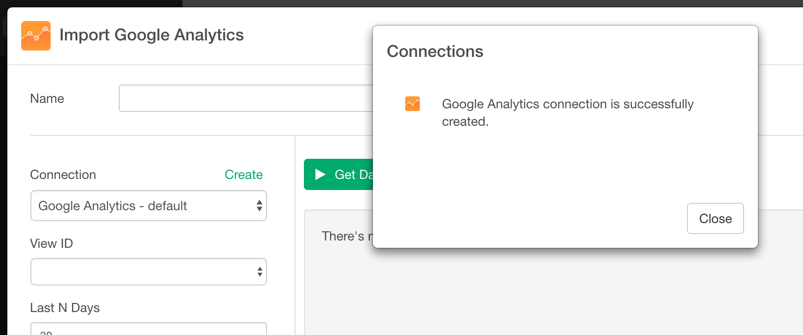

# Google Analytics Data

## 1. Select 'Import Cloud Apps Data' from Add New Data Frame menu.

Click Google Analytics

## 2. OAuth for Google Analytics

If this is your first time to create a Google Analytics Data Source, you want to create a new connection for Google Analytics. Click "create" link on Import Dialog.

This will opens up Connection Dialog.

And click "Add" button.

And Select "Google Analytics". Then Click OK on the popup.

Select your google account that you want to use.

And you will see Authorized message.

Go back to Exploratory and click "Refresh" button. And you will see small dialog message changes like below.

So click Close. And now View ID is filled automatically. So close Connection list dialog too.

And now ready to select parameters.

## 3. Set Parameters

- Type a data frame name.
- Select View ID from the dropdown menu.
- Set Last N days
- Select Dimensions and Metrics from the dropdown menu.

The default is set to 30, which means it will extract the last 30 days. You can update this based on your needs.

## 4. Preview and Import

Click Preview button to see the data back from Google Analytics. If it looks ok, then you can click 'Import' to import the data into Exploratory.

## Appendix

### View ID

If you are not sure about the View ID you can find this information from Google Analytics page.

Go to [Google Analytics web page](https://analytics.google.com), and go to Admin page.

Go to View Setting for the view (web site) you're interested in.

Now you can find View ID.

You can select a list of Dimensions and Measures that you want to see data for from the dropdown list.

### Dimensions and Measures

You might want to take a look at [Query Parameter reference page](https://developers.google.com/analytics/devguides/reporting/core/v3/reference) for more detail on Dimension and Measures. Also, [Google Analytics Query Explorer tool page](https://ga-dev-tools.appspot.com/query-explorer/) is helpful for you to explore different parameters that Google Analytics support.
