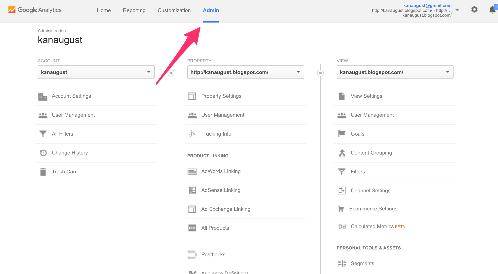

# Google Analytics Data

You need to have a few information before you start adding Google Analytics data in Exploratory.

- Client ID
- Client Secret
- View ID
- Dimensions
- Metrics

## Obtain information for Google Analytics parameters

### 1. Get Client ID and Client Secrete

Go to [Google Developers Console](https://console.developers.google.com/project)

Create a New Project and Open it

Make Analytics API enabled for your project

Click 'Credentials' to go to Credentials setting page.

Create OAuth Client ID

You will be asked to setup 'consent screen' first, so click 'Configure consent screen' button to set that up.

Set a product name for Consent Screen and click 'Save' button to save.

 In Credentials setup UI, select 'Other' for Application type and type any name for Name, and click 'Create' button

Now, you get Client ID and Client Secret.

### 2. Get Table ID (View ID)

You need this information to identify which of your Google Analytics monitoring web sites you want to use. You can get this information from Google Analytics page.

Go to [Google Analytics web page](https://analytics.google.com), and go to Admin page.

Go to View Setting for the view (web site) you're interested in.

Now you can find View ID.

### 3. Decide which Dimensions and Measures you need for Google Analytics data

You can use [Google Analytics Query Explorer tool](https://ga-dev-tools.appspot.com/query-explorer/) to find the dimensions and measures you would be interesting.

Take a look at [Query Parameter reference page](https://developers.google.com/analytics/devguides/reporting/core/v3/reference) for the detail about the query parameters.

## Import Google Analytics data

Select 'Import Remote Data' from Add New Data Frame menu.

Click Google Analytics

Type Data Frame name, and type the following parameters.

- Client ID
- Client Secret
- View ID
- Last N days
- Dimensions
- Metrics

Click Preview button to

Error: ignoring SIGPIPE signal
