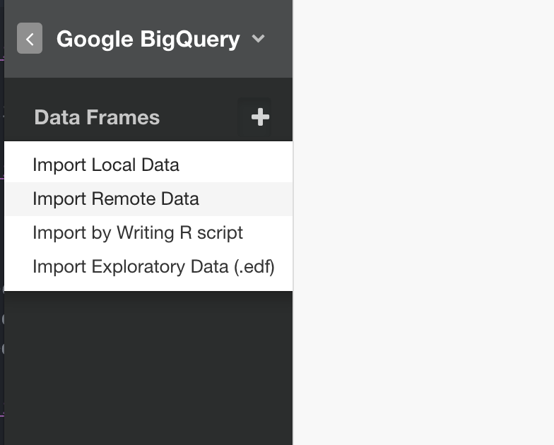
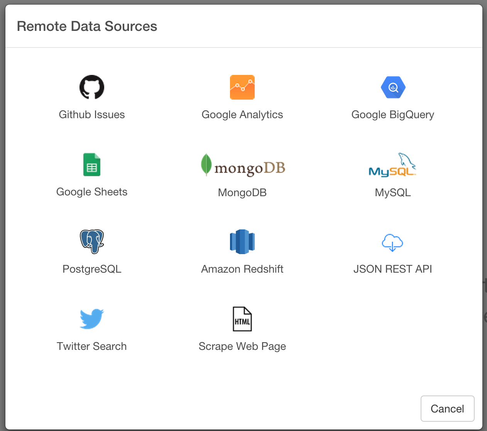
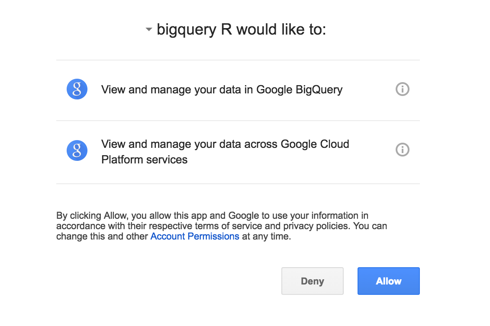
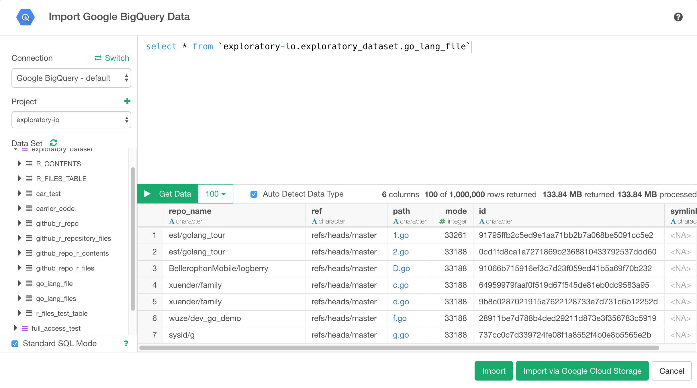
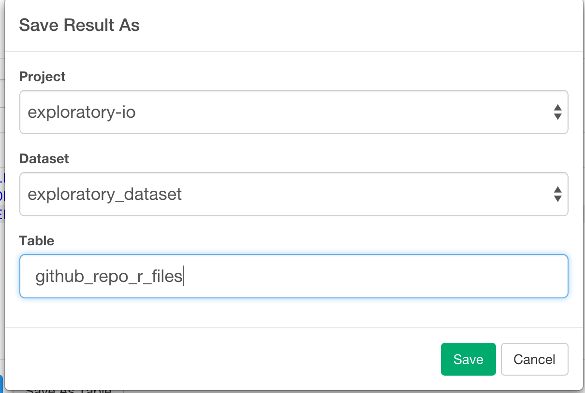
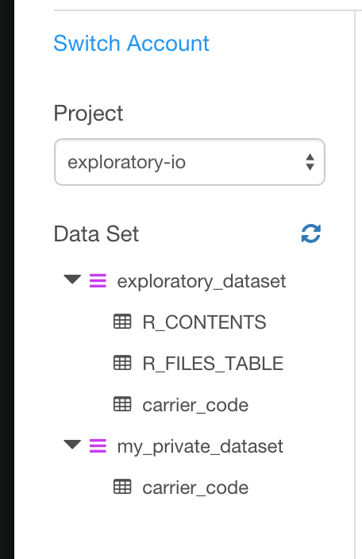
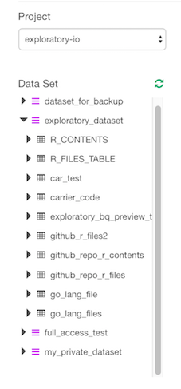
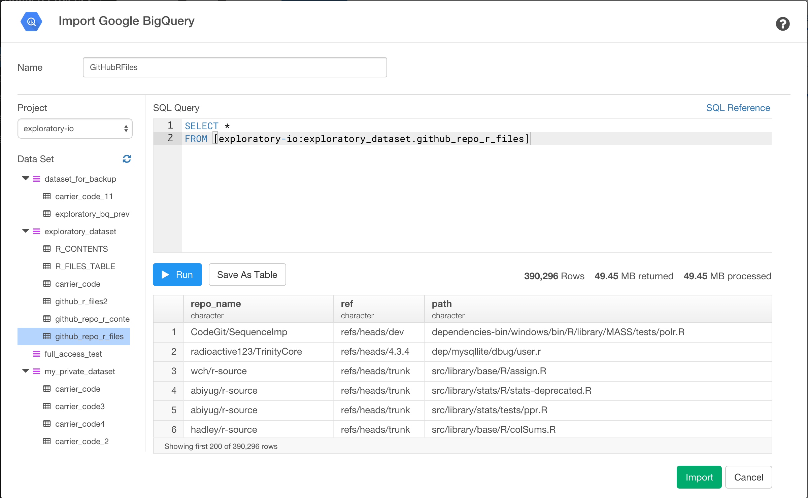

# Google BigQuery Data Import

## 1. Select Google BigQuery Data Menu

- Select 'Import Remote Data' from Add Data Frames dropdown

- Click 'Google BigQuery'

## 2. Authentication with Google OAuth

Select an account you want to use for your Google BigQuery and click 'Allow' button to allow Exploratory to extract your Google BigQuery data based on the parameters you are going to set up in the next step.

## 3. Write SQL Query

### 3.1 Preview Data

- Type Data Frame Name

- Select Google BigQuery Project from the dropdown menu

- Enter query to SQL Query editor

- Click Run button to preview data.

### 3.2 Save query result as a new table on Google BigQuery 

If your query is against huge table, it’s probably a good idea to create a a new table containing just the data you want to use for further analysis to minimize the cost. To do this, after getting preview data click Save As Table button.

- Select Project from pulldown menu
- Select Dataset from pulldown menu
- Type new table name 
- Click Save button

To confirm new table, click refresh icon on left hand side dataset tree

 
And once refresh is done, you can see newly created table on the tree

Once new table is created, you can query against the table.

## 4. Import

Click 'Import' button

If the data in the preview table look ok, then click 'Import' button to import the data into Exploratory.
