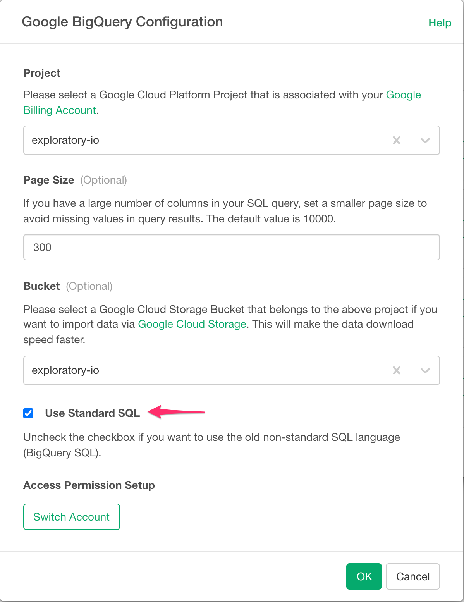
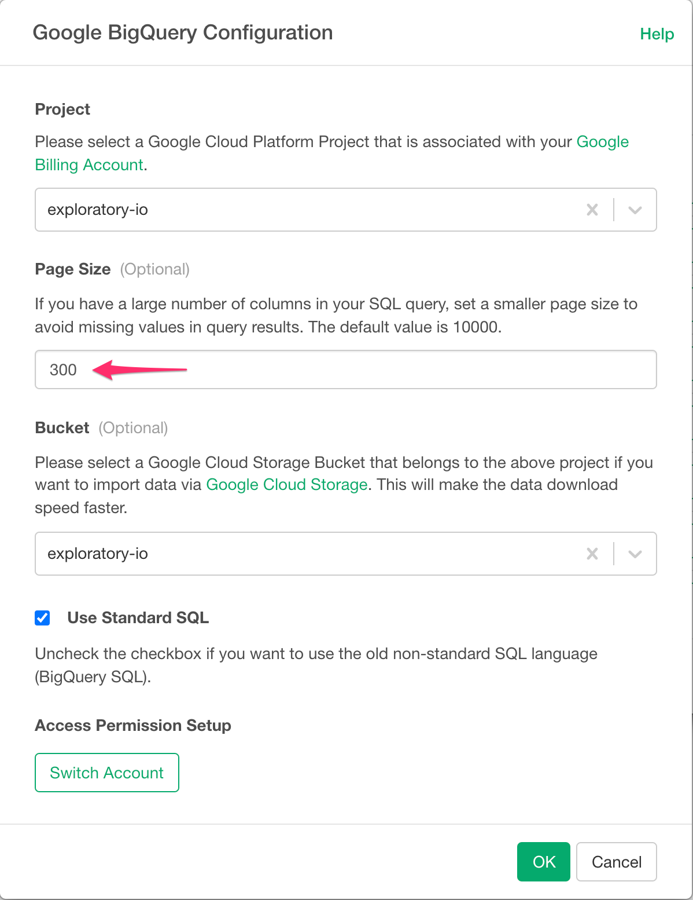

# Google BigQuery Data Import

## 1. Before you start

To use Google BigQuery with Exploratory Desktop, you need to create a project on Google Cloud Platform and a dataset on Google BigQuery.

### Create a project for Google BigQuery

- Open [Google Cloud Platform Console](https://console.cloud.google.com/)

- Click "Create Project" menu at the right hand side top


- Select a Project name and click "Create" button


- Make sure that you enable BigQuery API for you Project by clicking "Enable and manager APIs " menu under Use Google APIs section


### Create a dataset on Google BigQuery

- Open [Google BigQuery Web ui](https://bigquery.cloud.google.com/)

- Click down arrow icon next to your project name and select "Create new dataset" menu.


- Enter Dataset id and Click "OK" button


## 2. Select Google BigQuery Data Menu

- Select 'Import Database Data' from Add Data Frames dropdown


- Click 'Google BigQuery'


## 3. Authentication with Google OAuth

Select an account you want to use for your Google BigQuery and click 'Allow' button to allow Exploratory to extract your Google BigQuery data based on the parameters you are going to set up in the next step.


## 4. Write SQL Query

### 4.1 Preview Data

- Type Data Frame Name

- Select Google BigQuery Project from the dropdown menu

- Enter query to SQL Query editor

- Click Run button to preview data.


## 5. Standard SQL

You can now use Standard SQL by clicking "Standard SQL Mode" checkbox.



BigQuery standard SQL is compliant with the SQL 2011 standard and has extensions that support querying nested and repeated data.

Standard SQL has several advantages over legacy SQL, including:

* Composability using WITH clauses and SQL functions
* Subqueries in the SELECT list and WHERE clause
* Correlated subqueries
* ARRAY and STRUCT data types
* COUNT(DISTINCT \<expr\>) is exact and scalable, providing the accuracy of EXACT_COUNT_DISTINCT without its limitations
* Automatic predicate push-down through JOINs
* Complex JOIN predicates, including arbitrary expressions

### 5.1 Composability using WITH clauses and SQL functions

Now you can use `WITH` clause which enables extraction or reuse of named subqueries. For example:

```sql
WITH SUBQ AS (
  SELECT score FROM UNNEST([50, 60, 40, 50]) AS score
)
SELECT score / (SELECT SUM(score) FROM SUBQ) AS weighted_score
FROM SUBQ;
```


For Migration from legacy SQL, Please refer [Migrating to Standard SQL](https://cloud.google.com/bigquery/docs/reference/standard-sql/migrating-from-legacy-sql)


## 6. Page Size

When importing data from Google BigQuery, if you specify a lot of columns in your SQL query, the query may return missing results.
If this is the case, you might want to reduce the page size.

Also, when your query result contains many list columns, you also want to reduce page size so that you can import the query result.

Please note that decreasing the page size slows the importing data process.




## 7. Using Parameters in SQL

First, click Parameter link on the SQL Data Import Dialog.


Second, define a parameter and click Save button.


Finally, you can use @{} to surround a variable name inside the query like below.

  ```
  select *
  from airline_2016_01
  where carrier = @{carrier}
  ```

  If you type @ then it suggests parameters like below.

  


Here's a [blog post](https://exploratory.io/note/kanaugust/An-Introduction-to-Parameter-in-Exploratory-WCO4Vgn7HJ) for more detail.

## 8. Import

Click 'Import' button

If the data in the preview table look ok, then click 'Import' button to import the data into Exploratory.
