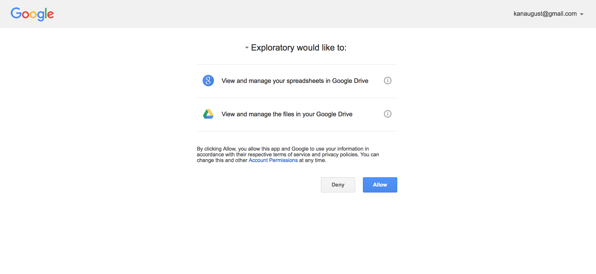
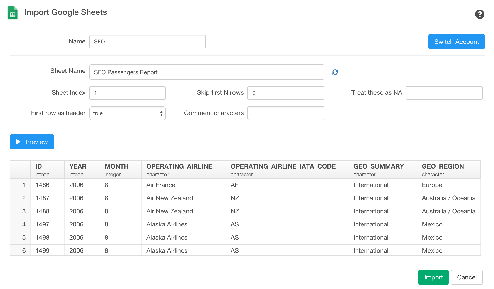

# Google Spreadsheet Data Import

## 1. Select Google Spreadsheet Data Menu

- Select 'Import Remote Data' from Add Data Frames dropdown

- Click 'Google Sheets'

## 2. Authentication with Google OAuth

Select an account you want to use for your Google Spreadsheet and click 'Allow' button to allow Exploratory to extract your Google Spreadsheet data based on the parameters you are going to set up in the next step.

## 3. Set Parameters

- Type Data Frame Name

- Select Google Spreadsheet name from the dropdown menu

- Type Worksheet name or its index number (e.g. 1, 2, etc.)

- Set parameters for how to read the data.

## 4. Preview and Import

Click 'Get Data' button

If the data in the preview table look ok, then click 'Save' button to import the data into Exploratory.
