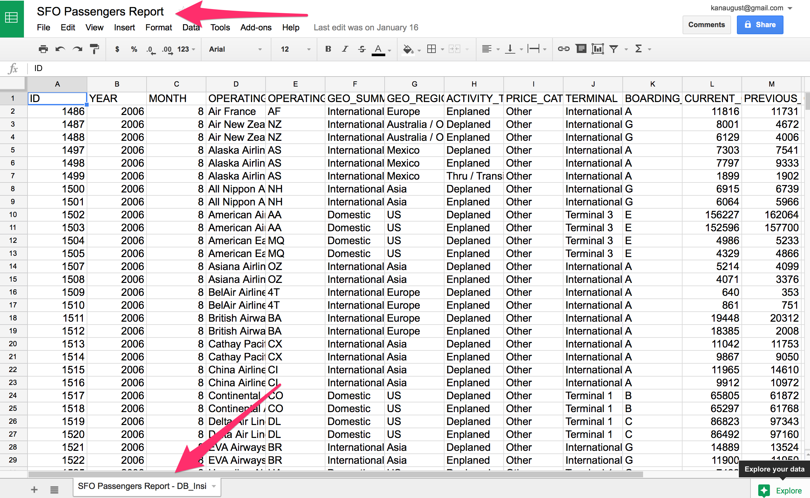
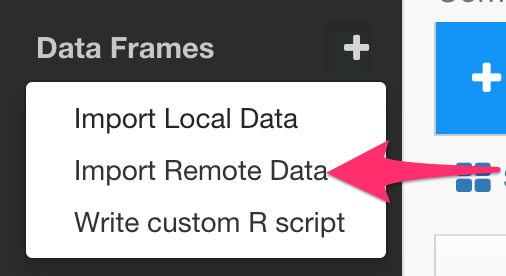
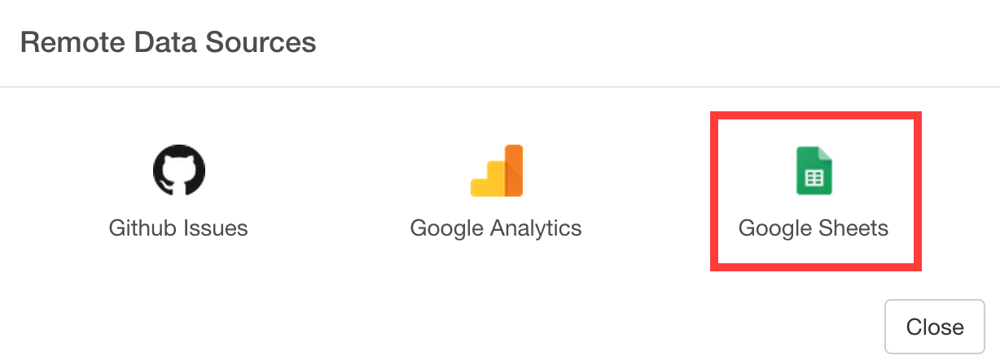
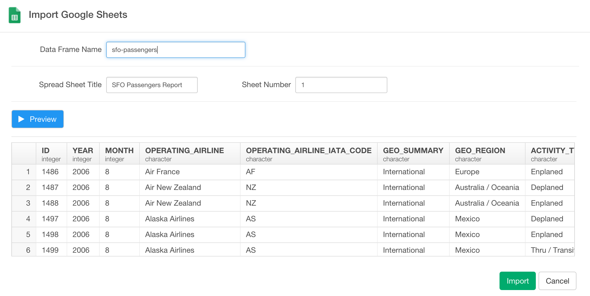

# Google Spreadsheet Data Import 

## Get Google Spreadsheet Name and Tab Name

Go to [Google Spreadsheet page](https://docs.google.com/spreadsheets) and find out the name of the spreadsheet and worksheet you want to import.

## Add Google Spreadsheet Data

- Select 'Import Remote Data' from Add Data Frames dropdown

- Click 'Google Sheets'

- Type Data Frame Name

- Type Google Spreadsheet name

- Type Worksheet name or its index number (e.g. 1, 2, etc.)

- Click 'Import' button
